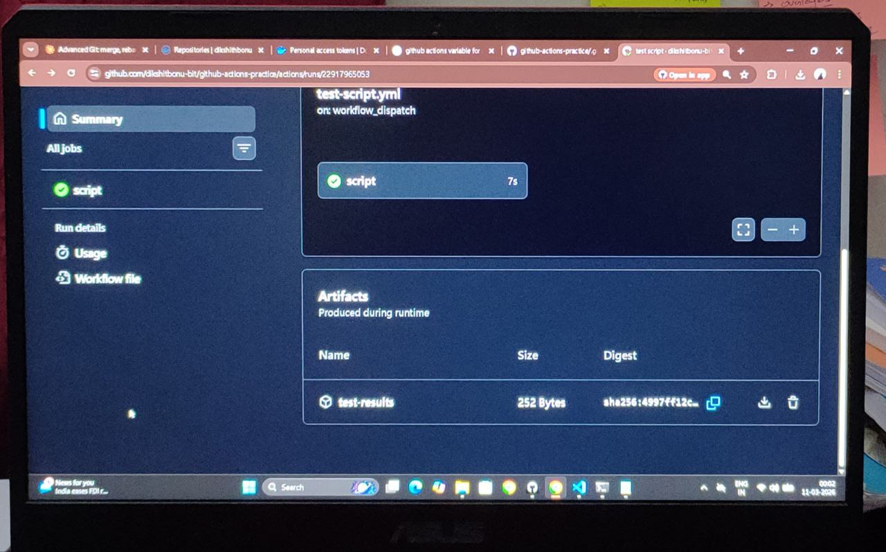
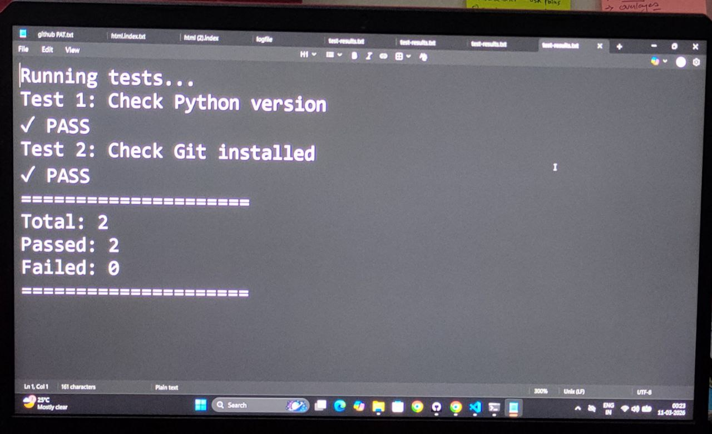

# Day 44 – Secrets, Artifacts & Running Real Tests in CI

---

## Task 1: GitHub Secrets


### .github/workflows/secrets-test.yml
```yaml
name: Test Secrets

on:
  workflow_dispatch:

jobs:
  test-secret:
    runs-on: ubuntu-latest
    
    steps:
      - name: Check if secret exists
        run: |
          if [ -n "${{ secrets.MY_SECRET_MESSAGE }}" ]; then
            echo "The secret is set: true"
          else
            echo "The secret is set: false"
          fi
      
      - name: Try to print secret directly
        run: echo "Secret value: ${{ secrets.MY_SECRET_MESSAGE }}"
```

**What GitHub shows:**
```
Secret value: ***
```

GitHub automatically masks secret values in logs.

### Why Never Print Secrets

**Reasons:**
- Logs visible to anyone with repo access
- Logs stored indefinitely
- Accidental exposure to team members
- Security breach if repo becomes public
- Can't revoke what's already logged

**Example breach:**
```yaml
run: echo "Password: ${{ secrets.DB_PASSWORD }}"
# Logs: Password: ***
# Someone screenshots it before masking kicks in
```

---

## Task 2: Secrets as Environment Variables

### Add Docker Secrets

Settings → Secrets → New repository secret:
- Name: `DOCKER_USERNAME`, Value: My Docker Hub username
- Name: `DOCKER_TOKEN`, Value: My Docker Hub token

### .github/workflows/env-secrets.yml
```yaml
name: Use Secrets as Env Vars

on:
  workflow_dispatch:

jobs:
  use-secrets:
    runs-on: ubuntu-latest
    
    steps:
      - name: Use secret in env
        env:
          SECRET_MESSAGE: ${{ secrets.MY_SECRET_MESSAGE }}
          DOCKER_USER: ${{ secrets.DOCKER_USERNAME }}
        run: |
          echo "Message length: ${#SECRET_MESSAGE}"
          echo "Docker user set: true"
          # Use $SECRET_MESSAGE in commands safely
          # Never: echo $SECRET_MESSAGE
      
      - name: Docker login example
        env:
          DOCKER_USERNAME: ${{ secrets.DOCKER_USERNAME }}
          DOCKER_TOKEN: ${{ secrets.DOCKER_TOKEN }}
        run: |
          echo "$DOCKER_TOKEN" | docker login -u "$DOCKER_USERNAME" --password-stdin
          echo "Logged in successfully"
```

**Safe pattern:** Pass via env, use in commands without printing.

---

## Task 3: Upload Artifacts

### .github/workflows/artifacts-upload.yml
```yaml
name: Upload Artifacts

on:
  workflow_dispatch:

jobs:
  generate-artifact:
    runs-on: ubuntu-latest
    
    steps:
      - name: Create test report
        run: |
          mkdir -p reports
          echo "Test Results" > reports/test-report.txt
          echo "Tests passed: 10" >> reports/test-report.txt
          echo "Tests failed: 0" >> reports/test-report.txt
          echo "Generated at: $(date)" >> reports/test-report.txt
      
      - name: Upload test report
        uses: actions/upload-artifact@v4
        with:
          name: test-reports
          path: reports/
```

**Download:**
1. Go to Actions tab → Click workflow run
2. Scroll to "Artifacts" section
3. Click artifact name to download ZIP

---

## Task 4: Download Artifacts Between Jobs

### .github/workflows/artifacts-share.yml
```yaml
name: Share Artifacts Between Jobs

on:
  workflow_dispatch:

jobs:
  build:
    runs-on: ubuntu-latest
    
    steps:
      - name: Generate build info
        run: |
          echo "Build ID: ${{ github.run_number }}" > build-info.txt
          echo "Commit: ${{ github.sha }}" >> build-info.txt
          echo "Timestamp: $(date)" >> build-info.txt
      
      - name: Upload build info
        uses: actions/upload-artifact@v4
        with:
          name: build-info
          path: build-info.txt
  
  test:
    runs-on: ubuntu-latest
    needs: build
    
    steps:
      - name: Download build info
        uses: actions/download-artifact@v4
        with:
          name: build-info
      
      - name: Use downloaded artifact
        run: |
          echo "=== Build Info ==="
          cat build-info.txt
          echo "================="
```

### When to Use Artifacts

**Real pipeline use cases:**
- Compiled binaries (pass from build to deploy)
- Test reports (save for later analysis)
- Code coverage reports


**Example flow:**
```
Build job → Upload binary artifact
↓
Test job → Download binary → Run tests
↓
Deploy job → Download binary → Deploy to server
```

---

## Task 5: Run Real Tests in CI

### Create Test Script

**test-script.sh:**
```bash
#!/bin/bash

echo "Running tests..."

# Simulate tests
test_count=0
pass_count=0
fail_count=0

# Test 1
echo "Test 1: Check Python version"
if python3 --version > /dev/null 2>&1; then
  echo "✓ PASS"
  ((pass_count++))
else
  echo "✗ FAIL"
  ((fail_count++))
fi
((test_count++))

# Test 2
echo "Test 2: Check Git installed"
if git --version > /dev/null 2>&1; then
  echo "✓ PASS"
  ((pass_count++))
else
  echo "✗ FAIL"
  ((fail_count++))
fi
((test_count++))


echo "====================="
echo "Total: $test_count"
echo "Passed: $pass_count"
echo "Failed: $fail_count"
echo "====================="

if [ $fail_count -gt 0 ]; then
  exit 1
fi

exit 0
```

### .github/workflows/run-tests.yml
```yaml
name: Run Tests

on:
  push:
    branches: [main]
  pull_request:
  workflow_dispatch:

jobs:
  test:
    runs-on: ubuntu-latest
    
    steps:
      - name: Checkout code
        uses: actions/checkout@v4
      
      - name: Make script executable
        run: chmod +x test-script.sh
      
      - name: Run tests
        run: ./test-script.sh | tee test-results.txt 
      
    name: Upload test results
        if: always()  # Upload even if tests fail
        uses: actions/upload-artifact@v4
        with:
          name: test-results
          path: test-results.txt
```  - 

**Test failure:**
```bash
# Break the script
echo "exit 1" >> test-script.sh

# Push
git add test-script.sh
git commit -m "Break tests"
git push

# Pipeline goes red 
```

**Fix:**
```bash
# Remove exit 1
git revert HEAD
git push

# Pipeline goes green 
```

---

## Task 6: Caching

### .github/workflows/cache-demo.yml
```yaml
name: Cache Demo

on:
  workflow_dispatch:

jobs:
  test-with-cache:
    runs-on: ubuntu-latest
    
    steps:
      - name: Checkout code
        uses: actions/checkout@v4
      
      - name: Cache node modules
        uses: actions/cache@v4
        with:
          path: ~/.npm
          key: npm-${{ runner.os }}-${{ hashFiles('**/package-lock.json') }}
          restore-keys: |
            npm-${{ runner.os }}-
      
      - name: Install dependencies
        run: |
          echo "Installing dependencies..."
          npm install
          echo "Installation complete"
      
      - name: Run tests
        run: npm test
```

### What Gets Cached

**Cache location:** GitHub's cloud storage (separate from runner)

**Cached data:**
- `~/.npm` - npm packages
- `node_modules/` - installed dependencies
- `~/.cache/pip` - Python packages
- `~/.m2` - Maven dependencies
- `vendor/` - Ruby gems

**Cache key:** `npm-Linux-abc123def456`
- `npm` - prefix
- `Linux` - OS
- `abc123def456` - hash of package-lock.json

**First run:**
```
Cache miss
Installing dependencies... (2 minutes)
Saving cache...
```

**Second run:**
```
Cache hit
Restoring from cache... (10 seconds)
Dependencies already installed
```

**Time saved:** 90% faster on cache hit

---

## Common Patterns

### Python with Cache
```yaml
- uses: actions/cache@v4
  with:
    path: ~/.cache/pip
    key: pip-${{ runner.os }}-${{ hashFiles('requirements.txt') }}

- run: pip install -r requirements.txt
```

### Node.js with Cache
```yaml
- uses: actions/cache@v4
  with:
    path: ~/.npm
    key: npm-${{ hashFiles('package-lock.json') }}

- run: npm ci
```

### Docker Layer Cache
```yaml
- uses: actions/cache@v4
  with:
    path: /tmp/.buildx-cache
    key: buildx-${{ github.sha }}
    restore-keys: buildx-

- run: docker build --cache-from /tmp/.buildx-cache .
```

---

## Secrets Best Practices

**DO:**
- Use GitHub Secrets for sensitive data
- Pass via environment variables
- Rotate secrets regularly
- Use least privilege (separate secrets per environment)

**DON'T:**
- Print secrets in logs
- Commit secrets to repo
- Share secrets across repos unnecessarily
- Use secrets in pull_request_target from forks

**Environments:**
```yaml
jobs:
  deploy:
    runs-on: ubuntu-latest
    environment: production  # Requires approval
    steps:
      - name: Deploy
        env:
          API_KEY: ${{ secrets.PROD_API_KEY }}
        run: ./deploy.sh
```

---

## Artifact Retention

**Default:** 90 days

**Configure:**
```yaml
- uses: actions/upload-artifact@v4
  with:
    name: logs
    path: logs/
    retention-days: 7  # Keep for 7 days
```

**Storage limits:**
- Free: 500 MB
- Pro: 2 GB
- Enterprise: 50 GB

---


## Key Takeaways

**Secrets:**
- Store in Settings → Secrets
- Access via `${{ secrets.NAME }}`
- Automatically masked in logs
- Never print directly

**Artifacts:**
- Upload: `actions/upload-artifact@v4`
- Download: `actions/download-artifact@v4`
- Share between jobs
- Auto-deleted after retention period

**Caching:**
- Speed up workflows
- Cache dependencies
- Key based on lockfile hash
- Saves minutes and money

**Real Tests:**
- Run actual scripts in CI
- Fail pipeline on test failure
- Upload test reports as artifacts
- Cache dependencies for speed

---




