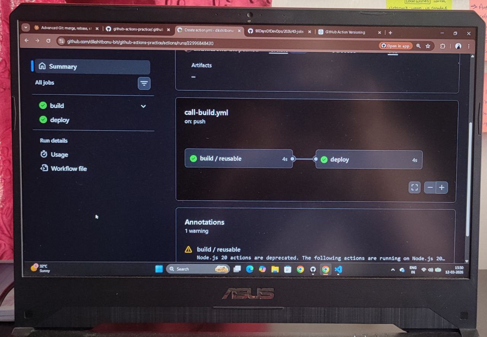

# Day 46 – Reusable Workflows & Composite Actions

---

## Task 1: Understanding Concepts

### What is a Reusable Workflow?

A workflow that can be called by other workflows like a function.

**Key points:**
- Contains complete jobs
- Triggered by `workflow_call`
- Can accept inputs, secrets, and return outputs
- Defined in `.github/workflows/`

### What is `workflow_call` Trigger?

Event that allows a workflow to be called by another workflow.
```yaml
on:
  workflow_call:  # Makes this workflow callable
```

Not triggered by push/PR/schedule. Only by other workflows.

### How is it Different from Regular Actions?

**Regular action (`uses:`):**
```yaml
steps:
  - uses: actions/checkout@v4  # Runs in a step
```

**Reusable workflow:**
```yaml
jobs:
  build:
    uses: ./.github/workflows/reusable.yml  # Runs entire job(s)
```

**Key difference:**
- Actions = steps within a job
- Reusable workflows = entire jobs

### Where Must Reusable Workflows Live?

**Must be:** `.github/workflows/` directory

**Same repo:**
```yaml
uses: ./.github/workflows/reusable.yml
```

**Different repo:**
```yaml
uses: org/repo/.github/workflows/reusable.yml@main
```

---

## Task 2: Create Reusable Workflow

### .github/workflows/reusable-build.yml
```yaml
name: Reusable Build Workflow

on:
  workflow_call:
    inputs:
      app_name:
        description: 'Application name'
        required: true
        type: string
      
      environment:
        description: 'Deployment environment'
        required: true
        type: string
        default: 'staging'
    
    secrets:
      docker_token:
        required: true

jobs:
  build:
    runs-on: ubuntu-latest
    
    steps:
      - name: Checkout code
        uses: actions/checkout@v4
      
      - name: Print build info
        run: |
          echo "Building ${{ inputs.app_name }} for ${{ inputs.environment }}"
          echo "Repository: ${{ github.repository }}"
      
      - name: Verify secret
        run: |
          if [ -n "${{ secrets.docker_token }}" ]; then
            echo "Docker token is set: true"
          else
            echo "Docker token is set: false"
          fi
```

**This workflow cannot run alone.** Needs a caller.

---

## Task 3: Create Caller Workflow

### .github/workflows/call-build.yml
```yaml
name: Call Reusable Build

on:
  push:
    branches: [main]
  workflow_dispatch:

jobs:
  build:
    uses: ./.github/workflows/reusable-build.yml
    with:
      app_name: "my-web-app"
      environment: "production"
    secrets:
      docker_token: ${{ secrets.DOCKER_TOKEN }}
```

**Push to main.**

**Actions tab shows:**
- Workflow: "Call Reusable Build"
- Job: "build / build" (caller / reusable)
- Output: "Building my-web-app for production"

---

## Task 4: Add Outputs

### Updated .github/workflows/reusable-build.yml
```yaml
name: Reusable Build Workflow

on:
  workflow_call:
    inputs:
      app_name:
        description: 'Application name'
        required: true
        type: string
      
      environment:
        description: 'Deployment environment'
        required: true
        type: string
        default: 'staging'
    
    secrets:
      docker_token:
        required: true
    
    outputs:
      build_version:
        description: 'Generated build version'
        value: ${{ jobs.build.outputs.version }}

jobs:
  build:
    runs-on: ubuntu-latest
    outputs:
      version: ${{ steps.generate-version.outputs.version }}
    
    steps:
      - name: Checkout code
        uses: actions/checkout@v4
      
      - name: Generate version
        id: generate-version
        run: |
          SHORT_SHA=${GITHUB_SHA:0:7}
          VERSION="v1.0-$SHORT_SHA"
          echo "version=$VERSION" >> $GITHUB_OUTPUT
          echo "Generated version: $VERSION"
      
      - name: Print build info
        run: |
          echo "Building ${{ inputs.app_name }} for ${{ inputs.environment }}"
          echo "Version: ${{ steps.generate-version.outputs.version }}"
      
      - name: Verify secret
        run: |
          if [ -n "${{ secrets.docker_token }}" ]; then
            echo "Docker token is set: true"
          else
            echo "Docker token is set: false"
          fi
```

### Updated .github/workflows/call-build.yml
```yaml
name: Call Reusable Build

on:
  push:
    branches: [main]
  workflow_dispatch:

jobs:
  build:
    uses: ./.github/workflows/reusable-build.yml
    with:
      app_name: "my-web-app"
      environment: "production"
    secrets:
      docker_token: ${{ secrets.DOCKER_TOKEN }}
  
  deploy:
    runs-on: ubuntu-latest
    needs: build
    steps:
      - name: Print build version
        run: |
          echo "Deploying version: ${{ needs.build.outputs.build_version }}"
          echo "Build completed successfully"
```

**Output flow:**
1. Reusable workflow generates: `v1.0-abc1234`
2. Exposes as output: `build_version`
3. Caller reads: `needs.build.outputs.build_version`
4. Deploy job prints: `Deploying version: v1.0-abc1234`

---

## Task 5: Create Composite Action

### .github/actions/setup-and-greet/action.yml
```yaml
name: 'Setup and Greet'
description: 'Greet user and display system info'

inputs:
  name:
    description: 'Name to greet'
    required: true
  
  language:
    description: 'Language for greeting'
    required: false
    default: 'en'

outputs:
  greeted:
    description: 'Whether greeting was successful'
    value: ${{ steps.greet.outputs.greeted }}

runs:
  using: 'composite'
  steps:
    - name: Greet user
      id: greet
      shell: bash
      run: |
        case "${{ inputs.language }}" in
          en)
            echo "Hello, ${{ inputs.name }}!"
            ;;
          es)
            echo "Hola, ${{ inputs.name }}!"
            ;;
          fr)
            echo "Bonjour, ${{ inputs.name }}!"
            ;;
          *)
            echo "Hi, ${{ inputs.name }}!"
            ;;
        esac
        echo "greeted=true" >> $GITHUB_OUTPUT
    
    - name: Display system info
      shell: bash
      run: |
        echo "Current date: $(date)"
        echo "Runner OS: ${{ runner.os }}"
        echo "Runner architecture: ${{ runner.arch }}"
```

### Use Composite Action

### .github/workflows/use-composite.yml
```yaml
name: Use Composite Action

on:
  workflow_dispatch:

jobs:
  greet:
    runs-on: ubuntu-latest
    
    steps:
      - name: Checkout code
        uses: actions/checkout@v4
      
      - name: Greet in English
        id: greet-en
        uses: ./.github/actions/setup-and-greet
        with:
          name: 'DevOps Engineer'
          language: 'en'
      
      - name: Greet in Spanish
        uses: ./.github/actions/setup-and-greet
        with:
          name: 'Ingeniero'
          language: 'es'
      
      - name: Check if greeted
        run: |
          echo "Greeted successfully: ${{ steps.greet-en.outputs.greeted }}"
```

**Output:**
```
Hello, DevOps Engineer!
Current date: Wed Jan 15 14:30:00 UTC 2025
Runner OS: Linux
Runner architecture: X64

Hola, Ingeniero!
Current date: Wed Jan 15 14:30:01 UTC 2025
Runner OS: Linux
Runner architecture: X64

Greeted successfully: true
```

---

## Task 6: Comparison Table

| Aspect | Reusable Workflow | Composite Action |
|--------|-------------------|------------------|
| **Triggered by** | `workflow_call` | `uses:` in a step |
| **Can contain jobs** | Yes (multiple jobs) | No (steps only) |
| **Can contain multiple steps** | Yes (within jobs) | Yes |
| **Lives where** | `.github/workflows/` | `.github/actions/` or any directory |
| **Can accept secrets directly** | Yes | No (must pass via env or inputs) |
| **Best for** | Complete CI/CD pipelines, multi-job workflows, sharing workflows across repos | Reusable step sequences, setup tasks, utility functions |
| **Called at level** | Job level | Step level |
| **Can use runners** | Yes (defines `runs-on`) | No (uses caller's runner) |
| **Can have matrix** | Yes | No |
| **Can have conditions** | Yes (job level) | No (applied by caller) |
| **Cross-repo usage** | Yes (`org/repo/.github/workflows/file.yml@ref`) | Yes (`org/repo/path/to/action@ref`) |

---

## When to Use Each

### Use Reusable Workflow When:

- Need multiple jobs
- Require different runners
- Want to share complete CI/CD pipeline
- Need job-level parallelism
- Require secrets at job level

**Example:**
```yaml
# Reusable workflow for full build-test-deploy
jobs:
  build:
    runs-on: ubuntu-latest
  test:
    runs-on: ubuntu-latest
    needs: build
  deploy:
    runs-on: ubuntu-latest
    needs: test
```

### Use Composite Action When:

- Reusing step sequences
- Setup/configuration tasks
- Utility functions
- Simple, focused functionality
- Want to distribute as package

**Example:**
```yaml
# Composite action for Node.js setup
steps:
  - run: node --version
  - run: npm ci
  - run: npm run build
```

---

## Real-World Examples

### Reusable Workflow: Docker Build

**.github/workflows/docker-build-reusable.yml:**
```yaml
name: Reusable Docker Build

on:
  workflow_call:
    inputs:
      image_name:
        required: true
        type: string
      dockerfile_path:
        required: false
        type: string
        default: './Dockerfile'
    secrets:
      docker_username:
        required: true
      docker_token:
        required: true
    outputs:
      image_tag:
        value: ${{ jobs.build.outputs.tag }}

jobs:
  build:
    runs-on: ubuntu-latest
    outputs:
      tag: ${{ steps.meta.outputs.tags }}
    
    steps:
      - uses: actions/checkout@v4
      
      - uses: docker/login-action@v3
        with:
          username: ${{ secrets.docker_username }}
          password: ${{ secrets.docker_token }}
      
      - id: meta
        uses: docker/metadata-action@v5
        with:
          images: ${{ inputs.image_name }}
          tags: type=sha,format=short
      
      - uses: docker/build-push-action@v5
        with:
          context: .
          file: ${{ inputs.dockerfile_path }}
          push: true
          tags: ${{ steps.meta.outputs.tags }}
```

**Caller:**
```yaml
jobs:
  build-frontend:
    uses: ./.github/workflows/docker-build-reusable.yml
    with:
      image_name: company/frontend
      dockerfile_path: ./frontend/Dockerfile
    secrets:
      docker_username: ${{ secrets.DOCKER_USERNAME }}
      docker_token: ${{ secrets.DOCKER_TOKEN }}
  
  build-backend:
    uses: ./.github/workflows/docker-build-reusable.yml
    with:
      image_name: company/backend
      dockerfile_path: ./backend/Dockerfile
    secrets:
      docker_username: ${{ secrets.DOCKER_USERNAME }}
      docker_token: ${{ secrets.DOCKER_TOKEN }}
```

---

### Composite Action: Setup Node with Cache

**.github/actions/setup-node-cached/action.yml:**
```yaml
name: 'Setup Node.js with Cache'
description: 'Install Node.js and cache dependencies'

inputs:
  node-version:
    description: 'Node.js version'
    required: false
    default: '18'

runs:
  using: 'composite'
  steps:
    - name: Setup Node.js
      uses: actions/setup-node@v4
      with:
        node-version: ${{ inputs.node-version }}
    
    - name: Cache dependencies
      uses: actions/cache@v4
      with:
        path: ~/.npm
        key: npm-${{ runner.os }}-${{ hashFiles('**/package-lock.json') }}
        restore-keys: npm-${{ runner.os }}-
    
    - name: Install dependencies
      shell: bash
      run: npm ci
```

**Usage:**
```yaml
steps:
  - uses: actions/checkout@v4
  - uses: ./.github/actions/setup-node-cached
    with:
      node-version: '20'
  - run: npm test
```

---

## Key Differences in Practice

### Reusable Workflow
```yaml
# Caller
jobs:
  call-build:
    uses: ./.github/workflows/build.yml  # Job level
    with:
      env: prod
```

**Runs as:** Separate job in workflow graph

### Composite Action
```yaml
# Caller
jobs:
  build:
    steps:
      - uses: ./.github/actions/setup  # Step level
        with:
          version: '1.0'
```

**Runs as:** Steps within existing job

---

## Advanced: Cross-Repo Reusable Workflows

### Central Workflows Repo

**Org setup:**
```
org/workflows-repo/
└── .github/workflows/
    ├── docker-build.yml
    ├── terraform-deploy.yml
    └── security-scan.yml
```

**Any repo in org:**
```yaml
jobs:
  build:
    uses: org/workflows-repo/.github/workflows/docker-build.yml@main
    with:
      image: myapp
    secrets: inherit  # Pass all secrets
```

**Benefits:**
- Central workflow management
- Consistent pipelines across repos
- Update once, affects all repos
- Governance and compliance

---

## Secrets Handling

### Reusable Workflow

**Explicit:**
```yaml
secrets:
  token: ${{ secrets.MY_TOKEN }}
```

**Inherit all:**
```yaml
secrets: inherit
```

### Composite Action

**Cannot accept secrets directly.** Pass via inputs or env:
```yaml
- uses: ./.github/actions/deploy
  env:
    API_KEY: ${{ secrets.API_KEY }}
```

---

## Outputs Flow

### Reusable Workflow
```yaml
# Reusable workflow
outputs:
  version:
    value: ${{ jobs.build.outputs.ver }}

jobs:
  build:
    outputs:
      ver: ${{ steps.gen.outputs.ver }}
    steps:
      - id: gen
        run: echo "ver=1.0.0" >> $GITHUB_OUTPUT

# Caller
- run: echo "${{ needs.build.outputs.version }}"
```

### Composite Action
```yaml
# Action
outputs:
  result:
    value: ${{ steps.check.outputs.result }}

steps:
  - id: check
    run: echo "result=success" >> $GITHUB_OUTPUT

# Caller
- id: my-action
  uses: ./.github/actions/check
- run: echo "${{ steps.my-action.outputs.result }}"
```

---

## Key Takeaways

**Reusable Workflows:**
- Complete jobs/pipelines
- Called at job level
- Can have multiple jobs
- Accept secrets directly
- Best for full CI/CD flows

**Composite Actions:**
- Step sequences
- Called at step level
- Single runner context
- No direct secrets
- Best for utilities

**Both:**
- Reduce duplication
- Improve maintainability
- Enable standardization
- Can be shared across repos

**Choose based on:**
- Reusable workflow = need jobs/runners/secrets
- Composite action = need step grouping

---

