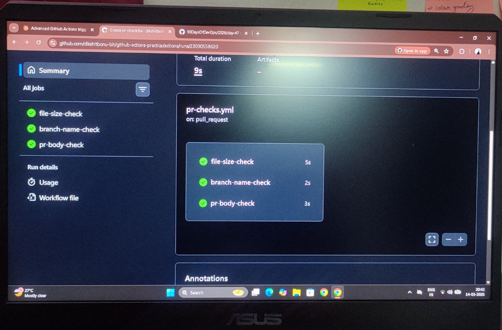

# Day 47 – Advanced Triggers

---

## Task 1: PR Lifecycle

### .github/workflows/pr-lifecycle.yml
```yaml
name: PR Lifecycle

on:
  pull_request:
    types: [opened, synchronize, reopened, closed]

jobs:
  pr-events:
    runs-on: ubuntu-latest
    
    steps:
      - name: Print event info
        run: |
          echo "Event type: ${{ github.event.action }}"
          echo "PR title: ${{ github.event.pull_request.title }}"
          echo "PR author: ${{ github.event.pull_request.user.login }}"
          echo "Source branch: ${{ github.head_ref }}"
          echo "Target branch: ${{ github.base_ref }}"
      
      - name: PR merged
        if: github.event.pull_request.merged == true
        run: echo "PR was merged!"
```

---

## Task 2: PR Validation

### .github/workflows/pr-checks.yml
```yaml
name: PR Checks

on:
  pull_request:
    branches: [main]

jobs:
  file-size-check:
    runs-on: ubuntu-latest
    steps:
      - uses: actions/checkout@v4
      
      - name: Check file sizes
        run: |
          find . -type f -size +1M -not -path "./.git/*" | while read file; do
            echo "Error: $file exceeds 1MB"
            exit 1
          done
  
  branch-name-check:
    runs-on: ubuntu-latest
    steps:
      - name: Validate branch name
        run: |
          BRANCH="${{ github.head_ref }}"
          if [[ ! "$BRANCH" =~ ^(feature|fix|docs)/ ]]; then
            echo "Error: Branch must start with feature/, fix/, or docs/"
            exit 1
          fi
          echo "Branch name valid: $BRANCH"
  
  pr-body-check:
    runs-on: ubuntu-latest
    steps:
      - name: Check PR description
        run: |
          BODY="${{ github.event.pull_request.body }}"
          if [ -z "$BODY" ]; then
            echo "Warning: PR description is empty"
          else
            echo "PR has description"
          fi
```

---

## Task 3: Scheduled Workflows

### .github/workflows/scheduled-tasks.yml
```yaml
name: Scheduled Tasks

on:
  schedule:
    - cron: '30 2 * * 1'    # Every Monday 2:30 AM UTC
    - cron: '0 */6 * * *'   # Every 6 hours
  workflow_dispatch:

jobs:
  health-check:
    runs-on: ubuntu-latest
    
    steps:
      - name: Print schedule
        run: echo "Triggered by: ${{ github.event.schedule }}"
      
      - name: Health check
        run: |
          HTTP_CODE=$(curl -s -o /dev/null -w "%{http_code}" https://example.com)
          if [ $HTTP_CODE -eq 200 ]; then
            echo "Health check passed: $HTTP_CODE"
          else
            echo "Health check failed: $HTTP_CODE"
            exit 1
          fi
```

### Cron Expressions

**Every weekday at 9 AM IST (3:30 AM UTC):**
```
30 3 * * 1-5
```

**First day of every month at midnight:**
```
0 0 1 * *
```

**Why delays/skips on inactive repos:**
GitHub disables scheduled workflows on repos with no activity for 60 days to save resources.

---

## Task 4: Path & Branch Filters

### .github/workflows/smart-triggers.yml
```yaml
name: Smart Triggers

on:
  push:
    branches:
      - main
      - 'release/**'
    paths:
      - 'src/**'
      - 'app/**'

jobs:
  build:
    runs-on: ubuntu-latest
    steps:
      - uses: actions/checkout@v4
      - run: echo "Code changed in src/ or app/"
```

### .github/workflows/ignore-docs.yml
```yaml
name: Ignore Docs

on:
  push:
    paths-ignore:
      - '**.md'
      - 'docs/**'

jobs:
  build:
    runs-on: ubuntu-latest
    steps:
      - uses: actions/checkout@v4
      - run: echo "Non-doc files changed"
```

**When to use:**
- `paths`: Only run when specific files change (save CI minutes)
- `paths-ignore`: Skip when only docs/config change (avoid unnecessary runs)

---

## Task 5: Workflow Chaining

### .github/workflows/tests.yml
```yaml
name: Run Tests

on:
  push:

jobs:
  test:
    runs-on: ubuntu-latest
    steps:
      - uses: actions/checkout@v4
      - run: echo "Running tests"
      - run: npm test || echo "Tests passed"
```

### .github/workflows/deploy-after-tests.yml
```yaml
name: Deploy After Tests

on:
  workflow_run:
    workflows: ["Run Tests"]
    types: [completed]

jobs:
  deploy:
    runs-on: ubuntu-latest
    if: github.event.workflow_run.conclusion == 'success'
    
    steps:
      - name: Deploy
        run: echo "Deploying after successful tests"
      
      - name: Failed warning
        if: github.event.workflow_run.conclusion != 'success'
        run: |
          echo "Tests failed, not deploying"
          exit 1
```

---

## Task 6: External Triggers

### .github/workflows/external-trigger.yml
```yaml
name: External Trigger

on:
  repository_dispatch:
    types: [deploy-request]

jobs:
  deploy:
    runs-on: ubuntu-latest
    
    steps:
      - name: Print payload
        run: |
          echo "Environment: ${{ github.event.client_payload.environment }}"
          echo "Triggered externally"
```

### Trigger Command
```bash
gh api repos/OWNER/REPO/dispatches \
  -f event_type=deploy-request \
  -f client_payload='{"environment":"production"}'
```

**When to use:**
- Slack bot triggers deploy
- Monitoring tool triggers rollback
- External service starts workflow
- Custom dashboard triggers jobs

---

## workflow_run vs workflow_call

**workflow_run:**
- Triggers AFTER another workflow completes
- Async (doesn't wait)
- Separate workflow run
- Access to triggering workflow's status

**workflow_call:**
- Called BY another workflow as a job
- Sync (waits for completion)
- Part of caller's run
- Reusable workflow pattern

---

## Screenshot


