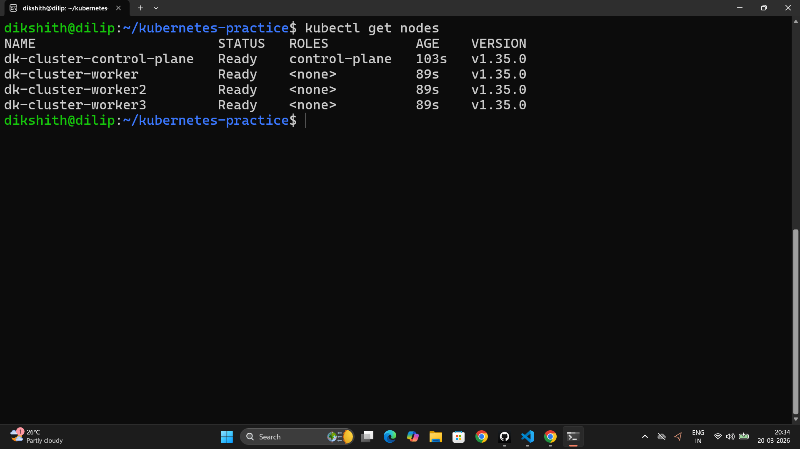
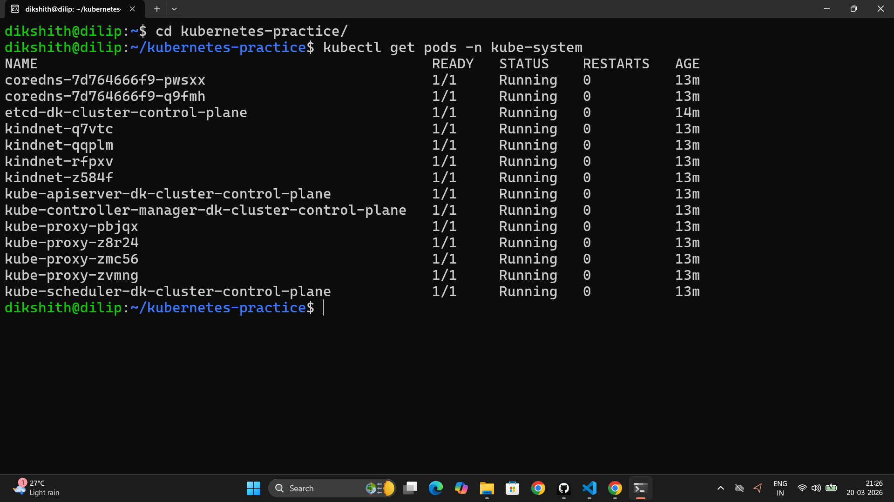

# Day 50 – Kubernetes Architecture and Cluster Setup

---

## Task 1 – The Kubernetes Story

Kubernetes was created because Docker solves running one container on one machine — but production systems run hundreds of containers across dozens of servers. Someone needs to decide where each container runs, restart it if it crashes, scale it up under load, and route traffic to it. Docker alone cannot do any of that. That is the problem Kubernetes solves.

Kubernetes was created by Google, originally inspired by an internal Google system called Borg — the same system that ran Gmail and Google Search at massive scale for years. Google open-sourced it in 2014 and donated it to the CNCF (Cloud Native Computing Foundation).

The name "Kubernetes" comes from ancient Greek — it means **helmsman** or **pilot**, the person who steers a ship. The wheel logo is a direct reference to this. Often shortened to **k8s** (k + 8 letters + s).

---

## Task 2 – Kubernetes Architecture

```
┌─────────────────────────────────────────────────────────────────┐
│                        CONTROL PLANE                            │
│                                                                 │
│  ┌─────────────────┐   ┌──────┐   ┌───────────┐   ┌─────────┐ │
│  │   API Server    │   │ etcd │   │ Scheduler │   │Controller│ │
│  │  (front door)   │   │ (DB) │   │(where to  │   │ Manager │ │
│  │  every command  │   │cluster   │ run pods) │   │(desired │ │
│  │  goes through it│   │ state│   │           │   │  state) │ │
│  └────────┬────────┘   └──────┘   └───────────┘   └─────────┘ │
└───────────┼─────────────────────────────────────────────────────┘
            │ (communicates down to worker nodes)
┌───────────┼─────────────────────────────────────────────────────┐
│           │            WORKER NODE                              │
│  ┌────────▼────────┐   ┌───────────┐   ┌──────────────────┐   │
│  │     kubelet     │   │kube-proxy │   │Container Runtime │   │
│  │ (agent on node) │   │(networking│   │  (containerd /   │   │
│  │ talks to API    │   │  rules)   │   │    CRI-O)        │   │
│  │ manages pods    │   │pod traffic│   │  actually runs   │   │
│  └─────────────────┘   └───────────┘   │   containers     │   │
│                                         └──────────────────┘   │
│   ┌──────────────────────────────────────────────────────────┐  │
│   │  POD  │  POD  │  POD  │  POD  │  POD  │  POD  │  POD   │  │
│   └──────────────────────────────────────────────────────────┘  │
└─────────────────────────────────────────────────────────────────┘
```

**What happens when you run `kubectl apply -f pod.yaml`:**

1. `kubectl` sends the request to the **API Server**
2. API Server validates and writes the desired state to **etcd**
3. **Scheduler** sees the new pod has no node assigned — picks the best node
4. API Server tells the **kubelet** on that node to start the pod
5. **kubelet** tells the **Container Runtime** (containerd) to pull the image and run it
6. **kube-proxy** updates networking rules so the pod is reachable

**If the API Server goes down:** Nothing can be changed. Existing pods keep running (kubelet manages them independently) but you cannot deploy, scale, or delete anything.

**If a worker node goes down:** The Controller Manager detects it. Pods on that node are rescheduled to healthy nodes automatically.

---


## Task 4 – Local Cluster Setup

**Chose: `kind` (Kubernetes in Docker)**

Why: Already have Docker running. kind spins up a cluster in seconds using containers as nodes — no VM overhead, no separate hypervisor needed. Perfect for local dev and CI.




---

## Task 5 – Explore the Cluster

```bash
kubectl cluster-info
kubectl get nodes
kubectl describe node <node-name>
kubectl get namespaces
kubectl get pods -A
kubectl get pods -n kube-system
```

**kube-system pods and what they do:**

| Pod | Component | What it does |
|-----|-----------|--------------|
| `etcd-*` | etcd | Stores all cluster state — the source of truth |
| `kube-apiserver-*` | API Server | Every kubectl command hits this first |
| `kube-scheduler-*` | Scheduler | Decides which node a pod runs on |
| `kube-controller-manager-*` | Controller Manager | Watches state, triggers reconciliation |
| `coredns-*` | CoreDNS | DNS resolution inside the cluster |
| `kube-proxy-*` | kube-proxy | Manages network rules for pod-to-pod traffic |
| `kindnet-*` | CNI Plugin | kind's network plugin for pod networking |



Every component from the architecture diagram in Task 2 is running as a pod inside the cluster — Kubernetes manages itself using Kubernetes.

---

## Task 6 – Cluster Lifecycle

```bash
# Delete
kind delete cluster --name devops-cluster

# Recreate
kind create cluster --name devops-cluster

# Verify
kubectl get nodes

# Context commands
kubectl config current-context
kubectl config get-contexts
kubectl config view
```

**What is a kubeconfig?**

A kubeconfig is a YAML file that tells `kubectl` which cluster to connect to, how to authenticate, and which namespace to use by default. It stores multiple cluster "contexts" so you can switch between clusters (local, staging, prod) with one command.

Stored at: `~/.kube/config`

When `kind create cluster` runs, it automatically writes a new context into this file and sets it as current — which is why `kubectl` just works immediately after cluster creation.