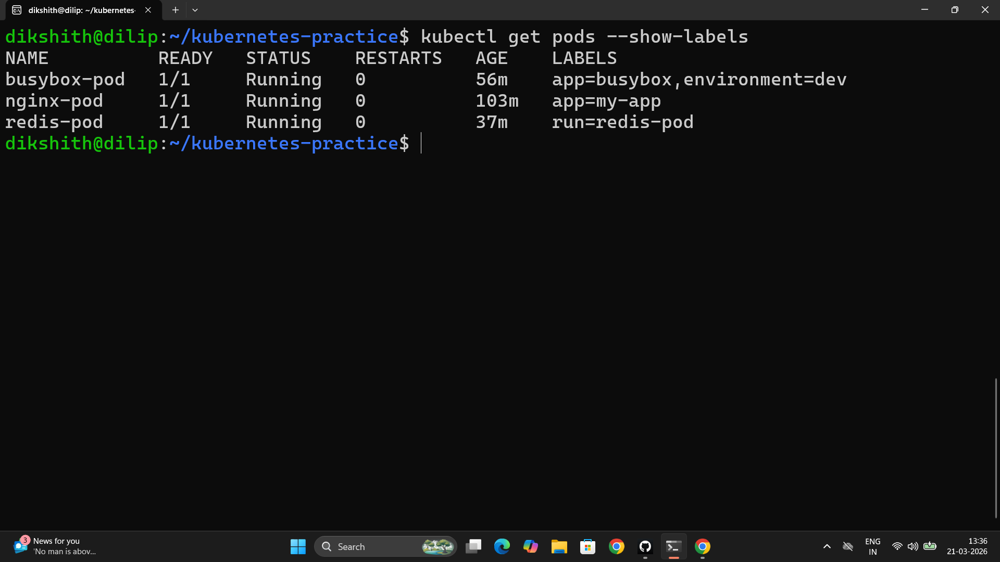

# Day 51 – Kubernetes Manifests and First Pods

---

## The Four Required Fields of a Kubernetes Manifest

| Field | What it does |
|-------|-------------|
| `apiVersion` | Which Kubernetes API version to use. Pods use `v1`. Deployments use `apps/v1`. |
| `kind` | The resource type — `Pod`, `Deployment`, `Service`, etc. |
| `metadata` | Identity of the resource. `name` is required. `labels` are optional key-value pairs for organization and selection. |
| `spec` | The desired state — what containers to run, which images, ports, commands, volumes, etc. |

---

## Task 1 – Nginx Pod

**File:** `nginx-pod.yaml`

```yaml
apiVersion: v1
kind: Pod
metadata:
  name: nginx-pod
  labels:
    app: nginx
spec:
  containers:
  - name: nginx
    image: nginx:latest
    ports:
    - containerPort: 80
```

```bash
kubectl apply -f nginx-pod.yaml
kubectl get pods
kubectl get pods -o wide
kubectl describe pod nginx-pod
kubectl logs nginx-pod
kubectl exec -it nginx-pod -- /bin/bash
# inside:
curl localhost:80
exit
```



---

## Task 2 – BusyBox Pod

**File:** `busybox-pod.yaml`

```yaml
apiVersion: v1
kind: Pod
metadata:
  name: busybox-pod
  labels:
    app: busybox
    environment: dev
spec:
  containers:
  - name: busybox
    image: busybox:latest
    command: ["sh", "-c", "echo Hello from BusyBox && sleep 3600"]
```

```bash
kubectl apply -f busybox-pod.yaml
kubectl get pods
kubectl logs busybox-pod
# Output: Hello from BusyBox
```

The `command` field is critical here — BusyBox has no long-running process by default. Without `sleep 3600`, the container exits immediately and Kubernetes puts the pod into `CrashLoopBackOff`, restarting it indefinitely.

---

## Task 3 – Imperative vs Declarative

**Imperative** — you tell Kubernetes what to do right now:
```bash
kubectl run redis-pod --image=redis:latest
```

**Declarative** — you describe the desired state in a file, Kubernetes figures out how to get there:
```bash
kubectl apply -f nginx-pod.yaml
```

| | Imperative | Declarative |
|---|---|---|
| How | `kubectl run` | `kubectl apply -f` |
| Reproducible | No — no file to re-run | Yes — YAML is source of truth |
| Production use | Debugging / quick tests | Everything |
| GitOps compatible | No | Yes |

**Extract the YAML Kubernetes generated:**
```bash
kubectl get pod redis-pod -o yaml
```

**Scaffold a manifest without creating anything:**
```bash
kubectl run test-pod --image=nginx --dry-run=client -o yaml > test-pod.yaml
```

The dry-run output includes extra fields Kubernetes auto-adds: `uid`, `resourceVersion`, `creationTimestamp`, `status` block. Your hand-written manifest only has what matters — Kubernetes fills in the rest.

---

## Task 4 – Validate Before Applying

```bash
# Client-side validation (checks YAML structure)
kubectl apply -f nginx-pod.yaml --dry-run=client

# Server-side validation (checks against cluster API — more thorough)
kubectl apply -f nginx-pod.yaml --dry-run=server
```

**Error when `image` field is missing:**
```
error: error validating "nginx-pod.yaml": error validating data:
ValidationError(Pod.spec.containers[0]): missing required field "image"
```

Kubernetes enforces required fields at the API level — a Pod spec without an image is rejected before anything gets scheduled.

---

## Task 5 – Pod Labels and Filtering

**File:** `multi-label-pod.yaml`

```yaml
apiVersion: v1
kind: Pod
metadata:
  name: multi-label-pod
  labels:
    app: api-service
    environment: staging
    team: backend
spec:
  containers:
  - name: nginx
    image: nginx:latest
    ports:
    - containerPort: 80
```

```bash
kubectl apply -f multi-label-pod.yaml

# List all pods with labels
kubectl get pods --show-labels

# Filter by label
kubectl get pods -l app=nginx
kubectl get pods -l environment=dev
kubectl get pods -l team=backend

# Add a label to existing pod
kubectl label pod nginx-pod environment=production

# Verify
kubectl get pods --show-labels

# Remove a label (note the trailing dash)
kubectl label pod nginx-pod environment-
```

Labels have no built-in meaning to Kubernetes — they are arbitrary key-value pairs. Their power comes from **selectors**: Services, Deployments, and other resources use label selectors to target pods.

---

## Task 6 – Clean Up

```bash
kubectl delete pod nginx-pod
kubectl delete pod busybox-pod
kubectl delete pod redis-pod
kubectl delete pod multi-label-pod

# Or via file
kubectl delete -f nginx-pod.yaml

# Verify
kubectl get pods
```

**What happens when you delete a standalone Pod?**

It is gone permanently. There is no controller watching it — no Deployment, no ReplicaSet — so nothing recreates it. This is the core reason bare Pods are never used in production. In production, a Deployment wraps the pod spec and a ReplicaSet controller ensures the desired number of pods always exists. If a pod dies, the controller creates a new one automatically.