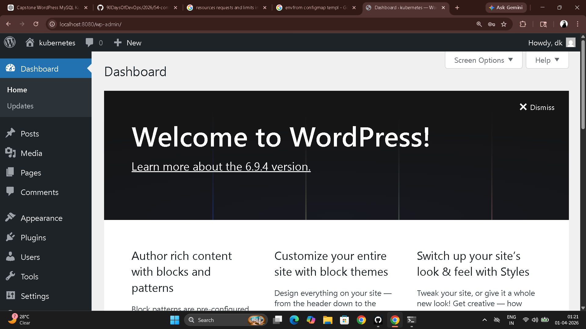
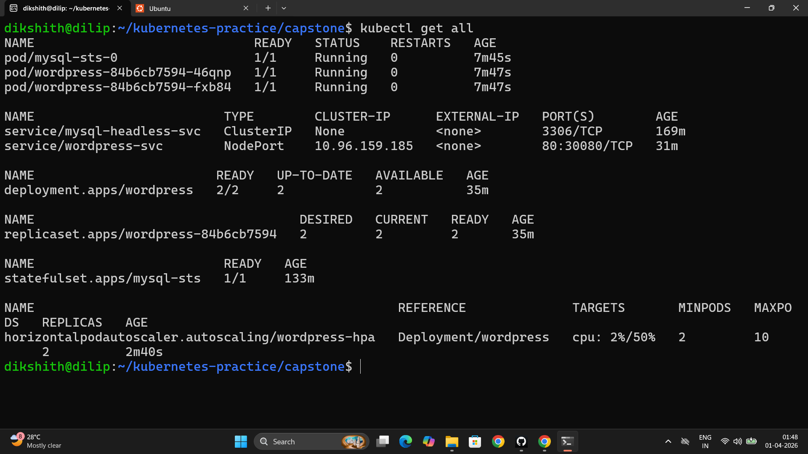

# Day 60 – Capstone: WordPress + MySQL on Kubernetes

---

## Architecture

```
                        Internet / Browser
                               │
                        port 30080 (NodePort)
                               │
                    ┌──────────▼──────────┐
                    │  WordPress Service  │
                    │  (NodePort :30080)  │
                    └──────────┬──────────┘
                               │
               ┌───────────────┴───────────────┐
               │                               │
    ┌──────────▼──────────┐       ┌────────────▼────────────┐
    │   wordpress-pod-0   │       │   wordpress-pod-1        │
    │  (Deployment)       │       │  (Deployment)            │
    │  envFrom: ConfigMap │       │  envFrom: ConfigMap      │
    │  secretKeyRef:Secret│       │  secretKeyRef: Secret    │
    │  liveness probe     │       │  liveness probe          │
    │  readiness probe    │       │  readiness probe         │
    └──────────┬──────────┘       └────────────┬────────────┘
               └──────────────┬────────────────┘
                              │
            mysql-0.mysql.capstone.svc.cluster.local:3306
                              │
                   ┌──────────▼──────────┐
                   │   MySQL Service     │
                   │  (Headless: None)   │
                   └──────────┬──────────┘
                              │
                   ┌──────────▼──────────┐
                   │      mysql-0        │
                   │   (StatefulSet)     │
                   │   envFrom: Secret   │
                   │   PVC: 1Gi          │
                   │   /var/lib/mysql    │
                   └─────────────────────┘
```

---

## Task 1 – Namespace

```bash
kubectl create namespace capstone
kubectl config set-context --current --namespace=capstone
```

---

## Task 2 – MySQL (StatefulSet + Headless Service + Secret)

**File:** `mysql-secret.yaml`

```yaml
apiVersion: v1
kind: Secret
metadata:
  name: mysql-secret
  namespace: capstone
stringData:
  MYSQL_ROOT_PASSWORD: rootpassword
  MYSQL_DATABASE: wordpress
  MYSQL_USER: wpuser
  MYSQL_PASSWORD: wppassword
```

**File:** `mysql-headless-service.yaml`

```yaml
apiVersion: v1
kind: Service
metadata:
  name: mysql
  namespace: capstone
spec:
  clusterIP: None
  selector:
    app: mysql
  ports:
  - port: 3306
    targetPort: 3306
```

**File:** `mysql-statefulset.yaml`

```yaml
apiVersion: apps/v1
kind: StatefulSet
metadata:
  name: mysql
  namespace: capstone
spec:
  serviceName: mysql
  replicas: 1
  selector:
    matchLabels:
      app: mysql
  template:
    metadata:
      labels:
        app: mysql
    spec:
      containers:
      - name: mysql
        image: mysql:8.0
        envFrom:
        - secretRef:
            name: mysql-secret
        resources:
          requests:
            cpu: 250m
            memory: 512Mi
          limits:
            cpu: 500m
            memory: 1Gi
        volumeMounts:
        - name: mysql-data
          mountPath: /var/lib/mysql
  volumeClaimTemplates:
  - metadata:
      name: mysql-data
    spec:
      accessModes: [ReadWriteOnce]
      resources:
        requests:
          storage: 1Gi
```

```bash
kubectl apply -f mysql-secret.yaml
kubectl apply -f mysql-headless-service.yaml
kubectl apply -f mysql-statefulset.yaml

# Verify MySQL is up
kubectl exec -it mysql-0 -n capstone -- mysql -u wpuser -pwppassword -e "SHOW DATABASES;"
# wordpress database should appear
```

---

## Task 3 – WordPress (Deployment + ConfigMap)

**File:** `wordpress-configmap.yaml`

```yaml
apiVersion: v1
kind: ConfigMap
metadata:
  name: wordpress-config
  namespace: capstone
data:
  WORDPRESS_DB_HOST: mysql-0.mysql.capstone.svc.cluster.local:3306
  WORDPRESS_DB_NAME: wordpress
```

**File:** `wordpress-deployment.yaml`

```yaml
apiVersion: apps/v1
kind: Deployment
metadata:
  name: wordpress
  namespace: capstone
spec:
  replicas: 2
  selector:
    matchLabels:
      app: wordpress
  template:
    metadata:
      labels:
        app: wordpress
    spec:
      containers:
      - name: wordpress
        image: wordpress:latest
        ports:
        - containerPort: 80
        envFrom:
        - configMapRef:
            name: wordpress-config
        env:
        - name: WORDPRESS_DB_USER
          valueFrom:
            secretKeyRef:
              name: mysql-secret
              key: MYSQL_USER
        - name: WORDPRESS_DB_PASSWORD
          valueFrom:
            secretKeyRef:
              name: mysql-secret
              key: MYSQL_PASSWORD
        resources:
          requests:
            cpu: 200m
            memory: 256Mi
          limits:
            cpu: 500m
            memory: 512Mi
        livenessProbe:
          httpGet:
            path: /wp-login.php
            port: 80
          initialDelaySeconds: 60
          periodSeconds: 10
          failureThreshold: 5
        readinessProbe:
          httpGet:
            path: /wp-login.php
            port: 80
          initialDelaySeconds: 30
          periodSeconds: 10
          failureThreshold: 3
```

```bash
kubectl apply -f wordpress-configmap.yaml
kubectl apply -f wordpress-deployment.yaml
kubectl get pods -n capstone
# wordpress-xxxx-0   1/1  Running
# wordpress-xxxx-1   1/1  Running
```

---

## Task 4 – Expose WordPress (NodePort Service)

**File:** `wordpress-service.yaml`

```yaml
apiVersion: v1
kind: Service
metadata:
  name: wordpress
  namespace: capstone
spec:
  type: NodePort
  selector:
    app: wordpress
  ports:
  - port: 80
    targetPort: 80
    nodePort: 30080
```

```bash
kubectl apply -f wordpress-service.yaml

# Minikube
minikube service wordpress -n capstone

# Kind
kubectl port-forward svc/wordpress 8080:80 -n capstone
# Access: http://localhost:8080
```



---

## Task 5 – Self-Healing and Persistence

```bash
# Delete a WordPress pod — Deployment recreates it
kubectl delete pod <wordpress-pod-name> -n capstone
kubectl get pods -n capstone -w
# New pod appears within seconds. Site stays up.

# Delete MySQL pod — StatefulSet recreates it with same PVC
kubectl delete pod mysql-0 -n capstone
kubectl get pods -n capstone -w
# mysql-0 comes back. Reconnects to same mysql-data-mysql-0 PVC.

# Verify blog post still exists after refresh
# WordPress data lives in the MySQL PVC — pod deletion changes nothing
```

**Result:** Blog post created before pod deletion was fully intact after both pods recovered. The PVC held the data. The pod is ephemeral. The storage is not.

---

## Task 6 – HPA for WordPress

**File:** `wordpress-hpa.yaml`

```yaml
apiVersion: autoscaling/v2
kind: HorizontalPodAutoscaler
metadata:
  name: wordpress-hpa
  namespace: capstone
spec:
  scaleTargetRef:
    apiVersion: apps/v1
    kind: Deployment
    name: wordpress
  minReplicas: 2
  maxReplicas: 10
  metrics:
  - type: Resource
    resource:
      name: cpu
      target:
        type: Utilization
        averageUtilization: 50
```

```bash
kubectl apply -f wordpress-hpa.yaml
kubectl get hpa -n capstone
kubectl get all -n capstone
```



---

## Task 7 – Helm Comparison (Bonus)

```bash
# Install WordPress stack with Helm in a separate namespace
helm install wp-helm bitnami/wordpress --namespace helm-compare --create-namespace

# Count resources
kubectl get all -n helm-compare | wc -l
```

| | Manual approach | Helm (Bitnami) |
|---|---|---|
| Commands to deploy | ~10 kubectl apply | 1 helm install |
| Customization | Full control over every field | values.yaml overrides |
| Database | MySQL 8.0 | MariaDB (compatible) |
| Resources created | ~8 objects you define | ~15 objects auto-generated |
| Transparency | You wrote it, you understand it | Abstracted — need to read chart source |
| Production suitability | Full control | Fast start, opinionated |

```bash
helm uninstall wp-helm -n helm-compare
kubectl delete namespace helm-compare
```

---

## Task 8 – Clean Up

```bash
kubectl get all -n capstone

kubectl delete namespace capstone
# Deletes everything: pods, services, deployments, configmaps, secrets, hpa

kubectl config set-context --current --namespace=default

kubectl get all -n capstone
# Error: namespace not found — everything gone
```

Deleting the namespace removes all namespaced resources inside it in one command. PVCs are also deleted because they are namespaced. The PV from static provisioning would remain — dynamic PVs follow the StorageClass reclaim policy (usually Delete).

---

## Concept Map

| Concept | Day Learned | Used for |
|---------|------------|---------|
| Namespace | 52 | Isolated `capstone` environment |
| Secret | 54 | MySQL credentials |
| ConfigMap | 54 | WordPress DB host and name |
| StatefulSet | 56 | MySQL with stable `mysql-0` identity |
| Headless Service | 56 | Stable DNS for MySQL pod |
| PVC / volumeClaimTemplates | 55 | MySQL data persistence |
| Deployment | 52 | WordPress with 2 replicas |
| Resource requests/limits | 57 | CPU and memory for all containers |
| Liveness probe | 57 | Detect broken WordPress containers |
| Readiness probe | 57 | Control traffic during startup |
| NodePort Service | 53 | Expose WordPress to browser |
| HPA | 58 | Autoscale WordPress under load |
| Helm | 59 | One-command alternative deployment |

---

## Reflection

**Hardest part:** Getting the WordPress DB host right. It must be the full StatefulSet DNS path — `mysql-0.mysql.capstone.svc.cluster.local:3306`. Any typo and WordPress silently fails to connect with no clear error in the pod logs.

**What clicked:** The StatefulSet + Headless Service combination. `mysql-0` comes back after deletion and immediately gets the same DNS name, the same PVC, and the same data. The WordPress pods reconnect without any config change. That's the whole point of StatefulSets demonstrated in one delete command.

**What to add for production:**
- TLS with cert-manager and an Ingress instead of NodePort
- WordPress PVC for `wp-content` uploads (currently ephemeral)
- MySQL replication with a primary + read replica StatefulSet
- Network policies to restrict pod-to-pod traffic
- External Secrets Operator for secrets from AWS Secrets Manager or Vault
- Prometheus + Grafana for monitoring