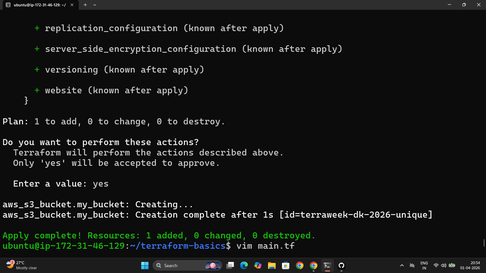
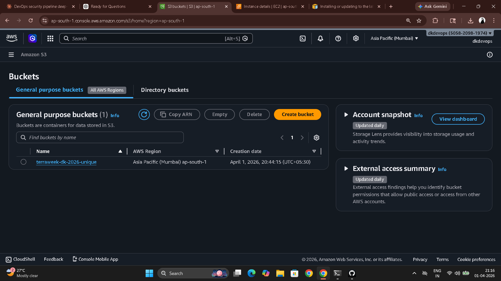
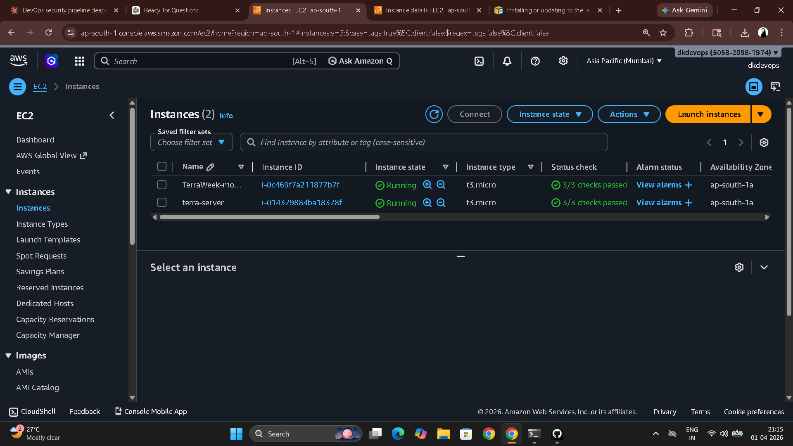

# Day 61 – Introduction to Terraform and Your First AWS Infrastructure

---

## Task 1 – Infrastructure as Code

**What IaC is and why it matters:**

Infrastructure as Code means defining your servers, networks, databases, and cloud resources in text files the same way you write application code — version-controlled, reviewable, repeatable. Instead of clicking through the AWS console to create a VPC or an EC2 instance, you write a `.tf` file, run one command, and the infrastructure appears. Run it again on a different account and you get the exact same result.

The problems it solves over manual console clicks: no more "works on my account" — the code is the documentation. No more configuration drift where production is slightly different from staging because someone changed something manually six months ago. No more "who created this resource and why" — the git history tells you. Disaster recovery goes from days to minutes.

**Terraform vs the alternatives:**

| Tool | Type | Cloud support | Language |
|------|------|--------------|----------|
| Terraform | Declarative IaC | Multi-cloud (AWS, GCP, Azure, +) | HCL |
| CloudFormation | Declarative IaC | AWS only | JSON/YAML |
| Ansible | Procedural config management | Multi-cloud | YAML |
| Pulumi | Declarative IaC | Multi-cloud | Python, JS, Go, etc. |

Terraform is **declarative** — you describe what you want (an S3 bucket, an EC2 instance), not the steps to create it. Terraform figures out the steps. It is **cloud-agnostic** — the same workflow (`init → plan → apply`) works whether you're provisioning AWS, GCP, Azure, or Kubernetes resources.

---

## Task 2 – Install Terraform and Configure AWS

```bash
# Linux
wget -O - https://apt.releases.hashicorp.com/gpg | sudo gpg --dearmor -o /usr/share/keyrings/hashicorp-archive-keyring.gpg
echo "deb [signed-by=/usr/share/keyrings/hashicorp-archive-keyring.gpg] https://apt.releases.hashicorp.com $(lsb_release -cs) main" | sudo tee /etc/apt/sources.list.d/hashicorp.list
sudo apt update && sudo apt install terraform

terraform -version

# Configure AWS CLI
aws configure
# AWS Access Key ID: <your key>
# AWS Secret Access Key: <your secret>
# Default region: ap-south-1
# Default output format: json

# Verify
aws sts get-caller-identity
```


---

## Task 3 – Create an S3 Bucket

```
mkdir terraform-basics && cd terraform-basics
```

**File:** `main.tf`

```hcl
terraform {
  required_providers {
    aws = {
      source  = "hashicorp/aws"
      version = "~> 5.0"
    }
  }
}

provider "aws" {
  region = "ap-south-1"
}

resource "aws_s3_bucket" "my_bucket" {
  bucket = "terraweek-dikshith-2026"

  tags = {
    Name        = "TerraWeek Bucket"
    Environment = "Dev"
  }
}
```

```bash
terraform init    # Downloads the AWS provider plugin into .terraform/
terraform plan    # Shows what will be created — no changes made yet
terraform apply   # Creates the S3 bucket (type 'yes')
```

**What `terraform init` downloaded:**

The `.terraform/` directory contains the downloaded AWS provider plugin — a binary that knows how to talk to the AWS API. It also creates `.terraform.lock.hcl` which pins the exact provider version so every team member and every CI run uses identical provider code.





---

## Task 4 – Add an EC2 Instance

Added to `main.tf`:

```hcl
resource "aws_instance" "my_instance" {
  ami           = "ami-0f5ee92e2d63afc18"  # Amazon Linux 2 - ap-south-1
  instance_type = "t2.micro"

  tags = {
    Name = "TerraWeek-Day1"
  }
}
```

```bash
terraform plan    # Shows: 1 to add (S3 bucket shows no changes)
terraform apply
```

**How Terraform knows the S3 bucket already exists:**

Terraform reads `terraform.tfstate` before every plan. The state file records every resource it has previously created with its current configuration. When Terraform plans, it compares the desired state (your `.tf` files) against the recorded state (`.tfstate`). The S3 bucket config hasn't changed, so Terraform shows `0 to change` for it and only adds the new EC2 instance.



---

## Task 5 – The State File

```bash
terraform show                                        # Human-readable current state
terraform state list                                  # Lists all managed resources
terraform state show aws_s3_bucket.my_bucket         # Detailed view of S3 bucket
terraform state show aws_instance.my_instance        # Detailed view of EC2 instance
```

**What the state file stores:**

For each resource: its type, name, all attributes (ARN, ID, region, tags, creation timestamp, etc.), dependencies on other resources, and the provider that manages it. It is the source of truth between your code and what actually exists in AWS.

**Why you must never manually edit the state file:**

The state file is JSON but it contains calculated checksums and dependency metadata. Manual edits corrupt the mapping between Terraform's view and AWS's reality — your next `apply` or `destroy` may create duplicates, fail to find existing resources, or delete things it shouldn't.

**Why the state file must not be committed to Git:**

It contains sensitive values in plaintext — database passwords, private IPs, secret ARNs. It also creates merge conflicts in team workflows. The production solution is remote state in an S3 bucket with DynamoDB locking (`terraform backend "s3"`) so the state is shared, locked during operations, and never touches a developer's machine.

Add to `.gitignore`:
```
*.tfstate
*.tfstate.backup
.terraform/
.terraform.lock.hcl
```

---

## Task 6 – Modify, Plan, and Destroy

Changed the EC2 tag in `main.tf`:

```hcl
tags = {
  Name = "TerraWeek-Modified"
}
```

```bash
terraform plan
```

**Plan symbols:**

| Symbol | Meaning |
|--------|---------|
| `+` | Resource will be created |
| `-` | Resource will be destroyed |
| `~` | Resource will be updated in-place |
| `-/+` | Resource will be destroyed and recreated |

Changing a tag is an **in-place update** (`~`) — AWS can update tags without replacing the instance. Changing the AMI ID would be a `-/+` destroy-and-recreate because you can't change the base image of a running instance.

```bash
terraform apply   # Tag updates in place

# Destroy everything
terraform destroy
# Both S3 bucket and EC2 instance gone — confirmed in AWS console
```

---

## Terraform Command Reference

| Command | What it does |
|---------|-------------|
| `terraform init` | Downloads providers and sets up the working directory |
| `terraform plan` | Shows a preview of what will change — no AWS calls made |
| `terraform apply` | Creates/updates/deletes resources to match desired state |
| `terraform destroy` | Destroys all resources managed by this config |
| `terraform show` | Human-readable view of current state |
| `terraform state list` | Lists all resources Terraform manages |
| `terraform fmt` | Auto-formats `.tf` files |
| `terraform validate` | Checks syntax without connecting to AWS |