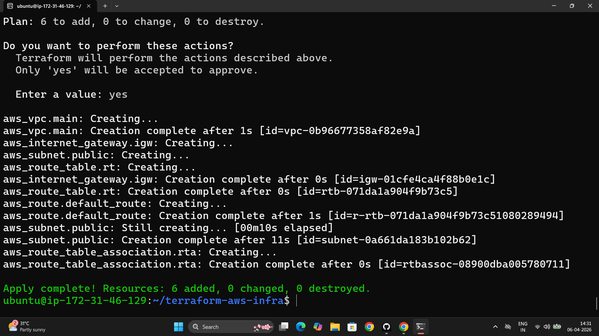
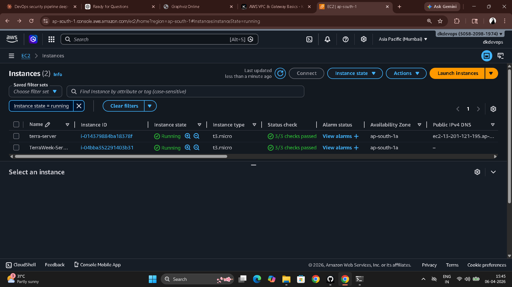
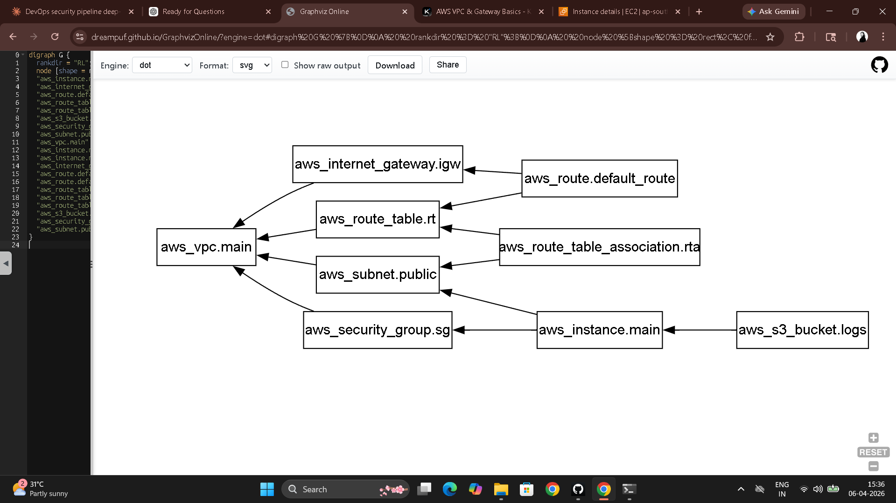

# Day 62 – Providers, Resources, and Dependencies

---

## Task 1 – The AWS Provider

**File:** `providers.tf`

```hcl
terraform {
  required_providers {
    aws = {
      source  = "hashicorp/aws"
      version = "~> 5.0"
    }
  }
}

provider "aws" {
  region = "ap-south-1"
}
```

```bash
terraform init
```

**Version constraint meanings:**

| Constraint | Meaning |
|------------|---------|
| `~> 5.0` | >= 5.0.0 and < 6.0.0 — patch + minor updates allowed |
| `>= 5.0` | Any version 5.0 or higher, including v6, v7, forever |
| `= 5.0.0` | Exactly 5.0.0 and nothing else |

`~> 5.0` is the production standard — bug fixes and minor features come automatically but breaking changes in a major version are blocked.

**`.terraform.lock.hcl`** records the exact provider version and checksums installed. Every team member and every CI run gets the identical provider binary on `terraform init`. Without it, `~> 5.0` could resolve to different patch versions on different machines.

---

## Task 2 – VPC from Scratch

**File:** `main.tf`

```hcl
# VPC — the isolated network container for all resources
resource "aws_vpc" "main" {
  cidr_block = "10.0.0.0/16"

  tags = {
    Name = "TerraWeek-VPC"
  }
}

# Subnet — a slice of the VPC IP range on a specific AZ
resource "aws_subnet" "public" {
  vpc_id                  = aws_vpc.main.id          # implicit dependency on VPC
  cidr_block              = "10.0.1.0/24"
  map_public_ip_on_launch = true

  tags = {
    Name = "TerraWeek-Public-Subnet"
  }
}

# Internet Gateway — the door between VPC and the public internet
resource "aws_internet_gateway" "igw" {
  vpc_id = aws_vpc.main.id                           # implicit dependency on VPC

  tags = {
    Name = "TerraWeek-IGW"
  }
}

# Route table — rules that direct traffic out of the subnet
resource "aws_route_table" "public" {
  vpc_id = aws_vpc.main.id                           # implicit dependency on VPC

  route {
    cidr_block = "0.0.0.0/0"
    gateway_id = aws_internet_gateway.igw.id         # implicit dependency on IGW
  }

  tags = {
    Name = "TerraWeek-RT"
  }
}

# Route table association — wire the route table to the subnet
resource "aws_route_table_association" "public" {
  subnet_id      = aws_subnet.public.id              # implicit dependency on subnet
  route_table_id = aws_route_table.public.id         # implicit dependency on route table
}
```

```bash
terraform plan    # 5 resources to create
terraform apply
```




---

## Task 3 – Implicit Dependencies

Terraform reads every attribute reference (`aws_vpc.main.id`) and builds a dependency graph before touching anything. It knows to create the VPC before the subnet because the subnet block literally contains `vpc_id = aws_vpc.main.id` — that reference IS the dependency.

**All implicit dependencies in this config:**

```
aws_subnet.public           → aws_vpc.main
aws_internet_gateway.igw    → aws_vpc.main
aws_route_table.public      → aws_vpc.main
                            → aws_internet_gateway.igw
aws_route_table_association → aws_subnet.public
                            → aws_route_table.public
```

**What would happen without the VPC:** AWS would reject the subnet API call — you can't create a subnet without a VPC ID. But Terraform's dependency graph prevents even attempting it. The subnet is never scheduled until `aws_vpc.main` is confirmed created.

---

## Task 4 – Security Group and EC2 Instance

Added to `main.tf`:

```hcl
# Security group — firewall rules for the EC2 instance
resource "aws_security_group" "web_sg" {
  name   = "TerraWeek-SG"
  vpc_id = aws_vpc.main.id

  ingress {
    from_port   = 22
    to_port     = 22
    protocol    = "tcp"
    cidr_blocks = ["0.0.0.0/0"]
  }

  ingress {
    from_port   = 80
    to_port     = 80
    protocol    = "tcp"
    cidr_blocks = ["0.0.0.0/0"]
  }

  egress {
    from_port   = 0
    to_port     = 0
    protocol    = "-1"
    cidr_blocks = ["0.0.0.0/0"]
  }

  tags = {
    Name = "TerraWeek-SG"
  }
}

# EC2 instance — runs inside the public subnet with a public IP
resource "aws_instance" "server" {
  ami                         = "ami-0f5ee92e2d63afc18"
  instance_type               = "t2.micro"
  subnet_id                   = aws_subnet.public.id
  vpc_security_group_ids      = [aws_security_group.web_sg.id]
  associate_public_ip_address = true

  tags = {
    Name = "TerraWeek-Server"
  }
}
```

```bash
terraform apply
```



---

## Task 5 – Explicit Dependencies with `depends_on`

```hcl
resource "aws_s3_bucket" "app_logs" {
  bucket = "terraweek-app-logs-dikshith-2026"

  depends_on = [aws_instance.server]

  tags = {
    Name = "TerraWeek-Logs"
  }
}
```

No attribute from `aws_instance.server` is referenced in this bucket — Terraform would have no way to detect the ordering requirement automatically. `depends_on` makes it explicit.

```bash
terraform graph | dot -Tpng > graph.png
# Or paste DOT output into webgraphviz.com
```

**When to use `depends_on` in real projects:**

1. **IAM role + policy → EC2 instance:** The instance doesn't reference the policy resource directly but needs it attached before launch. `depends_on` on the instance ensures the role has full permissions before it starts.

2. **S3 bucket → Lambda function:** A Lambda reads from a bucket. Terraform might create Lambda first since there's no attribute reference to the bucket. If the bucket doesn't exist yet, the Lambda deployment fails. `depends_on` on the Lambda prevents this.

---

## Task 6 – Lifecycle Rules

```hcl
resource "aws_instance" "server" {
  # ... same config ...

  lifecycle {
    create_before_destroy = true
  }
}
```

Changing the AMI ID triggers `-/+` (destroy and recreate). With `create_before_destroy = true` Terraform creates the new instance first, then destroys the old one — zero downtime replacement.

```bash
terraform destroy
# Destroys in reverse dependency order:
# EC2 + S3 → Security Group → Route Table Association
# → Route Table → IGW → Subnet → VPC
```

**Three lifecycle arguments:**

| Argument | What it does | When to use |
|----------|-------------|-------------|
| `create_before_destroy` | Creates replacement before destroying original | EC2, RDS, load balancers — anything where downtime matters |
| `prevent_destroy` | Makes `terraform destroy` error for this resource | Production databases, S3 buckets with critical data |
| `ignore_changes` | Ignores specified attribute drifts during plan | AMI IDs managed by ASGs, tags managed by another team |

---

## Full Dependency Chain

```
aws_vpc.main
  ├── aws_subnet.public
  │     ├── aws_route_table_association.public
  │     └── aws_instance.server
  │           └── aws_s3_bucket.app_logs  (via depends_on)
  ├── aws_internet_gateway.igw
  │     └── aws_route_table.public
  │           └── aws_route_table_association.public
  └── aws_security_group.web_sg
        └── aws_instance.server
```

Resources with no dependency between them are created in parallel — Terraform doesn't wait for IGW to finish before starting the subnet. The graph maximizes parallelism automatically.  

