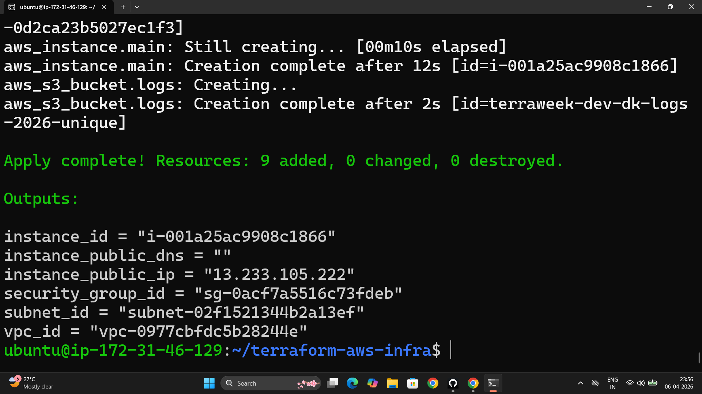

# Day 63 – Variables, Outputs, Data Sources, and Expressions

---

## Task 1 – Variables

**File:** `variables.tf`

```hcl
variable "region" {
  type    = string
  default = "ap-south-1"
}

variable "vpc_cidr" {
  type    = string
  default = "10.0.0.0/16"
}

variable "subnet_cidr" {
  type    = string
  default = "10.0.1.0/24"
}

variable "instance_type" {
  type    = string
  default = "t2.micro"
}

variable "project_name" {
  type        = string
  description = "Project name — required, no default"
  # No default — Terraform will prompt at plan time if not provided
}

variable "environment" {
  type    = string
  default = "dev"
}

variable "allowed_ports" {
  type    = list(number)
  default = [22, 80, 443]
}

variable "extra_tags" {
  type    = map(string)
  default = {}
}
```

Updated `main.tf` references:

```hcl
resource "aws_vpc" "main" {
  cidr_block = var.vpc_cidr
  ...
}

resource "aws_subnet" "public" {
  vpc_id     = aws_vpc.main.id
  cidr_block = var.subnet_cidr
  ...
}

resource "aws_instance" "server" {
  instance_type = var.instance_type
  ...
}
```

**Five variable types in Terraform:**

| Type | Example |
|------|---------|
| `string` | `"ap-south-1"` |
| `number` | `3` |
| `bool` | `true` |
| `list` | `["22", "80", "443"]` |
| `map` | `{env = "dev", team = "backend"}` |

---

## Task 2 – Variable Files and Precedence

**File:** `terraform.tfvars` (loaded automatically)

```hcl
project_name  = "terraweek"
environment   = "dev"
instance_type = "t2.micro"
```

**File:** `prod.tfvars`

```hcl
project_name  = "terraweek"
environment   = "prod"
instance_type = "t3.small"
vpc_cidr      = "10.1.0.0/16"
subnet_cidr   = "10.1.1.0/24"
```

```bash
terraform plan                              # Uses terraform.tfvars automatically
terraform plan -var-file="prod.tfvars"      # Explicit file
terraform plan -var="instance_type=t2.nano" # CLI flag — overrides everything
export TF_VAR_environment="staging"
terraform plan                              # env var overrides default, not tfvars
```

**Variable precedence — lowest to highest:**

```
1. Default values in variables.tf           (lowest)
2. terraform.tfvars (auto-loaded)
3. *.auto.tfvars (auto-loaded, alphabetical)
4. -var-file="file.tfvars" (explicit flag)
5. -var="key=value" (CLI flag)
6. TF_VAR_* environment variables           (highest)
```

A `-var` CLI flag beats a `terraform.tfvars` value. `TF_VAR_*` env vars beat defaults but lose to `-var` flags. Knowing this matters when CI pipelines inject values differently than local dev.

---

## Task 3 – Outputs

**File:** `outputs.tf`

```hcl
output "vpc_id" {
  description = "ID of the VPC"
  value       = aws_vpc.main.id
}

output "subnet_id" {
  description = "ID of the public subnet"
  value       = aws_subnet.public.id
}

output "instance_id" {
  description = "EC2 instance ID"
  value       = aws_instance.server.id
}

output "instance_public_ip" {
  description = "Public IP of the EC2 instance"
  value       = aws_instance.server.public_ip
}

output "instance_public_dns" {
  description = "Public DNS of the EC2 instance"
  value       = aws_instance.server.public_dns
}

output "security_group_id" {
  description = "Security group ID"
  value       = aws_security_group.web_sg.id
}
```

```bash
terraform apply
# Outputs printed at end of apply:
# instance_public_ip = "13.234.x.x"
# vpc_id = "vpc-0abc123..."

terraform output                          # All outputs
terraform output instance_public_ip       # Single output
terraform output -json                    # JSON for scripting
```



---

## Task 4 – Data Sources

**AMI and AZ data sources added to `main.tf`:**

```hcl
# Fetch the latest Amazon Linux 2 AMI dynamically — no hardcoded ID
data "aws_ami" "amazon_linux" {
  most_recent = true
  owners      = ["amazon"]

  filter {
    name   = "name"
    values = ["amzn2-ami-hvm-*-x86_64-gp2"]
  }

  filter {
    name   = "virtualization-type"
    values = ["hvm"]
  }

  filter {
    name   = "root-device-type"
    values = ["ebs"]
  }
}

# Fetch available AZs in the configured region
data "aws_availability_zones" "available" {
  state = "available"
}
```

Updated subnet to use the first AZ dynamically:

```hcl
resource "aws_subnet" "public" {
  vpc_id            = aws_vpc.main.id
  cidr_block        = var.subnet_cidr
  availability_zone = data.aws_availability_zones.available.names[0]
  ...
}
```

Updated instance to use the dynamic AMI:

```hcl
resource "aws_instance" "server" {
  ami           = data.aws_ami.amazon_linux.id    # no more hardcoded AMI
  instance_type = var.instance_type
  ...
}
```

**Resource vs data source:**

| | `resource` | `data` |
|---|---|---|
| What it does | Creates and manages infrastructure | Reads existing infrastructure |
| In state file | Yes — tracked and managed | No — read-only, not tracked |
| On destroy | Resource is deleted | Nothing happens |
| Example | `resource "aws_instance"` | `data "aws_ami"` |

---

## Task 5 – Locals for Dynamic Values

Added to `main.tf`:

```hcl
locals {
  name_prefix = "${var.project_name}-${var.environment}"
  common_tags = {
    Project     = var.project_name
    Environment = var.environment
    ManagedBy   = "Terraform"
  }
}
```

Updated all resource tags:

```hcl
resource "aws_vpc" "main" {
  cidr_block = var.vpc_cidr
  tags = merge(local.common_tags, {
    Name = "${local.name_prefix}-vpc"
  })
}

resource "aws_subnet" "public" {
  ...
  tags = merge(local.common_tags, {
    Name = "${local.name_prefix}-subnet"
  })
}

resource "aws_instance" "server" {
  ...
  tags = merge(local.common_tags, {
    Name = "${local.name_prefix}-server"
  })
}
```

With `project_name = "terraweek"` and `environment = "prod"`:
- VPC tag: `terraweek-prod-vpc`
- Instance tag: `terraweek-prod-server`

Change one variable, every resource tag updates consistently.

---

## Task 6 – Built-in Functions and Conditionals

```bash
terraform console
```

```hcl
> upper("terraweek")
"TERRAWEEK"

> join("-", ["terra", "week", "2026"])
"terra-week-2026"

> format("arn:aws:s3:::%s", "my-bucket")
"arn:aws:s3:::my-bucket"

> length(["a", "b", "c"])
3

> lookup({dev = "t2.micro", prod = "t3.small"}, "dev")
"t2.micro"

> toset(["a", "b", "a"])
toset(["a", "b"])

> cidrsubnet("10.0.0.0/16", 8, 1)
"10.0.1.0/24"
```

**Five most useful functions:**

| Function | What it does | Real use |
|----------|-------------|---------|
| `merge(map1, map2)` | Combines two maps, second wins on conflict | Merge `common_tags` with resource-specific tags |
| `cidrsubnet(cidr, bits, num)` | Calculates a subnet CIDR from a parent CIDR | Generate 10 subnets from one VPC CIDR without math |
| `lookup(map, key, default)` | Gets a value from a map with a fallback | `lookup(var.ami_ids, var.region, "default-ami")` |
| `join(sep, list)` | Joins a list into a string | Build resource names from a list of parts |
| `toset(list)` | Converts list to set, removes duplicates | Deduplicate a list of allowed IPs or ports |

**Conditional expression in config:**

```hcl
instance_type = var.environment == "prod" ? "t3.small" : "t2.micro"
```

Apply with `environment = "prod"` → instance launches as `t3.small`.
Apply with `environment = "dev"` → instance launches as `t2.micro`.
Zero separate configs. One expression.

---

## The Four Concepts — How They Differ

| Concept | Defined in | Purpose | Example |
|---------|-----------|---------|---------|
| `variable` | `variables.tf` | External input — users/CI provide values | `var.environment` |
| `local` | `locals {}` block | Internal computed value — not exposed | `local.name_prefix` |
| `output` | `outputs.tf` | External output — printed after apply, usable by other modules | `output "vpc_id"` |
| `data` | `data {}` block | Read existing AWS resources — no creation | `data.aws_ami.amazon_linux.id` |