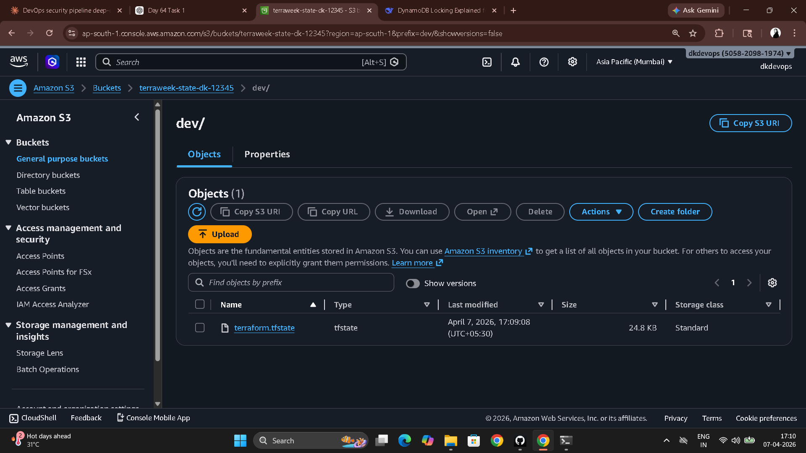
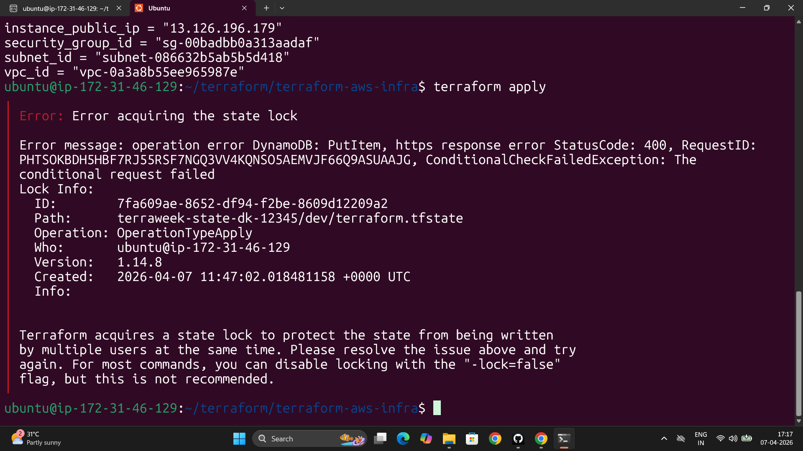

# Day 64 – Terraform State Management and Remote Backends

---

## Local State vs Remote State

```
LOCAL STATE (dangerous)                    REMOTE STATE (production standard)
────────────────────────                   ──────────────────────────────────
terraform.tfstate                          S3 Bucket
  └── lives on your machine                  └── dev/terraform.tfstate
  └── lost if machine dies                        └── versioned (S3 versioning)
  └── no locking                                  └── encrypted at rest
  └── not shareable with team                     └── accessible to whole team

                                           DynamoDB Table
                                             └── terraweek-state-lock
                                                  └── LockID (hash key)
                                                  └── prevents concurrent applies
```

---

## Task 1 – Inspect Current State

```bash
terraform show                                    # Full state, human-readable
terraform state list                              # All tracked resources
terraform state show aws_instance.server          # Every attribute of the instance
terraform state show aws_vpc.main                 # Every attribute of the VPC
```

**What the state stores for an EC2 instance** (way beyond what you defined):

The `.tf` file has: `ami`, `instance_type`, `subnet_id`, `tags`. The state additionally stores: `arn`, `availability_zone`, `cpu_core_count`, `cpu_threads_per_core`, `ebs_block_device`, `id`, `private_dns`, `private_ip`, `public_dns`, `public_ip`, `root_block_device`, `security_groups`, `vpc_security_group_ids`, `tenancy`, `monitoring`, and more — the full AWS API response.

**The `serial` number** in `terraform.tfstate` increments every time the state is written. It is a monotonically increasing integer that prevents older state from overwriting newer state — if two concurrent operations both read serial `5` and try to write, only the first write (serial `6`) wins. The second detects the mismatch and fails.

---

## Task 2 – S3 Remote Backend

**Create backend infrastructure (one-time setup):**

```bash
# Create the S3 bucket
aws s3api create-bucket \
  --bucket terraweek-state-dikshith \
  --region ap-south-1 \
  --create-bucket-configuration LocationConstraint=ap-south-1

# Enable versioning — recovery if state gets corrupted
aws s3api put-bucket-versioning \
  --bucket terraweek-state-dikshith \
  --versioning-configuration Status=Enabled

# Block all public access
aws s3api put-public-access-block \
  --bucket terraweek-state-dikshith \
  --public-access-block-configuration \
  BlockPublicAcls=true,IgnorePublicAcls=true,BlockPublicPolicy=true,RestrictPublicBuckets=true

# Create DynamoDB table for state locking
aws dynamodb create-table \
  --table-name terraweek-state-lock \
  --attribute-definitions AttributeName=LockID,AttributeType=S \
  --key-schema AttributeName=LockID,KeyType=HASH \
  --billing-mode PAY_PER_REQUEST \
  --region ap-south-1
```

**Add backend block to `main.tf`:**

```hcl
terraform {
  backend "s3" {
    bucket         = "terraweek-state-dikshith"
    key            = "dev/terraform.tfstate"
    region         = "ap-south-1"
    dynamodb_table = "terraweek-state-lock"
    encrypt        = true
  }

  required_providers {
    aws = {
      source  = "hashicorp/aws"
      version = "~> 5.0"
    }
  }
}
```

```bash
terraform init
# Prompt: "Do you want to copy existing state to the new backend?" → yes

# Verify migration
terraform plan        # should show: No changes
```

Local `terraform.tfstate` is now empty. State lives in S3 at `dev/terraform.tfstate`, encrypted, versioned.



---

## Task 3 – State Locking

```bash
# Terminal 1
terraform apply
# Waiting for approval...

# Terminal 2 — while Terminal 1 is running
terraform plan
```

DynamoDB writes a lock record to the `terraweek-state-lock` table at the start of every operation. Any other process that tries to acquire the lock sees the existing record and fails immediately with the Lock ID. This prevents two engineers from running `terraform apply` simultaneously and writing conflicting state — which would corrupt the state file and potentially create duplicate or orphaned resources in AWS.

```bash
# Only if absolutely sure no other operation is running
terraform force-unlock 6d8f1c2a-4e3b-11ee-b462-0a58a9feac02
```


---

## Task 4 – Import Existing Resource

```bash
# Manually created S3 bucket in AWS console: terraweek-import-test-dikshith
```

**Add resource block to `main.tf`:**

```hcl
resource "aws_s3_bucket" "imported" {
  bucket = "terraweek-import-test-dikshith"
}
```

```bash
terraform import aws_s3_bucket.imported terraweek-import-test-dikshith
# aws_s3_bucket.imported: Import prepared!
# aws_s3_bucket.imported: Importing from ID "terraweek-import-test-dikshith"...
# Import successful!

terraform plan
# No changes — import matched the real resource
```

```bash
terraform state list
# aws_instance.server
# aws_vpc.main
# aws_subnet.public
# aws_security_group.web_sg
# aws_s3_bucket.imported   ← now tracked by Terraform
```

**`terraform import` vs creating from scratch:**

| | `terraform import` | Creating from scratch |
|---|---|---|
| AWS resource | Already exists | Created by Terraform |
| State | Adds existing resource to state | State populated after creation |
| Config required | Yes — you write the `.tf` block first | Yes — Terraform uses it to create |
| Risk | State might not match config exactly — plan carefully | None — Terraform owns it from day one |
| Use case | Adopt pre-existing infrastructure | New infrastructure |

---

## Task 5 – State Surgery

**Rename a resource in state:**

```bash
terraform state list
# aws_s3_bucket.imported

terraform state mv aws_s3_bucket.imported aws_s3_bucket.logs_bucket
# Move "aws_s3_bucket.imported" to "aws_s3_bucket.logs_bucket"
# Successfully moved 1 object(s).
```

Update `main.tf` to rename the resource block to `logs_bucket`, then:

```bash
terraform plan    # No changes — state and config are aligned
```

**Remove from state without destroying in AWS:**

```bash
terraform state rm aws_s3_bucket.logs_bucket
# Removed aws_s3_bucket.logs_bucket
# Successfully removed 1 resource instance(s).

terraform plan
# Bucket still exists in AWS but Terraform no longer knows about it

# Re-import to bring it back
terraform import aws_s3_bucket.logs_bucket terraweek-import-test-dikshith
```

**When to use each:**

| Command | Use when |
|---------|---------|
| `state mv` | Renaming a resource in your `.tf` file, or moving a resource into a module, without recreating it in AWS |
| `state rm` | Removing a resource from Terraform management without destroying it — e.g. handing it off to another team or another Terraform workspace |
| `import` | Bringing pre-existing AWS resources under Terraform management |
| `force-unlock` | Clearing a stale lock after a crashed operation — only when certain nothing else is running |
| `terraform apply -refresh-only` | Updating state to match reality without making any changes — detects drift without reconciling |

---

## Task 6 – State Drift

```bash
# Everything in sync after apply
terraform plan    # No changes
```

Manually changed in AWS console:
- EC2 instance Name tag → `"ManuallyChanged"`

```bash
terraform plan
# ~ aws_instance.server
#   ~ tags = {
#       ~ "Name" = "ManuallyChanged" -> "terraweek-dev-server"
#     }
# Plan: 0 to add, 1 to change, 0 to destroy.
```

Terraform detected the drift — reality diverged from desired state.

```bash
# Option A: Reconcile — force AWS back to match config
terraform apply
# Tags restored to "terraweek-dev-server"

terraform plan    # No changes — drift resolved
```

**How teams prevent drift in production:**

1. **Restrict console access** — use IAM SCPs or permission boundaries that prevent manual resource changes. All changes must go through Terraform.
2. **CI/CD for all Terraform runs** — no local `terraform apply` in production. Engineers open PRs, pipelines run `plan`, reviewers approve, pipeline runs `apply`.
3. **Scheduled `terraform plan` jobs** — run plan every hour in CI and alert on any unexpected diff. Catches drift before it causes problems.
4. **Policy as Code** — tools like Sentinel (Terraform Enterprise) or OPA block plans that don't meet compliance rules, preventing drift through automation.