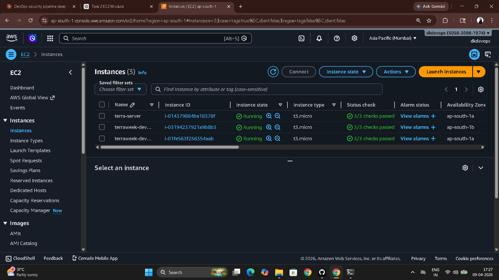

# Day 65 – Terraform Modules: Reusable Infrastructure

---

## What Modules Are

A Terraform module is just a directory with `.tf` files. The **root module** is where you run `terraform apply` — it's the entry point that calls everything else. A **child module** is any module called by the root via a `module {}` block. It has no provider config of its own — it inherits from whoever calls it.

Think of modules as functions: they take inputs (variables), do work (create resources), and return outputs. You call the same module ten times with different inputs and get ten different results.

---

## Task 1 – Module Structure

```
terraform-modules/
├── main.tf              # Root module — calls child modules, creates VPC
├── variables.tf         # Root input variables
├── outputs.tf           # Root outputs (references module outputs)
├── providers.tf         # Provider config lives here only
├── locals.tf            # Common tags, name prefix
└── modules/
    ├── ec2-instance/
    │   ├── main.tf      # aws_instance resource
    │   ├── variables.tf # Module inputs
    │   └── outputs.tf   # instance_id, public_ip, private_ip
    └── security-group/
        ├── main.tf      # aws_security_group resource
        ├── variables.tf # Module inputs
        └── outputs.tf   # sg_id
```

---

## Task 2 – EC2 Module

**`modules/ec2-instance/variables.tf`**

```hcl
variable "ami_id" {
  type        = string
  description = "AMI ID for the EC2 instance"
}

variable "instance_type" {
  type    = string
  default = "t2.micro"
}

variable "subnet_id" {
  type        = string
  description = "Subnet to launch the instance in"
}

variable "security_group_ids" {
  type        = list(string)
  description = "List of security group IDs to attach"
}

variable "instance_name" {
  type        = string
  description = "Name tag for the instance"
}

variable "tags" {
  type    = map(string)
  default = {}
}
```

**`modules/ec2-instance/main.tf`**

```hcl
resource "aws_instance" "this" {
  ami                         = var.ami_id
  instance_type               = var.instance_type
  subnet_id                   = var.subnet_id
  vpc_security_group_ids      = var.security_group_ids
  associate_public_ip_address = true

  tags = merge(var.tags, {
    Name = var.instance_name
  })
}
```

**`modules/ec2-instance/outputs.tf`**

```hcl
output "instance_id" {
  value = aws_instance.this.id
}

output "public_ip" {
  value = aws_instance.this.public_ip
}

output "private_ip" {
  value = aws_instance.this.private_ip
}
```

---

## Task 3 – Security Group Module

**`modules/security-group/variables.tf`**

```hcl
variable "vpc_id" {
  type        = string
  description = "VPC to create the security group in"
}

variable "sg_name" {
  type        = string
  description = "Name of the security group"
}

variable "ingress_ports" {
  type    = list(number)
  default = [22, 80]
}

variable "tags" {
  type    = map(string)
  default = {}
}
```

**`modules/security-group/main.tf`**

```hcl
resource "aws_security_group" "this" {
  name   = var.sg_name
  vpc_id = var.vpc_id

  # dynamic block — loops over ingress_ports list
  # instead of copy-pasting one ingress block per port
  dynamic "ingress" {
    for_each = var.ingress_ports
    content {
      from_port   = ingress.value
      to_port     = ingress.value
      protocol    = "tcp"
      cidr_blocks = ["0.0.0.0/0"]
    }
  }

  egress {
    from_port   = 0
    to_port     = 0
    protocol    = "-1"
    cidr_blocks = ["0.0.0.0/0"]
  }

  tags = merge(var.tags, {
    Name = var.sg_name
  })
}
```

**`modules/security-group/outputs.tf`**

```hcl
output "sg_id" {
  value = aws_security_group.this.id
}
```

**How `dynamic` works:** `for_each = var.ingress_ports` iterates over `[22, 80, 443]`. Each iteration creates one `ingress` block with `ingress.value` as the port. Three ports → three ingress rules, no copy-paste.

---

## Task 4 – Root Module Wiring Everything Together

**`main.tf` (root)**

```hcl
data "aws_ami" "amazon_linux" {
  most_recent = true
  owners      = ["amazon"]
  filter {
    name   = "name"
    values = ["amzn2-ami-hvm-*-x86_64-gp2"]
  }
}

# VPC and subnet (hand-written — replaced with registry module in Task 5)
resource "aws_vpc" "main" {
  cidr_block = var.vpc_cidr
  tags       = merge(local.common_tags, { Name = "${local.name_prefix}-vpc" })
}

resource "aws_subnet" "public" {
  vpc_id                  = aws_vpc.main.id
  cidr_block              = var.subnet_cidr
  map_public_ip_on_launch = true
  tags                    = merge(local.common_tags, { Name = "${local.name_prefix}-subnet" })
}

resource "aws_internet_gateway" "igw" {
  vpc_id = aws_vpc.main.id
  tags   = merge(local.common_tags, { Name = "${local.name_prefix}-igw" })
}

resource "aws_route_table" "public" {
  vpc_id = aws_vpc.main.id
  route {
    cidr_block = "0.0.0.0/0"
    gateway_id = aws_internet_gateway.igw.id
  }
}

resource "aws_route_table_association" "public" {
  subnet_id      = aws_subnet.public.id
  route_table_id = aws_route_table.public.id
}

# Security group module
module "web_sg" {
  source        = "./modules/security-group"
  vpc_id        = aws_vpc.main.id
  sg_name       = "terraweek-web-sg"
  ingress_ports = [22, 80, 443]
  tags          = local.common_tags
}

# EC2 module — called twice, same module, different inputs
module "web_server" {
  source             = "./modules/ec2-instance"
  ami_id             = data.aws_ami.amazon_linux.id
  instance_type      = var.instance_type
  subnet_id          = aws_subnet.public.id
  security_group_ids = [module.web_sg.sg_id]
  instance_name      = "${local.name_prefix}-web"
  tags               = local.common_tags
}

module "api_server" {
  source             = "./modules/ec2-instance"
  ami_id             = data.aws_ami.amazon_linux.id
  instance_type      = var.instance_type
  subnet_id          = aws_subnet.public.id
  security_group_ids = [module.web_sg.sg_id]
  instance_name      = "${local.name_prefix}-api"
  tags               = local.common_tags
}
```

**`outputs.tf` (root)**

```hcl
output "web_server_ip" {
  value = module.web_server.public_ip
}

output "api_server_ip" {
  value = module.api_server.public_ip
}

output "security_group_id" {
  value = module.web_sg.sg_id
}
```

```bash
terraform init    # Links local modules
terraform plan    # Shows resources from both module calls
terraform apply
```



---

## Task 5 – Public Registry VPC Module

Replaced the 5 hand-written VPC resources with one registry module call:

```hcl
module "vpc" {
  source  = "terraform-aws-modules/vpc/aws"
  version = "~> 5.0"

  name = "${local.name_prefix}-vpc"
  cidr = "10.0.0.0/16"

  azs             = ["ap-south-1a", "ap-south-1b"]
  public_subnets  = ["10.0.1.0/24", "10.0.2.0/24"]
  private_subnets = ["10.0.3.0/24", "10.0.4.0/24"]

  enable_nat_gateway   = false
  enable_dns_hostnames = true

  tags = local.common_tags
}
```

Updated module calls to reference registry module outputs:

```hcl
module "web_sg" {
  ...
  vpc_id = module.vpc.vpc_id      # was aws_vpc.main.id
}

module "web_server" {
  ...
  subnet_id = module.vpc.public_subnets[0]   # was aws_subnet.public.id
}
```

```bash
terraform init     # Downloads registry module to .terraform/modules/
terraform plan
terraform apply
```

**Hand-written VPC vs registry module:**

| | Hand-written (Day 62) | Registry module |
|---|---|---|
| Lines of code | ~50 | ~15 |
| Resources created | 5 (VPC, subnet, IGW, RT, RTA) | ~20+ (VPC, 4 subnets across 2 AZs, 2 RTs, RTAs, DHCP options, default SG, default NACL) |
| Subnets | 1 public | 2 public + 2 private across 2 AZs |
| Production ready | Partially | Yes — multi-AZ, best practices baked in |

Registry modules are downloaded to `.terraform/modules/` — Terraform caches them locally so subsequent `init` calls don't re-download unchanged module versions.

---

## Task 6 – Module Versioning and Best Practices

```bash
terraform state list
# module.api_server.aws_instance.this
# module.vpc.aws_internet_gateway.this[0]
# module.vpc.aws_route_table.private[0]
# module.vpc.aws_subnet.public[0]
# module.web_server.aws_instance.this
# module.web_sg.aws_security_group.this
# ...
```

State uses `module.<name>.<resource>` prefixes — every resource from every module is individually tracked.

**Version pinning:**

```hcl
version = "5.1.0"       # exact — fully deterministic
version = "~> 5.0"      # any 5.x — recommended for most cases
version = ">= 5.0, < 6.0"  # range — same as ~> 5.0 but explicit
```

```bash
terraform init -upgrade   # Checks for newer versions within constraints
terraform destroy
```

**Five module best practices:**

1. **Always pin registry module versions.** `~> 5.0` not `latest`. An upstream module breaking change should never surprise your production apply.
2. **One concern per module.** An EC2 module creates EC2 instances. It does not also create VPCs, IAM roles, or S3 buckets. Focused modules are reusable; sprawling modules are not.
3. **Use variables for everything, hardcode nothing.** Region, AMI, CIDR, tags — all inputs. A module with hardcoded values is not reusable, it's just reorganized copy-paste.
4. **Always define outputs.** The caller cannot reference resources inside a module unless the module exposes them. If your EC2 module doesn't output `public_ip`, nothing above it can use it.
5. **Add a `README.md` to every custom module.** Document inputs, outputs, and a usage example. Future you and your teammates will thank you. A module without a README is a module no one trusts to call.