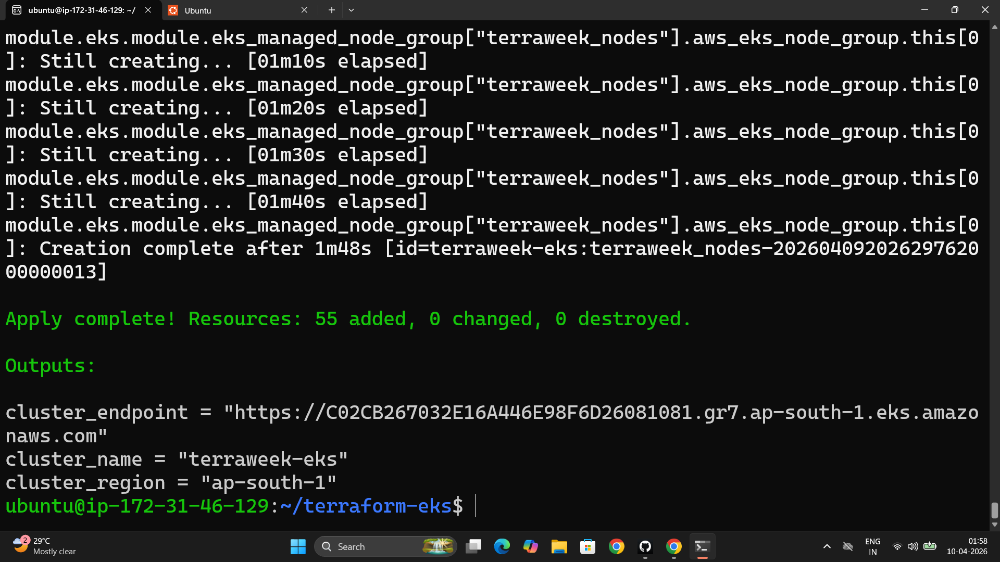
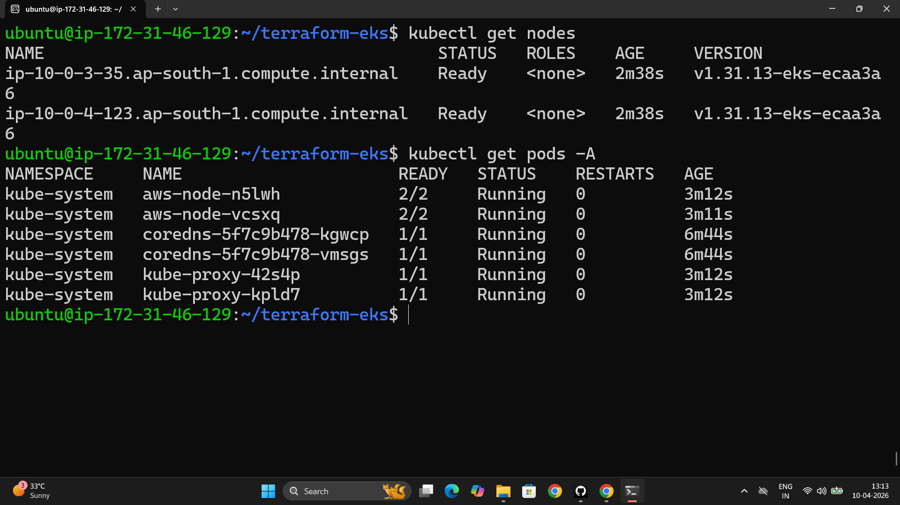
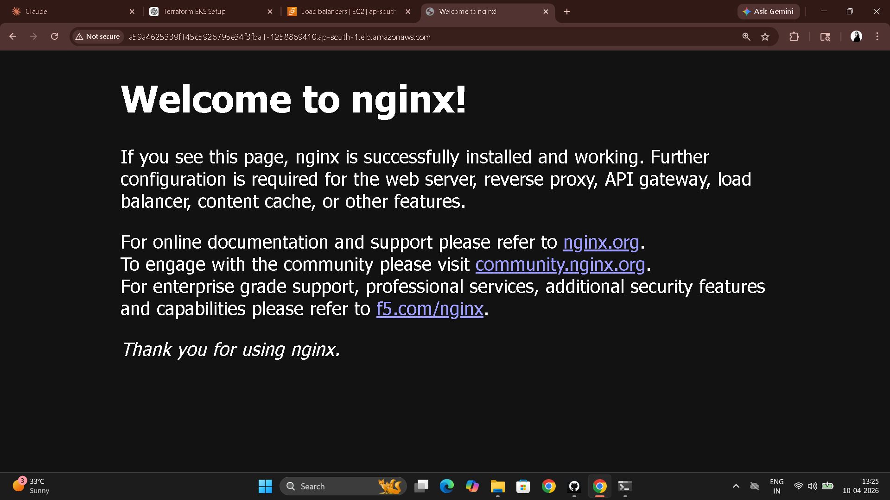

# Day 66 – Provision an EKS Cluster with Terraform Modules

---

## File Structure

```
terraform-eks/
├── providers.tf        # AWS + Kubernetes providers
├── vpc.tf              # VPC module call
├── eks.tf              # EKS module call
├── variables.tf        # All input variables
├── outputs.tf          # Cluster name, endpoint, region
├── terraform.tfvars    # Variable values
└── k8s/
    └── nginx-deployment.yaml   # Workload deployed after cluster is up
```

---

## Task 1 – Project Setup

**`providers.tf`**

```hcl
terraform {
  required_providers {
    aws = {
      source  = "hashicorp/aws"
      version = "~> 5.0"
    }
    kubernetes = {
      source  = "hashicorp/kubernetes"
      version = "~> 2.0"
    }
  }

  backend "s3" {
    bucket         = "terraweek-state-dikshith"
    key            = "eks/terraform.tfstate"
    region         = "ap-south-1"
    dynamodb_table = "terraweek-state-lock"
    encrypt        = true
  }
}

provider "aws" {
  region = var.region
}
```

**`variables.tf`**

```hcl
variable "region" {
  type    = string
  default = "ap-south-1"
}

variable "cluster_name" {
  type    = string
  default = "terraweek-eks"
}

variable "cluster_version" {
  type    = string
  default = "1.31"
}

variable "node_instance_type" {
  type    = string
  default = "t3.medium"
}

variable "node_desired_count" {
  type    = number
  default = 2
}

variable "vpc_cidr" {
  type    = string
  default = "10.0.0.0/16"
}
```

**`terraform.tfvars`**

```hcl
region             = "ap-south-1"
cluster_name       = "terraweek-eks"
cluster_version    = "1.31"
node_instance_type = "t3.medium"
node_desired_count = 2
vpc_cidr           = "10.0.0.0/16"
```

---

## Task 2 – VPC

**`vpc.tf`**

```hcl
data "aws_availability_zones" "available" {
  state = "available"
}

module "vpc" {
  source  = "terraform-aws-modules/vpc/aws"
  version = "~> 5.0"

  name = "${var.cluster_name}-vpc"
  cidr = var.vpc_cidr

  azs             = slice(data.aws_availability_zones.available.names, 0, 2)
  public_subnets  = ["10.0.1.0/24", "10.0.2.0/24"]
  private_subnets = ["10.0.3.0/24", "10.0.4.0/24"]

  enable_nat_gateway   = true
  single_nat_gateway   = true    # one NAT to save cost (~$0.045/hr)
  enable_dns_hostnames = true

  # Required tags for EKS load balancer discovery
  public_subnet_tags = {
    "kubernetes.io/role/elb" = 1
  }

  private_subnet_tags = {
    "kubernetes.io/role/internal-elb" = 1
  }

  tags = {
    Environment = "dev"
    Project     = "TerraWeek"
    ManagedBy   = "Terraform"
  }
}
```

**Why EKS needs both public and private subnets:**

EKS worker nodes run in **private subnets** — they have no public IP, reducing attack surface. They reach the internet (to pull container images, call AWS APIs) via the NAT Gateway which lives in the public subnet.

Load balancers for Services of type `LoadBalancer` get provisioned in **public subnets** — that's how external traffic reaches the cluster.

**What the subnet tags do:**

The AWS Load Balancer Controller uses these tags to discover which subnets to place load balancers in. Without `kubernetes.io/role/elb = 1` on public subnets, a `LoadBalancer` Service will sit in `Pending` forever — the controller can't find anywhere to put the ELB.

```bash
terraform init
terraform plan    # Should show VPC resources — verify before EKS
```

---

## Task 3 – EKS Cluster

**`eks.tf`**

```hcl
module "eks" {
  source  = "terraform-aws-modules/eks/aws"
  version = "~> 20.0"

  cluster_name    = var.cluster_name
  cluster_version = var.cluster_version

  vpc_id     = module.vpc.vpc_id
  subnet_ids = module.vpc.private_subnets    # nodes in private subnets

  cluster_endpoint_public_access = true      # allows kubectl from laptop

  eks_managed_node_groups = {
    terraweek_nodes = {
      ami_type       = "AL2_x86_64"
      instance_types = [var.node_instance_type]

      min_size     = 1
      max_size     = 3
      desired_size = var.node_desired_count
    }
  }

  tags = {
    Environment = "dev"
    Project     = "TerraWeek"
    ManagedBy   = "Terraform"
  }
}
```

```bash
terraform init      # Downloads EKS module + dependencies
terraform plan      # 30+ resources — review before applying
```

The EKS module automatically creates: the cluster control plane, IAM roles for the cluster and node group, security groups, OIDC provider, launch template for nodes, autoscaling group, and CloudWatch log groups. All the IAM plumbing that would take hours to configure manually is handled by the module.

---

## Task 4 – Apply and Connect kubectl

```bash
terraform apply    # Takes 10-15 minutes
```

**`outputs.tf`**

```hcl
output "cluster_name" {
  value = module.eks.cluster_name
}

output "cluster_endpoint" {
  value = module.eks.cluster_endpoint
}

output "cluster_region" {
  value = var.region
}
```

```bash
# Connect kubectl to the new cluster
aws eks update-kubeconfig --name terraweek-eks --region ap-south-1

# Verify nodes and pods
kubectl get nodes
# NAME                                          STATUS   ROLES    AGE
# ip-10-0-3-xx.ap-south-1.compute.internal     Ready    <none>   3m
# ip-10-0-4-xx.ap-south-1.compute.internal     Ready    <none>   3m

kubectl get pods -A
kubectl cluster-info
```





---

## Task 5 – Deploy Workload on the Cluster

**`k8s/nginx-deployment.yaml`**

```yaml
apiVersion: apps/v1
kind: Deployment
metadata:
  name: nginx-terraweek
  labels:
    app: nginx
spec:
  replicas: 3
  selector:
    matchLabels:
      app: nginx
  template:
    metadata:
      labels:
        app: nginx
    spec:
      containers:
      - name: nginx
        image: nginx:latest
        ports:
        - containerPort: 80
---
apiVersion: v1
kind: Service
metadata:
  name: nginx-service
spec:
  type: LoadBalancer
  selector:
    app: nginx
  ports:
  - port: 80
    targetPort: 80
```

```bash
kubectl apply -f k8s/nginx-deployment.yaml

# Wait for LoadBalancer external IP (takes 2-3 mins for AWS ELB)
kubectl get svc nginx-service -w
# nginx-service   LoadBalancer   10.100.x.x   <pending>   80:32xxx/TCP
# nginx-service   LoadBalancer   10.100.x.x   xxx.ap-south-1.elb.amazonaws.com   80:32xxx/TCP

# Full cluster status
kubectl get nodes
kubectl get deployments
kubectl get pods
kubectl get svc
```



---

## Task 6 – Destroy Everything

**Important:** Delete Kubernetes resources FIRST — the `LoadBalancer` Service provisions an AWS ELB. If you run `terraform destroy` without deleting it, the ELB holds an ENI in the VPC and the VPC deletion hangs indefinitely.

```bash
# Step 1: Delete Kubernetes resources (removes the ELB)
kubectl delete -f k8s/nginx-deployment.yaml

# Step 2: Wait for ELB to be fully removed
# Check: EC2 > Load Balancers — wait until terraweek ELB disappears

# Step 3: Destroy everything
terraform destroy    # Takes 10-15 minutes
```

**Verify clean teardown in AWS console:**

| Resource | Expected after destroy |
|----------|----------------------|
| EKS Clusters | Empty |
| EC2 Instances | No node group instances |
| VPC | terraweek-eks-vpc gone |
| NAT Gateways | Deleted |
| Elastic IPs | Released |
| Load Balancers | None |
| IAM Roles | Roles created by EKS module removed |

---

## Reflection: Terraform EKS vs Manual kind/minikube (Day 50)

| | Manual (kind/minikube) | Terraform EKS |
|---|---|---|
| Setup time | 5 minutes | 15 minutes |
| Infrastructure | Containers on laptop | Real AWS EC2 nodes |
| High availability | No — single node | Yes — multi-node, multi-AZ |
| Reproducibility | Not shareable | Exact same cluster with `terraform apply` |
| Cost | Free | ~$0.10/hr (EKS) + nodes + NAT |
| Production use | Never | Yes |
| Teardown | `kind delete cluster` | `terraform destroy` |

Day 50 was understanding Kubernetes. Day 66 is operating Kubernetes infrastructure. The `kubectl` commands are identical — the cluster underneath is completely different in scale, reliability, and reproducibility.

Everything Terraform created is tracked in state. Destroy is guaranteed complete cleanup. Recreate is guaranteed identical infrastructure. That's what "infrastructure as code" actually means in production.