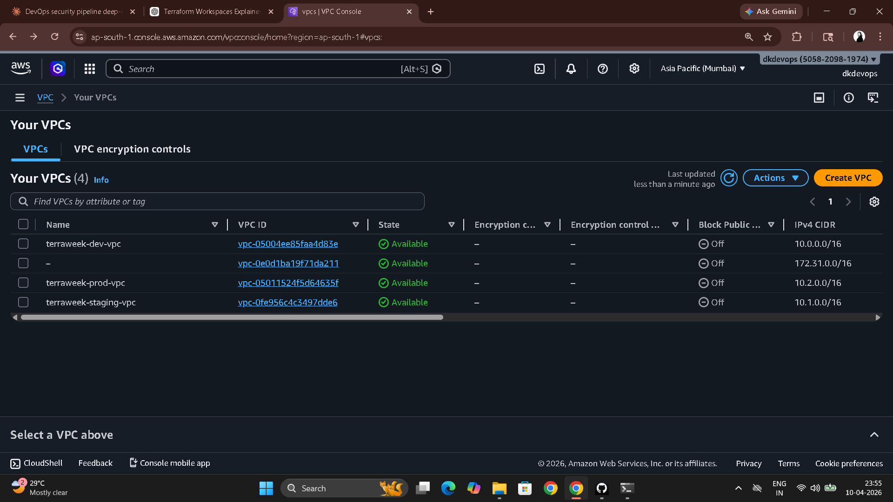
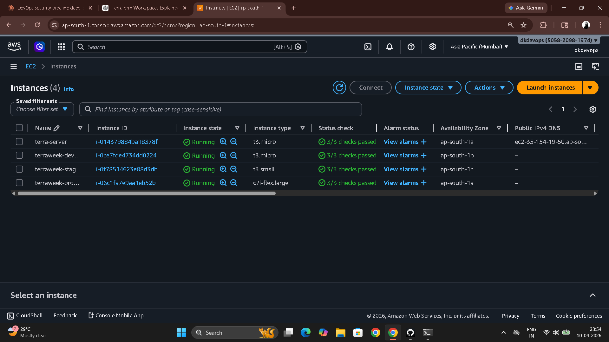

# Day 67 – TerraWeek Capstone: Multi-Environment Infrastructure with Workspaces

---

## Project Structure

```
terraweek-capstone/
├── main.tf                  # Root module — calls all three child modules
├── variables.tf             # Root input variables
├── outputs.tf               # Root outputs referencing module outputs
├── providers.tf             # AWS provider + S3 remote backend
├── locals.tf                # Workspace-aware name prefix and common tags
├── dev.tfvars               # Dev environment values
├── staging.tfvars           # Staging environment values
├── prod.tfvars              # Prod environment values
├── .gitignore               # Exclude state, .terraform, tfvars with secrets
└── modules/
    ├── vpc/
    │   ├── main.tf          # VPC, subnet, IGW, route table, association
    │   ├── variables.tf
    │   └── outputs.tf
    ├── security-group/
    │   ├── main.tf          # Security group with dynamic ingress
    │   ├── variables.tf
    │   └── outputs.tf
    └── ec2-instance/
        ├── main.tf          # aws_instance with tags
        ├── variables.tf
        └── outputs.tf
```

**`.gitignore`**

```
.terraform/
*.tfstate
*.tfstate.backup
*.tfvars
.terraform.lock.hcl
```

---

## Task 1 – Terraform Workspaces

```bash
terraform workspace show          # default
terraform workspace new dev
terraform workspace new staging
terraform workspace new prod
terraform workspace list
# * default
#   dev
#   prod
#   staging

terraform workspace select dev
terraform workspace show          # dev
```

**`terraform.workspace`** returns the name of the active workspace as a string — `"dev"`, `"staging"`, or `"prod"`. You can use it directly in your config to drive names, tags, and sizing.

**Where workspaces store state:**

With local state: `terraform.tfstate.d/<workspace>/terraform.tfstate`
With S3 remote backend: `env:/<workspace>/terraform.tfstate` in the configured bucket.

**Workspaces vs separate directories:**

| | Workspaces | Separate directories |
|---|---|---|
| Codebase | One shared codebase | Separate copy per environment |
| Isolation | State isolation per workspace | Full filesystem isolation |
| Risk of drift | Low — same code runs everywhere | High — easy to forget to sync changes |
| State location | env:/<workspace>/<key> | Separate backend config per dir |
| Team adoption | Simpler to start | More explicit, preferred at larger scale |

---

## Task 2 – Providers and Backend

**`providers.tf`**

```hcl
terraform {
  required_providers {
    aws = {
      source  = "hashicorp/aws"
      version = "~> 5.0"
    }
  }

  backend "s3" {
    bucket         = "terraweek-state-dikshith"
    key            = "capstone/terraform.tfstate"
    region         = "ap-south-1"
    dynamodb_table = "terraweek-state-lock"
    encrypt        = true
  }
}

provider "aws" {
  region = "ap-south-1"
}
```

---

## Task 3 – Custom Modules

### VPC Module

**`modules/vpc/variables.tf`**

```hcl
variable "cidr" {
  type = string
}

variable "public_subnet_cidr" {
  type = string
}

variable "environment" {
  type = string
}

variable "project_name" {
  type = string
}
```

**`modules/vpc/main.tf`**

```hcl
locals {
  prefix = "${var.project_name}-${var.environment}"
  tags = {
    Project     = var.project_name
    Environment = var.environment
    ManagedBy   = "Terraform"
  }
}

resource "aws_vpc" "this" {
  cidr_block = var.cidr
  tags       = merge(local.tags, { Name = "${local.prefix}-vpc" })
}

resource "aws_subnet" "public" {
  vpc_id                  = aws_vpc.this.id
  cidr_block              = var.public_subnet_cidr
  map_public_ip_on_launch = true
  tags                    = merge(local.tags, { Name = "${local.prefix}-subnet" })
}

resource "aws_internet_gateway" "igw" {
  vpc_id = aws_vpc.this.id
  tags   = merge(local.tags, { Name = "${local.prefix}-igw" })
}

resource "aws_route_table" "public" {
  vpc_id = aws_vpc.this.id
  route {
    cidr_block = "0.0.0.0/0"
    gateway_id = aws_internet_gateway.igw.id
  }
  tags = merge(local.tags, { Name = "${local.prefix}-rt" })
}

resource "aws_route_table_association" "public" {
  subnet_id      = aws_subnet.public.id
  route_table_id = aws_route_table.public.id
}
```

**`modules/vpc/outputs.tf`**

```hcl
output "vpc_id" {
  value = aws_vpc.this.id
}

output "subnet_id" {
  value = aws_subnet.public.id
}
```

---

### Security Group Module

**`modules/security-group/variables.tf`**

```hcl
variable "vpc_id"       { type = string }
variable "ingress_ports" { type = list(number) }
variable "environment"  { type = string }
variable "project_name" { type = string }
```

**`modules/security-group/main.tf`**

```hcl
locals {
  prefix = "${var.project_name}-${var.environment}"
  tags = {
    Project     = var.project_name
    Environment = var.environment
    ManagedBy   = "Terraform"
  }
}

resource "aws_security_group" "this" {
  name   = "${local.prefix}-sg"
  vpc_id = var.vpc_id

  dynamic "ingress" {
    for_each = var.ingress_ports
    content {
      from_port   = ingress.value
      to_port     = ingress.value
      protocol    = "tcp"
      cidr_blocks = ["0.0.0.0/0"]
    }
  }

  egress {
    from_port   = 0
    to_port     = 0
    protocol    = "-1"
    cidr_blocks = ["0.0.0.0/0"]
  }

  tags = merge(local.tags, { Name = "${local.prefix}-sg" })
}
```

**`modules/security-group/outputs.tf`**

```hcl
output "sg_id" {
  value = aws_security_group.this.id
}
```

---

### EC2 Module

**`modules/ec2-instance/variables.tf`**

```hcl
variable "ami_id"             { type = string }
variable "instance_type"      { type = string }
variable "subnet_id"          { type = string }
variable "security_group_ids" { type = list(string) }
variable "environment"        { type = string }
variable "project_name"       { type = string }
```

**`modules/ec2-instance/main.tf`**

```hcl
resource "aws_instance" "this" {
  ami                         = var.ami_id
  instance_type               = var.instance_type
  subnet_id                   = var.subnet_id
  vpc_security_group_ids      = var.security_group_ids
  associate_public_ip_address = true

  tags = {
    Name        = "${var.project_name}-${var.environment}-server"
    Project     = var.project_name
    Environment = var.environment
    ManagedBy   = "Terraform"
  }
}
```

**`modules/ec2-instance/outputs.tf`**

```hcl
output "instance_id" { value = aws_instance.this.id }
output "public_ip"   { value = aws_instance.this.public_ip }
```

---

## Task 4 – Root Module (Workspace-Aware)

**`locals.tf`**

```hcl
locals {
  environment = terraform.workspace
  name_prefix = "${var.project_name}-${local.environment}"
  common_tags = {
    Project     = var.project_name
    Environment = local.environment
    ManagedBy   = "Terraform"
    Workspace   = terraform.workspace
  }
}
```

**`variables.tf`**

```hcl
variable "project_name" {
  type    = string
  default = "terraweek"
}

variable "vpc_cidr"      { type = string }
variable "subnet_cidr"   { type = string }
variable "instance_type" { type = string }

variable "ingress_ports" {
  type    = list(number)
  default = [22, 80]
}
```

**`main.tf`**

```hcl
data "aws_ami" "amazon_linux" {
  most_recent = true
  owners      = ["amazon"]
  filter {
    name   = "name"
    values = ["amzn2-ami-hvm-*-x86_64-gp2"]
  }
}

module "vpc" {
  source             = "./modules/vpc"
  cidr               = var.vpc_cidr
  public_subnet_cidr = var.subnet_cidr
  environment        = local.environment
  project_name       = var.project_name
}

module "sg" {
  source        = "./modules/security-group"
  vpc_id        = module.vpc.vpc_id
  ingress_ports = var.ingress_ports
  environment   = local.environment
  project_name  = var.project_name
}

module "server" {
  source             = "./modules/ec2-instance"
  ami_id             = data.aws_ami.amazon_linux.id
  instance_type      = var.instance_type
  subnet_id          = module.vpc.subnet_id
  security_group_ids = [module.sg.sg_id]
  environment        = local.environment
  project_name       = var.project_name
}
```

**`outputs.tf`**

```hcl
output "environment"   { value = local.environment }
output "vpc_id"        { value = module.vpc.vpc_id }
output "instance_ip"   { value = module.server.public_ip }
output "instance_id"   { value = module.server.instance_id }
```

---

## Environment tfvars Files

**`dev.tfvars`**
```hcl
vpc_cidr      = "10.0.0.0/16"
subnet_cidr   = "10.0.1.0/24"
instance_type = "t2.micro"
ingress_ports = [22, 80]         # SSH allowed in dev
```

**`staging.tfvars`**
```hcl
vpc_cidr      = "10.1.0.0/16"
subnet_cidr   = "10.1.1.0/24"
instance_type = "t2.small"
ingress_ports = [22, 80, 443]    # SSH + HTTP + HTTPS
```

**`prod.tfvars`**
```hcl
vpc_cidr      = "10.2.0.0/16"
subnet_cidr   = "10.2.1.0/24"
instance_type = "t3.small"
ingress_ports = [80, 443]        # No SSH in prod — use SSM instead
```

**Why different CIDRs:** Non-overlapping ranges prevent conflicts if environments are ever peered or connected through a transit gateway. You can't peer two VPCs with overlapping CIDRs.

**Why prod has no port 22:** Production servers should not be directly SSH-accessible. AWS Systems Manager Session Manager provides audited shell access without needing an open SSH port.

---

## Task 5 – Deploy All Three Environments

```bash
terraform init

terraform workspace select dev
terraform apply -var-file="dev.tfvars"

terraform workspace select staging
terraform apply -var-file="staging.tfvars"

terraform workspace select prod
terraform apply -var-file="prod.tfvars"

# Verify each workspace's outputs
terraform workspace select dev     && terraform output
terraform workspace select staging && terraform output
terraform workspace select prod    && terraform output
```





---

## Task 6 – Terraform Best Practices

1. **File structure:** Split into `providers.tf`, `variables.tf`, `outputs.tf`, `locals.tf`, `main.tf`. Never put everything in one file at project scale. Reviewers should be able to find what they're looking for without searching the whole file.

2. **State management:** Always use a remote backend (S3 + DynamoDB). Enable S3 versioning so you can recover a previous state. Enable encryption. Never store state in git — it contains plaintext secrets.

3. **Variables:** No hardcoded values anywhere. One `.tfvars` file per environment. Use `validation` blocks for critical inputs (region names, instance types) to catch misconfigurations before they reach AWS.

4. **Modules:** One concern per module. Every module needs `outputs.tf` — a module that doesn't expose its resources is useless to callers. Pin registry module versions with `~> X.Y`. Add a `README.md` to every custom module.

5. **Workspaces:** Use `terraform.workspace` in locals, not inline in resources. Reference the local instead so you can change the logic in one place. Don't use workspaces for truly separate teams — separate backends/directories are cleaner at that scale.

6. **Security:** `.gitignore` the `.terraform/` directory, all `*.tfstate` files, and `*.tfvars` files that contain secrets. Restrict S3 backend access to specific IAM roles. Use OIDC for CI/CD authentication instead of long-lived access keys.

7. **Commands:** Always `terraform fmt` before committing. Always `terraform validate` before pushing. Always `terraform plan` before `terraform apply`. Review the plan output — read what the `~`, `+`, `-`, `-/+` symbols mean before typing yes.

8. **Tagging:** Every resource gets `Project`, `Environment`, `ManagedBy = "Terraform"`. Consistent tagging enables cost allocation by environment and automated compliance checks.

9. **Naming:** `<project>-<environment>-<resource>` everywhere. `terraweek-prod-server`, `terraweek-dev-vpc`. Consistent naming makes AWS console and CloudTrail logs readable.

10. **Cleanup:** `terraform destroy` non-production environments when not in use. EKS clusters, NAT gateways, and EC2 instances cost money per hour. Cost discipline is part of infrastructure management.

---

## Task 7 – Destroy All Environments

```bash
terraform workspace select prod
terraform destroy -var-file="prod.tfvars"

terraform workspace select staging
terraform destroy -var-file="staging.tfvars"

terraform workspace select dev
terraform destroy -var-file="dev.tfvars"

# Clean up workspaces
terraform workspace select default
terraform workspace delete prod
terraform workspace delete staging
terraform workspace delete dev

terraform workspace list    # only default remains
```

---

## TerraWeek Concepts Map

| Day | Concepts Covered |
|-----|-----------------|
| 61 | IaC principles, HCL syntax, `init` / `plan` / `apply` / `destroy`, local state, state file basics |
| 62 | Providers, resources, implicit + explicit dependencies, `depends_on`, lifecycle rules, `terraform graph` |
| 63 | Variables (5 types), `tfvars` files, variable precedence, outputs, data sources, locals, built-in functions, conditionals |
| 64 | Remote backend (S3 + DynamoDB), state locking, `terraform import`, `state mv` / `state rm`, drift detection and reconciliation |
| 65 | Custom modules, `dynamic` blocks, registry modules, module versioning, module outputs, `.terraform/modules/` |
| 66 | EKS cluster provisioning, VPC with EKS subnet tags, managed node groups, connecting `kubectl`, LoadBalancer service ordering for destroy |
| 67 | Terraform workspaces, multi-environment architecture, workspace-aware locals, per-environment tfvars, full capstone project |