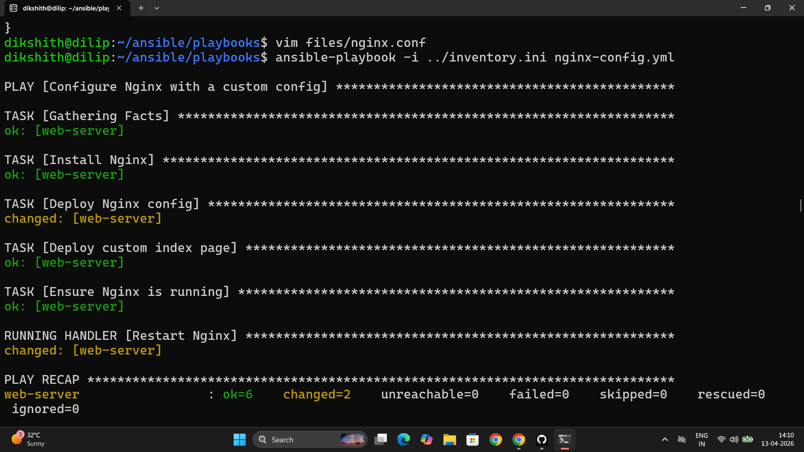
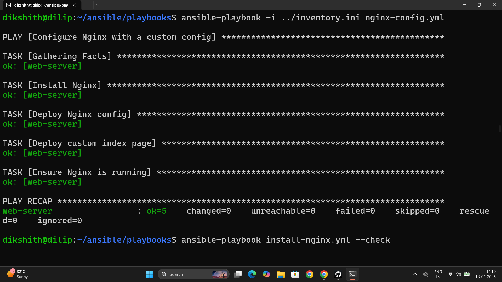

# Day 69 – Ansible Playbooks and Modules

---

## Task 1 – First Playbook

**`install-nginx.yml`**

```yaml
---
- name: Install and start Nginx on web servers
  hosts: web
  become: true

  tasks:
    - name: Install Nginx
      yum:                         # Use apt: for Ubuntu
        name: nginx
        state: present             # Install if not already present

    - name: Start and enable Nginx
      service:
        name: nginx
        state: started             # Start if not running
        enabled: true              # Start on boot

    - name: Create a custom index page
      copy:
        content: "<h1>Deployed by Ansible - TerraWeek Server</h1>"
        dest: /usr/share/nginx/html/index.html
```

```bash
ansible-playbook install-nginx.yml
# First run:  TASK [Install Nginx] → changed
# Second run: TASK [Install Nginx] → ok   ← idempotency
```

**Idempotency:** Ansible checks the current state before acting. If Nginx is already installed, the task returns `ok` — no action taken. Run it 100 times, the result is identical after the first. This is the core contract of Ansible.

```bash
curl http://<web-server-ip>
# <h1>Deployed by Ansible - TerraWeek Server</h1>
```




---

## Task 2 – Playbook Structure Annotated

```yaml
---                                       # YAML document start — required
- name: Install and start Nginx           # PLAY — a targeting block for a group of hosts
  hosts: web                             # Which inventory group this play runs on
  become: true                           # All tasks in this play run as root (sudo)

  tasks:                                 # Ordered list of TASKS
    - name: Install Nginx                # TASK — one unit of work, runs one module
      yum:                               # MODULE — the action Ansible takes
        name: nginx                      # Module argument — what to install
        state: present                   # Module argument — desired state
```

**Play vs task:** A play is the targeting block — it selects hosts and sets global options like `become`. A task is a single step inside a play — it runs one module against the selected hosts. One playbook can contain multiple plays, each targeting different host groups.

**Multiple plays:** Yes — one playbook file can have many plays. Each starts with a `- name:` at the top level (indented with `-`). Each play can target a different `hosts` group and have completely different tasks.

**`become: true` at play level vs task level:** At play level, every task in the play runs as root. At task level, only that specific task escalates. Use task-level `become` when most tasks run as a normal user but one needs root.

**Task failure:** By default, Ansible stops the playbook on a failed task for the affected host — remaining tasks do not run for that host. Other hosts in the same play continue. Use `ignore_errors: true` on a task to continue past failures.

---

## Task 3 – Essential Modules

**`essential-modules.yml`**

```yaml
---
- name: Essential Ansible modules demo
  hosts: all
  become: true

  tasks:

    # yum/apt — install packages
    - name: Install multiple packages
      yum:
        name:
          - git
          - curl
          - wget
          - tree
        state: present

    # service — manage service state
    - name: Ensure Nginx is running and enabled
      service:
        name: nginx
        state: started
        enabled: true

    # copy — push a file from control node to managed node
    - name: Copy application config
      copy:
        src: files/app.conf
        dest: /etc/app.conf
        owner: root
        group: root
        mode: '0644'

    # file — create directories and set permissions
    - name: Create application directory
      file:
        path: /opt/myapp
        state: directory
        owner: ec2-user
        mode: '0755'

    # command — run a command (no shell features — safer)
    - name: Check disk space
      command: df -h
      register: disk_output

    - name: Print disk usage
      debug:
        var: disk_output.stdout_lines

    # shell — run a command with shell features (pipes, redirects)
    - name: Count running processes
      shell: ps aux | wc -l
      register: process_count

    - name: Show process count
      debug:
        msg: "Total processes: {{ process_count.stdout }}"

    # lineinfile — manage a single line in a file
    - name: Set timezone in environment file
      lineinfile:
        path: /etc/environment
        line: 'TZ=Asia/Kolkata'
        create: true             # Create the file if it doesn't exist
```

**`command` vs `shell`:**

| | `command` | `shell` |
|---|---|---|
| Shell features (pipes, `&&`, `>`) | No | Yes |
| Security | Safer — no shell injection risk | Riskier — passes to `/bin/sh` |
| Use when | Running a single binary with args | Need pipes, redirects, or shell builtins |
| Example | `command: df -h` | `shell: df -h \| grep /var` |

Default to `command`. Use `shell` only when you genuinely need shell features — pipes, redirects, `&&`, environment variable expansion. Everything `command` can do, it does more securely.

---

## Task 4 – Handlers

**`nginx-config.yml`**

```yaml
---
- name: Configure Nginx with a custom config
  hosts: web
  become: true

  tasks:
    - name: Install Nginx
      yum:
        name: nginx
        state: present

    - name: Deploy Nginx config
      copy:
        src: files/nginx.conf
        dest: /etc/nginx/nginx.conf
        owner: root
        mode: '0644'
      notify: Restart Nginx          # Triggers handler IF this task changed

    - name: Deploy custom index page
      copy:
        content: "<h1>Managed by Ansible</h1><p>Server: {{ inventory_hostname }}</p>"
        dest: /usr/share/nginx/html/index.html

    - name: Ensure Nginx is running
      service:
        name: nginx
        state: started
        enabled: true

  handlers:
    - name: Restart Nginx             # Runs ONLY if notified AND something changed
      service:
        name: nginx
        state: restarted
```

**`files/nginx.conf`**

```nginx
user nginx;
worker_processes auto;
error_log /var/log/nginx/error.log;
pid /run/nginx.pid;

events {
    worker_connections 1024;
}

http {
    server {
        listen 80;
        root /usr/share/nginx/html;
        index index.html;
    }
}
```

```bash
# First run: config is new → task shows changed → handler fires → Nginx restarts
ansible-playbook nginx-config.yml
# TASK [Deploy Nginx config]     → changed
# RUNNING HANDLER [Restart Nginx] → changed

# Second run: config unchanged → task shows ok → handler does NOT fire
ansible-playbook nginx-config.yml
# TASK [Deploy Nginx config]     → ok
# (no handler output)
```

**Why handlers exist:** Without handlers, you'd `service: state=restarted` in every run — restarting Nginx even when the config didn't change, causing brief downtime for no reason. Handlers make restarts conditional on actual changes. If you notify the same handler from 10 tasks, it still only runs once at the end of all tasks.

---

## Task 5 – Dry Run, Diff, and Verbosity

```bash
# Check mode — shows what WOULD change, makes no actual changes
ansible-playbook install-nginx.yml --check

# Diff + check — shows exact file content differences before applying
ansible-playbook nginx-config.yml --check --diff

# Verbosity levels
ansible-playbook install-nginx.yml -v      # Task results
ansible-playbook install-nginx.yml -vv     # Task input/output
ansible-playbook install-nginx.yml -vvv    # Connection-level debugging

# Target specific hosts
ansible-playbook install-nginx.yml --limit web1

# Preview without running
ansible-playbook install-nginx.yml --list-hosts
ansible-playbook install-nginx.yml --list-tasks
```

**Why `--check --diff` is the most important combination for production:**

`--check` alone tells you which tasks would change but not what they'd change to. `--diff` alone runs the playbook and shows changes as they happen. Combined, `--check --diff` gives you a preview of every file modification before a single change lands on the server — like a `git diff` for your infrastructure. On production systems this is the mandatory review step before any `ansible-playbook` run.

---

## Task 6 – Multiple Plays in One Playbook

**`multi-play.yml`**

```yaml
---
- name: Configure web servers
  hosts: web
  become: true
  tasks:
    - name: Install Nginx
      yum:
        name: nginx
        state: present

    - name: Start Nginx
      service:
        name: nginx
        state: started
        enabled: true

- name: Configure app servers
  hosts: app
  become: true
  tasks:
    - name: Install build dependencies
      yum:
        name:
          - gcc
          - make
        state: present

    - name: Create app directory
      file:
        path: /opt/app
        state: directory
        mode: '0755'

- name: Configure database servers
  hosts: db
  become: true
  tasks:
    - name: Install MySQL client
      yum:
        name: mysql
        state: present

    - name: Create data directory
      file:
        path: /var/lib/appdata
        state: directory
        mode: '0700'
```

```bash
ansible-playbook multi-play.yml
# PLAY [Configure web servers]  → runs only on web group
# PLAY [Configure app servers]  → runs only on app group
# PLAY [Configure database servers] → runs only on db group
```

Each play runs its tasks only on the hosts in its `hosts` group. Nginx is installed only on web servers, MySQL client only on db servers. Ansible evaluates each play's `hosts` against the inventory independently.

---

## Module Quick Reference

| Module | Purpose | Key args |
|--------|---------|----------|
| `yum` / `apt` | Install/remove packages | `name`, `state: present/absent` |
| `service` | Start/stop/enable services | `name`, `state: started/stopped/restarted`, `enabled` |
| `copy` | Push file from control → managed node | `src`, `dest`, `owner`, `mode` |
| `file` | Create dirs, set permissions | `path`, `state: directory/absent`, `mode` |
| `command` | Run binary — no shell features | command string |
| `shell` | Run with pipes/redirects | shell string |
| `lineinfile` | Manage one line in a file | `path`, `line`, `regexp`, `create` |
| `debug` | Print variable or message | `var` or `msg` |
| `template` | Jinja2 template → file on node | `src`, `dest` |
| `git` | Clone/update a git repo | `repo`, `dest`, `version` |