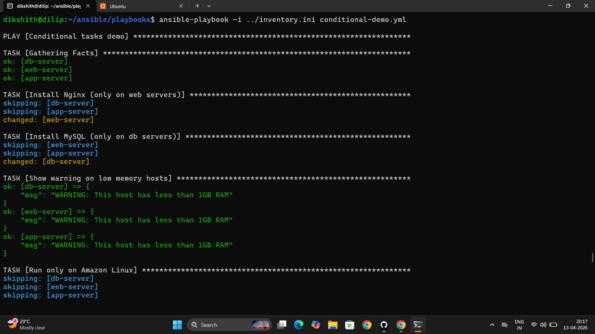

# Day 70 – Variables, Facts, Conditionals, and Loops

---

## Task 1 – Variables in Playbooks

**`variables-demo.yml`**

```yaml
---
- name: Variable demo
  hosts: all
  become: true

  vars:
    app_name: terraweek-app
    app_port: 8080
    app_dir: "/opt/{{ app_name }}"    # Variables can reference other variables
    packages:
      - git
      - curl
      - wget

  tasks:
    - name: Print app details
      debug:
        msg: "Deploying {{ app_name }} on port {{ app_port }} to {{ app_dir }}"

    - name: Create application directory
      file:
        path: "{{ app_dir }}"
        state: directory
        mode: '0755'

    - name: Install required packages
      yum:
        name: "{{ packages }}"
        state: present
```

```bash
ansible-playbook variables-demo.yml
# app_dir resolves to: /opt/terraweek-app

# Override from CLI — -e beats everything
ansible-playbook variables-demo.yml -e "app_name=my-custom-app app_port=9090"
# app_dir resolves to: /opt/my-custom-app  ← CLI variable won
```

`-e` (extra vars) has the highest precedence of any variable source. CLI variables override `vars:` in the playbook, `group_vars`, `host_vars` — everything.

---

## Task 2 – group_vars and host_vars

**Directory structure:**

```
ansible-practice/
├── inventory.ini
├── ansible.cfg
├── group_vars/
│   ├── all.yml         # Applied to every host
│   ├── web.yml         # Applied only to [web] group
│   └── db.yml          # Applied only to [db] group
├── host_vars/
│   └── web-server.yml  # Applied only to web-server host
└── playbooks/
    └── site.yml
```

**`group_vars/all.yml`**

```yaml
---
ntp_server: pool.ntp.org
app_env: development
common_packages:
  - vim
  - htop
  - tree
```

**`group_vars/web.yml`**

```yaml
---
http_port: 80
max_connections: 1000
web_packages:
  - nginx
```

**`group_vars/db.yml`**

```yaml
---
db_port: 3306
db_packages:
  - mysql-server
```

**`host_vars/web-server.yml`**

```yaml
---
max_connections: 2000           # Overrides group_vars/web.yml for this host only
custom_message: "This is the primary web server"
```

**`playbooks/site.yml`**

```yaml
---
- name: Apply common config
  hosts: all
  become: true
  tasks:
    - name: Install common packages
      yum:
        name: "{{ common_packages }}"
        state: present

    - name: Show environment
      debug:
        msg: "Environment: {{ app_env }}"

- name: Configure web servers
  hosts: web
  become: true
  tasks:
    - name: Show web config
      debug:
        msg: "HTTP port: {{ http_port }}, Max connections: {{ max_connections }}"

    - name: Show host-specific message
      debug:
        msg: "{{ custom_message }}"
```

On `web-server`: `max_connections` = `2000` (host_vars wins over group_vars).
On other web hosts: `max_connections` = `1000` (group_vars applies).

**Variable precedence — lowest to highest:**

```
1. Role defaults           (lowest priority)
2. group_vars/all
3. group_vars/<group>
4. host_vars/<host>
5. Playbook vars:
6. Task vars / set_fact
7. Extra vars: -e         (highest priority — always wins)
```

---

## Task 3 – Ansible Facts

```bash
# See all facts for a host
ansible web-server -m setup

# Filter specific facts
ansible web-server -m setup -a "filter=ansible_os_family"
ansible web-server -m setup -a "filter=ansible_distribution*"
ansible web-server -m setup -a "filter=ansible_memtotal_mb"
ansible web-server -m setup -a "filter=ansible_default_ipv4"
```

**`facts-demo.yml`**

```yaml
---
- name: Facts demo
  hosts: all
  tasks:
    - name: Show OS and system info
      debug:
        msg: >
          Hostname: {{ ansible_hostname }},
          OS: {{ ansible_distribution }} {{ ansible_distribution_version }},
          RAM: {{ ansible_memtotal_mb }}MB,
          IP: {{ ansible_default_ipv4.address }}

    - name: Show all network interfaces
      debug:
        var: ansible_interfaces
```

**Five facts and where you'd use them:**

| Fact | Example value | Real use |
|------|--------------|---------|
| `ansible_distribution` | `"Amazon"` / `"Ubuntu"` | Conditional `when:` to pick `yum` vs `apt` |
| `ansible_memtotal_mb` | `983` | Alert on low-memory hosts, set JVM heap sizes |
| `ansible_default_ipv4.address` | `"10.0.1.15"` | Configure services to bind to correct IP |
| `ansible_processor_count` | `2` | Set worker thread counts in Nginx/Node config |
| `ansible_hostname` | `"web-server-1"` | Generate server-specific config file names or report filenames |

---

## Task 4 – Conditionals with `when`

**`conditional-demo.yml`**

```yaml
---
- name: Conditional tasks demo
  hosts: all
  become: true

  tasks:
    - name: Install Nginx (only on web servers)
      yum:
        name: nginx
        state: present
      when: "'web' in group_names"                    # group_names is a built-in list

    - name: Install MySQL (only on db servers)
      yum:
        name: mysql-server
        state: present
      when: "'db' in group_names"

    - name: Warn on low memory hosts
      debug:
        msg: "WARNING: This host has less than 1GB RAM"
      when: ansible_memtotal_mb < 1024

    - name: Run only on Amazon Linux
      debug:
        msg: "This is an Amazon Linux machine"
      when: ansible_distribution == "Amazon"

    - name: Run only on Ubuntu
      debug:
        msg: "This is an Ubuntu machine"
      when: ansible_distribution == "Ubuntu"

    - name: Run only in production
      debug:
        msg: "Production settings applied"
      when: app_env == "production"

    - name: Multiple conditions (AND) — list means ALL must be true
      debug:
        msg: "Web server with enough memory"
      when:
        - "'web' in group_names"
        - ansible_memtotal_mb >= 512

    - name: OR condition
      debug:
        msg: "Either web or app server"
      when: "'web' in group_names or 'app' in group_names"
```

Tasks that don't match their `when` condition show `skipping` in the output — they don't fail, they're just skipped for that host. No `{{ }}` needed inside `when:` — variable references are evaluated directly.



---

## Task 5 – Loops

**`loops-demo.yml`**

```yaml
---
- name: Loops demo
  hosts: all
  become: true

  vars:
    users:
      - name: deploy
        groups: wheel
      - name: monitor
        groups: wheel
      - name: appuser
        groups: users

    directories:
      - /opt/app/logs
      - /opt/app/config
      - /opt/app/data
      - /opt/app/tmp

  tasks:
    - name: Create multiple users
      user:
        name: "{{ item.name }}"
        groups: "{{ item.groups }}"
        state: present
      loop: "{{ users }}"

    - name: Create multiple directories
      file:
        path: "{{ item }}"
        state: directory
        mode: '0755'
      loop: "{{ directories }}"

    - name: Install multiple packages
      yum:
        name: "{{ item }}"
        state: present
      loop:
        - git
        - curl
        - unzip
        - jq

    - name: Print each user created
      debug:
        msg: "Created user {{ item.name }} in group {{ item.groups }}"
      loop: "{{ users }}"
```

Each `loop` iteration runs the task once with `item` set to the current element. The output shows one task result per iteration, clearly labelled with the `item` value.

**`loop` vs `with_items`:**

`with_items` was the old syntax (Ansible < 2.5). `loop` is the modern unified replacement. Both do the same thing, but `loop` works with any data structure and is the recommended syntax going forward. `with_items` still works but should not be used in new playbooks.

---

## Task 6 – Server Health Report

**`server-report.yml`**

```yaml
---
- name: Server Health Report
  hosts: all

  tasks:
    - name: Check disk space
      command: df -h /
      register: disk_result

    - name: Check memory
      command: free -m
      register: memory_result

    - name: Check running services
      shell: systemctl list-units --type=service --state=running | head -20
      register: services_result

    - name: Generate report
      debug:
        msg:
          - "========== {{ inventory_hostname }} =========="
          - "OS: {{ ansible_distribution }} {{ ansible_distribution_version }}"
          - "IP: {{ ansible_default_ipv4.address }}"
          - "RAM: {{ ansible_memtotal_mb }}MB"
          - "Disk: {{ disk_result.stdout_lines[1] }}"
          - "Running services count: {{ services_result.stdout_lines | length }}"

    - name: Flag if disk is critically high
      debug:
        msg: "ALERT: Check disk space on {{ inventory_hostname }}"
      when: "'9' in disk_result.stdout_lines[1] or '100%' in disk_result.stdout_lines[1]"

    - name: Save report to file
      copy:
        content: |
          Server: {{ inventory_hostname }}
          OS: {{ ansible_distribution }} {{ ansible_distribution_version }}
          IP: {{ ansible_default_ipv4.address }}
          RAM: {{ ansible_memtotal_mb }}MB
          Disk:
          {{ disk_result.stdout }}
          Checked at: {{ ansible_date_time.iso8601 }}
        dest: "/tmp/server-report-{{ inventory_hostname }}.txt"
      become: true
```

```bash
ansible-playbook server-report.yml

# Verify report on server
ssh ec2-user@<web-server-ip>
cat /tmp/server-report-web-server.txt
```

The report file combines facts (automatically gathered), registered command output, and a timestamp — all written to a per-host file named with `inventory_hostname` so reports don't overwrite each other across the fleet.

---

## Variable Sources Summary

| Source | Scope | Where defined | Precedence |
|--------|-------|--------------|------------|
| `group_vars/all.yml` | All hosts | File | Low |
| `group_vars/<group>.yml` | Group members | File | Medium |
| `host_vars/<host>.yml` | One host | File | High |
| `vars:` in playbook | Play scope | Playbook | Medium |
| `register:` | Task scope | Runtime | Per-task |
| `-e` CLI flag | Everything | Command line | Highest |