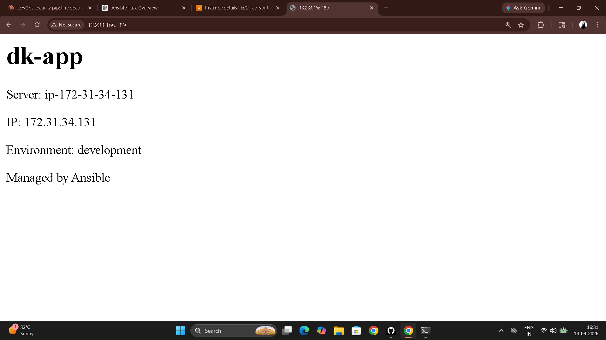
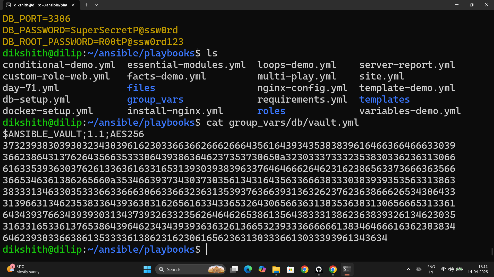

# Day 71 – Roles, Galaxy, Templates, and Vault

---

## Task 1 – Jinja2 Templates

**`templates/nginx-vhost.conf.j2`**

```jinja2
# Managed by Ansible -- do not edit manually
server {
    listen {{ http_port | default(80) }};
    server_name {{ ansible_hostname }};

    root /var/www/{{ app_name }};
    index index.html;

    location / {
        try_files $uri $uri/ =404;
    }

    access_log /var/log/nginx/{{ app_name }}_access.log;
    error_log /var/log/nginx/{{ app_name }}_error.log;
}
```

**`template-demo.yml`**

```yaml
---
- name: Deploy Nginx with template
  hosts: web
  become: true
  vars:
    app_name: terraweek-app
    http_port: 80

  tasks:
    - name: Install Nginx
      yum:
        name: nginx
        state: present

    - name: Create web root
      file:
        path: "/var/www/{{ app_name }}"
        state: directory
        mode: '0755'

    - name: Deploy vhost config from template
      template:
        src: templates/nginx-vhost.conf.j2
        dest: "/etc/nginx/conf.d/{{ app_name }}.conf"
        owner: root
        mode: '0644'
      notify: Restart Nginx

    - name: Deploy index page
      copy:
        content: "<h1>{{ app_name }}</h1><p>Host: {{ ansible_hostname }} | IP: {{ ansible_default_ipv4.address }}</p>"
        dest: "/var/www/{{ app_name }}/index.html"

  handlers:
    - name: Restart Nginx
      service:
        name: nginx
        state: restarted
```

```bash
ansible-playbook template-demo.yml --diff
# Shows rendered template diff before applying
```

The `template` module runs Jinja2 locally on the control node, renders the `.j2` file with all variables and facts substituted, then copies the rendered file to the managed node. `{{ ansible_hostname }}` resolves to the actual hostname of each target server — the same template produces a different config file per host.

---

## Task 2 – Role Structure

```
roles/
  webserver/
    tasks/
      main.yml        # Main task list — loaded automatically
    handlers/
      main.yml        # Handlers (service restarts etc.)
    templates/
      nginx.conf.j2   # Jinja2 templates
      vhost.conf.j2
      index.html.j2
    files/
      index.html      # Static files for copy module
    vars/
      main.yml        # High-priority role variables
    defaults/
      main.yml        # Low-priority defaults (easily overridden by callers)
    meta/
      main.yml        # Role metadata and Galaxy dependencies
    README.md
```

```bash
ansible-galaxy init roles/webserver
```

**`vars/main.yml` vs `defaults/main.yml`:**

| | `vars/main.yml` | `defaults/main.yml` |
|---|---|---|
| Priority | High — overrides group_vars and host_vars | Lowest — anything overrides it |
| Purpose | Constants that should not change | Sensible defaults callers can override |
| Use for | Internal role logic, OS-specific settings | `http_port`, `app_name`, tunable parameters |

Use `defaults/` for anything you want callers to customize. Use `vars/` for internal values the role controls.

---

## Task 3 – Custom Webserver Role

**`roles/webserver/defaults/main.yml`**

```yaml
---
http_port: 80
app_name: myapp
max_connections: 512
```

**`roles/webserver/tasks/main.yml`**

```yaml
---
- name: Install Nginx
  yum:
    name: nginx
    state: present

- name: Deploy Nginx config
  template:
    src: nginx.conf.j2
    dest: /etc/nginx/nginx.conf
    owner: root
    mode: '0644'
  notify: Restart Nginx

- name: Deploy vhost config
  template:
    src: vhost.conf.j2
    dest: "/etc/nginx/conf.d/{{ app_name }}.conf"
    owner: root
    mode: '0644'
  notify: Restart Nginx

- name: Create web root
  file:
    path: "/var/www/{{ app_name }}"
    state: directory
    mode: '0755'

- name: Deploy index page
  template:
    src: index.html.j2
    dest: "/var/www/{{ app_name }}/index.html"
    mode: '0644'

- name: Start and enable Nginx
  service:
    name: nginx
    state: started
    enabled: true
```

**`roles/webserver/handlers/main.yml`**

```yaml
---
- name: Restart Nginx
  service:
    name: nginx
    state: restarted
```

**`roles/webserver/templates/nginx.conf.j2`**

```jinja2
# Managed by Ansible -- do not edit manually
user nginx;
worker_processes auto;
worker_connections {{ max_connections }};
error_log /var/log/nginx/error.log;
pid /run/nginx.pid;

events {
    worker_connections {{ max_connections }};
}

http {
    include       /etc/nginx/mime.types;
    default_type  application/octet-stream;
    sendfile on;
    keepalive_timeout 65;
    include /etc/nginx/conf.d/*.conf;
}
```

**`roles/webserver/templates/vhost.conf.j2`**

```jinja2
# Managed by Ansible -- do not edit manually
server {
    listen {{ http_port }};
    server_name {{ ansible_hostname }};
    root /var/www/{{ app_name }};
    index index.html;

    location / {
        try_files $uri $uri/ =404;
    }

    access_log /var/log/nginx/{{ app_name }}_access.log;
    error_log /var/log/nginx/{{ app_name }}_error.log;
}
```

**`roles/webserver/templates/index.html.j2`**

```jinja2
<h1>{{ app_name }}</h1>
<p>Server: {{ ansible_hostname }}</p>
<p>IP: {{ ansible_default_ipv4.address }}</p>
<p>Environment: {{ app_env | default('development') }}</p>
<p>Managed by Ansible</p>
```

**`site.yml`**

```yaml
---
- name: Configure web servers
  hosts: web
  become: true
  roles:
    - role: webserver
      vars:
        app_name: terraweek
        http_port: 80
```

```bash
ansible-playbook site.yml
curl http://<web-server-ip>
# <h1>terraweek</h1>
# <p>Server: web-server</p>  ...
```



---

## Task 4 – Ansible Galaxy

```bash
# Search
ansible-galaxy search nginx --platforms EL
ansible-galaxy search mysql

# Install
ansible-galaxy install geerlingguy.docker
ansible-galaxy list     # Shows installed roles and their paths
```

**`docker-setup.yml`**

```yaml
---
- name: Install Docker using Galaxy role
  hosts: app
  become: true
  roles:
    - geerlingguy.docker
```

**`requirements.yml`**

```yaml
---
roles:
  - name: geerlingguy.docker
    version: "7.4.1"
  - name: geerlingguy.ntp
    version: "2.3.3"
```

```bash
ansible-galaxy install -r requirements.yml
```

**Why `requirements.yml` over manual installs:**

Pinned versions ensure reproducibility — every team member and every CI run installs the exact same role version. One command installs the entire dependency set. The file is version-controlled alongside the playbooks so the roles and their consumers stay in sync. Without it, `ansible-galaxy install geerlingguy.docker` would install whatever version is latest today, which may break tomorrow.

---

## Task 5 – Ansible Vault

```bash
# Create an encrypted file
ansible-vault create group_vars/db/vault.yml
# Prompts for vault password, opens editor
```

Inside the editor:

```yaml
vault_db_password: SuperSecretP@ssw0rd
vault_db_root_password: R00tP@ssw0rd123
vault_api_key: sk-abc123xyz789
```

```bash
cat group_vars/db/vault.yml
# $ANSIBLE_VAULT;1.1;AES256
# 61383966613963313763663766333437303564323835313564333337343...
# (fully encrypted — unreadable without the vault password)

# Edit, view, encrypt existing file
ansible-vault edit group_vars/db/vault.yml
ansible-vault view group_vars/db/vault.yml
ansible-vault encrypt group_vars/db/secrets.yml

# Decrypt temporarily (never commit decrypted vault files)
ansible-vault decrypt group_vars/db/vault.yml
```

**`db-setup.yml`**

```yaml
---
- name: Configure database
  hosts: db
  become: true
  tasks:
    - name: Confirm DB password is set
      debug:
        msg: "DB password is set: {{ vault_db_password | length > 0 }}"
```

```bash
# Interactive — not suitable for CI
ansible-playbook db-setup.yml --ask-vault-pass

# Password file — recommended for automation
echo "YourVaultPassword" > .vault_pass
chmod 600 .vault_pass
echo ".vault_pass" >> .gitignore
ansible-playbook db-setup.yml --vault-password-file .vault_pass
```

Add to `ansible.cfg`:

```ini
[defaults]
vault_password_file = .vault_pass
```

**Why `--vault-password-file` beats `--ask-vault-pass` for pipelines:**

`--ask-vault-pass` requires interactive input — a CI/CD runner can't type a password. `--vault-password-file` reads from a file that can be injected as a secret by the CI system (GitHub Actions secret → file, Jenkins credential → file) without any human interaction. The vault password file itself is never committed to git.



---

## Task 6 – Full site.yml Combining Everything

**`site.yml`**

```yaml
---
- name: Configure web servers
  hosts: web
  become: true
  roles:
    - role: webserver
      vars:
        app_name: terraweek
        http_port: 80

- name: Configure app servers with Docker
  hosts: app
  become: true
  roles:
    - geerlingguy.docker

- name: Configure database servers
  hosts: db
  become: true
  tasks:
    - name: Create DB config with secrets
      template:
        src: templates/db-config.j2
        dest: /etc/db-config.env
        owner: root
        mode: '0600'          # Only root can read — secrets file
```

**`templates/db-config.j2`**

```jinja2
# Database Configuration -- Managed by Ansible
DB_HOST={{ ansible_default_ipv4.address }}
DB_PORT={{ db_port | default(3306) }}
DB_PASSWORD={{ vault_db_password }}
DB_ROOT_PASSWORD={{ vault_db_root_password }}
```

```bash
ansible-playbook site.yml
# SSH and verify
ssh ec2-user@<db-server-ip>
cat /etc/db-config.env
# DB_HOST=10.0.3.x
# DB_PORT=3306
# DB_PASSWORD=SuperSecretP@ssw0rd   ← decrypted at runtime
ls -la /etc/db-config.env
# -rw------- 1 root root ...   ← permission 600 confirmed
```

---

## When to Use What

| Tool | Use when |
|------|---------|
| Ad-hoc command | Quick one-off check or change — `ansible all -m ping` |
| Playbook | Multi-step automation that doesn't need reuse across projects |
| Role | Repeatable unit of automation shared across projects or teams |
| Galaxy role | Well-maintained community automation for common software |
| Template | Config files that vary per host, group, or environment |
| Vault | Any value you wouldn't commit to a public git repo |