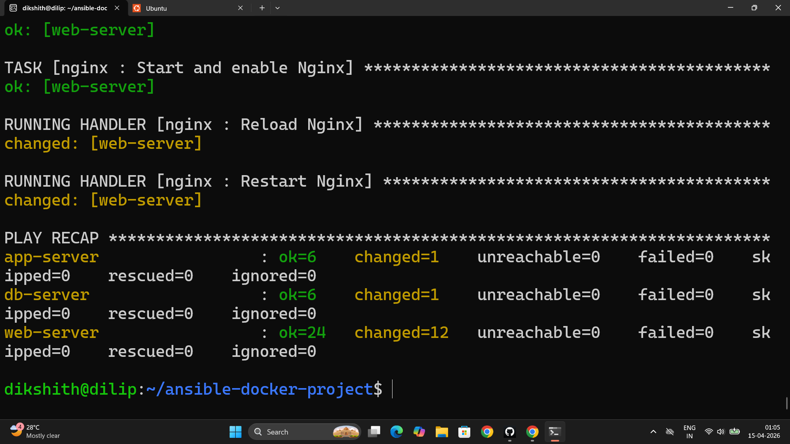
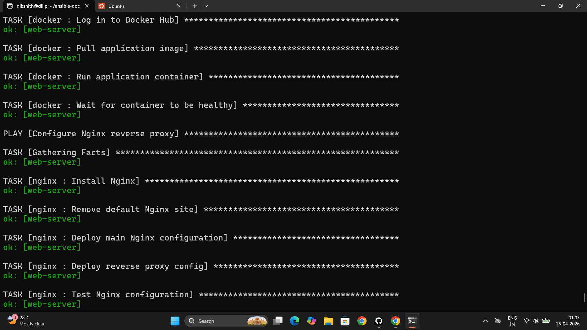
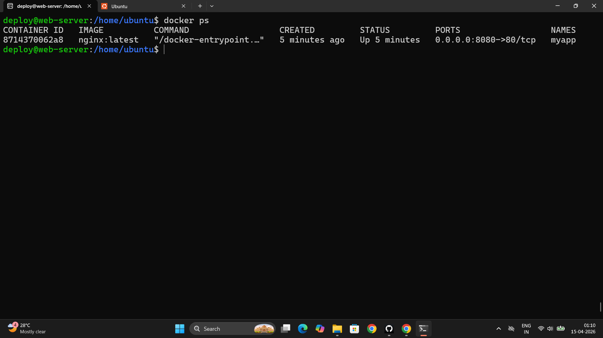
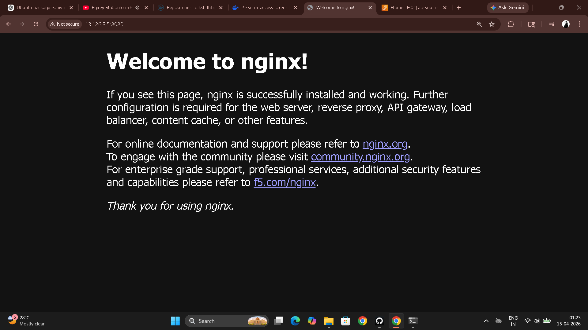

# Day 72 – Ansible Capstone: Docker + Nginx Deployment

---

## Architecture

```
Ansible Control Node
        │
        │ SSH
        ▼
   Web Server (EC2)
   ┌──────────────────────────────┐
   │   Nginx :80                  │
   │     │ reverse proxy          │
   │     ▼                        │
   │   Docker Container :8080     │
   │   (nginx:latest / httpd)     │
   └──────────────────────────────┘
```

---

## Project Structure

```
ansible-docker-project/
├── ansible.cfg
├── inventory.ini
├── site.yml                          # Master playbook
├── .vault_pass                       # Never committed to git
├── .gitignore
├── group_vars/
│   ├── all.yml                       # Common variables for all hosts
│   └── web/
│       ├── vars.yml                  # Nginx variables
│       └── vault.yml                 # Encrypted Docker Hub credentials
└── roles/
    ├── common/
    │   └── tasks/main.yml
    ├── docker/
    │   ├── defaults/main.yml
    │   ├── tasks/main.yml
    │   ├── templates/
    │   │   └── docker-compose.yml.j2
    │   └── handlers/main.yml
    └── nginx/
        ├── defaults/main.yml
        ├── tasks/main.yml
        ├── templates/
        │   ├── nginx.conf.j2
        │   └── app-proxy.conf.j2
        └── handlers/main.yml
```

```bash
ansible-galaxy init roles/common
ansible-galaxy init roles/docker
ansible-galaxy init roles/nginx
ansible-galaxy collection install community.docker
```

---

## ansible.cfg

```ini
[defaults]
inventory         = inventory.ini
host_key_checking = False
vault_password_file = .vault_pass
remote_user       = ec2-user

[ssh_connection]
pipelining = True
```

---

## group_vars/all.yml

```yaml
---
timezone: Asia/Kolkata
project_name: devops-app
app_env: development
common_packages:
  - vim
  - curl
  - wget
  - git
  - htop
  - tree
  - jq
  - unzip
```

---

## Task 2 – Common Role

**`roles/common/tasks/main.yml`**

```yaml
---
- name: Update package cache
  yum:
    update_cache: true
  tags: common

- name: Install common packages
  yum:
    name: "{{ common_packages }}"
    state: present
  tags: common

- name: Set hostname
  hostname:
    name: "{{ inventory_hostname }}"
  tags: common

- name: Set timezone
  timezone:
    name: "{{ timezone }}"
  tags: common

- name: Create deploy user
  user:
    name: deploy
    groups: wheel
    shell: /bin/bash
    state: present
  tags: common
```

---

## Task 3 – Docker Role

**`roles/docker/defaults/main.yml`**

```yaml
---
docker_app_image: nginx
docker_app_tag: latest
docker_app_name: myapp
docker_app_port: 8080
docker_container_port: 80
```

**`roles/docker/tasks/main.yml`**

```yaml
---
- name: Install Docker dependencies
  yum:
    name:
      - yum-utils
      - device-mapper-persistent-data
      - lvm2
    state: present
  tags: docker

- name: Add Docker CE repository
  get_url:
    url: https://download.docker.com/linux/centos/docker-ce.repo
    dest: /etc/yum.repos.d/docker-ce.repo
  tags: docker

- name: Install Docker CE
  yum:
    name:
      - docker-ce
      - docker-ce-cli
      - containerd.io
    state: present
  tags: docker

- name: Start and enable Docker
  service:
    name: docker
    state: started
    enabled: true
  tags: docker

- name: Add deploy user to docker group
  user:
    name: deploy
    groups: docker
    append: true
  tags: docker

- name: Install pip3
  yum:
    name: python3-pip
    state: present
  tags: docker

- name: Install Docker SDK for Python
  pip:
    name: docker
    state: present
  tags: docker

- name: Log in to Docker Hub
  community.docker.docker_login:
    username: "{{ vault_docker_username }}"
    password: "{{ vault_docker_password }}"
  become_user: deploy
  when: vault_docker_username is defined
  tags: docker

- name: Pull application image
  community.docker.docker_image:
    name: "{{ docker_app_image }}"
    tag: "{{ docker_app_tag }}"
    source: pull
  tags: docker

- name: Stop and remove existing container
  community.docker.docker_container:
    name: "{{ docker_app_name }}"
    state: absent
  tags: docker

- name: Run application container
  community.docker.docker_container:
    name: "{{ docker_app_name }}"
    image: "{{ docker_app_image }}:{{ docker_app_tag }}"
    state: started
    restart_policy: always
    ports:
      - "{{ docker_app_port }}:{{ docker_container_port }}"
  tags: docker

- name: Wait for container to be healthy
  uri:
    url: "http://localhost:{{ docker_app_port }}"
    status_code: 200
  retries: 5
  delay: 3
  register: health_check
  until: health_check.status == 200
  tags: docker
```

**`roles/docker/handlers/main.yml`**

```yaml
---
- name: Restart Docker
  service:
    name: docker
    state: restarted
```

---

## Task 4 – Nginx Role

**`roles/nginx/defaults/main.yml`**

```yaml
---
nginx_http_port: 80
nginx_upstream_port: 8080
nginx_server_name: "_"
```

**`roles/nginx/tasks/main.yml`**

```yaml
---
- name: Install Nginx
  yum:
    name: nginx
    state: present
  tags: nginx

- name: Remove default Nginx site config
  file:
    path: /etc/nginx/conf.d/default.conf
    state: absent
  notify: Reload Nginx
  tags: nginx

- name: Deploy Nginx main config
  template:
    src: nginx.conf.j2
    dest: /etc/nginx/nginx.conf
    owner: root
    mode: '0644'
  notify: Reload Nginx
  tags: nginx

- name: Deploy reverse proxy vhost config
  template:
    src: app-proxy.conf.j2
    dest: "/etc/nginx/conf.d/{{ project_name }}.conf"
    owner: root
    mode: '0644'
  notify: Reload Nginx
  tags: nginx

- name: Test Nginx configuration
  command: nginx -t
  changed_when: false
  tags: nginx

- name: Start and enable Nginx
  service:
    name: nginx
    state: started
    enabled: true
  tags: nginx
```

**`roles/nginx/handlers/main.yml`**

```yaml
---
- name: Reload Nginx
  service:
    name: nginx
    state: reloaded

- name: Restart Nginx
  service:
    name: nginx
    state: restarted
```

**`roles/nginx/templates/app-proxy.conf.j2`**

```jinja2
# Reverse Proxy to Docker Container -- Managed by Ansible
upstream docker_app {
    server 127.0.0.1:{{ nginx_upstream_port }};
}

server {
    listen {{ nginx_http_port }};
    server_name {{ nginx_server_name }};

    location / {
        proxy_pass http://docker_app;
        proxy_set_header Host $host;
        proxy_set_header X-Real-IP $remote_addr;
        proxy_set_header X-Forwarded-For $proxy_add_x_forwarded_for;
        proxy_set_header X-Forwarded-Proto $scheme;
    }

    location /health {
        access_log off;
        return 200 'OK';
        add_header Content-Type text/plain;
    }


    access_log /var/log/nginx/{{ project_name }}_access.log;
    error_log /var/log/nginx/{{ project_name }}_error.log;

    access_log /var/log/nginx/{{ project_name }}_access.log;
    error_log /var/log/nginx/{{ project_name }}_error.log debug;

}
```

---

## Task 5 – Vault for Docker Hub Credentials

```bash
ansible-vault create group_vars/web/vault.yml
```

Contents (encrypted):

```yaml
vault_docker_username: your-dockerhub-username
vault_docker_password: your-dockerhub-token
```

```bash
echo "YourVaultPassword" > .vault_pass
chmod 600 .vault_pass
echo ".vault_pass" >> .gitignore
```

---

## Task 6 – Master Playbook and Deploy

**`site.yml`**

```yaml
---
- name: Apply common configuration
  hosts: all
  become: true
  roles:
    - common
  tags: common

- name: Install Docker and run containers
  hosts: web
  become: true
  roles:
    - docker
  tags: docker

- name: Configure Nginx reverse proxy
  hosts: web
  become: true
  roles:
    - nginx
  tags: nginx
```

```bash
# Always dry run first
ansible-playbook site.yml --check --diff

# Full deploy
ansible-playbook site.yml

# Selective execution with tags
ansible-playbook site.yml --tags docker      # Only Docker setup
ansible-playbook site.yml --tags nginx       # Only Nginx config
ansible-playbook site.yml --skip-tags common # Skip baseline setup

# Verify
curl http://<server-ip>:8080    # Direct to container
curl http://<server-ip>         # Through Nginx reverse proxy
curl http://<server-ip>/health  # Nginx health endpoint
```

```bash
# On server
docker ps
# CONTAINER ID  IMAGE         PORTS                  NAMES
# abc123        nginx:latest  0.0.0.0:8080->80/tcp   myapp
```

```bash
# Second run — proves idempotency
ansible-playbook site.yml
# All tasks show: ok=N changed=0 unreachable=0 failed=0
```






---

## Task 7 – Deploy Different App

```bash
ansible-playbook site.yml --tags docker \
  -e "docker_app_image=httpd docker_app_tag=latest docker_app_name=apache-app"
# Old container replaced, Nginx still proxies — no config change needed
```

---

## Concept Map: Five Days → One Project

| Day | Concept | Used in this project |
|-----|---------|---------------------|
| 68 | Inventory, ad-hoc, SSH | `inventory.ini`, `ansible.cfg`, SSH key auth |
| 69 | Playbooks, modules, handlers | `site.yml`, all role task files, Nginx reload handler |
| 70 | Variables, facts, conditionals, loops | `group_vars/all.yml`, `when:` in docker login, `ansible_hostname` in templates |
| 71 | Roles, Jinja2 templates, Galaxy, Vault | All three custom roles, `app-proxy.conf.j2`, `community.docker`, `vault.yml` |
| 72 | Full project integration | Tags, idempotency, reverse proxy architecture |

---

## What to Add for Production

- **SSL** — certbot role (`geerlingguy.certbot`) + HTTPS redirect in Nginx template
- **Docker Compose** — replace single container with `community.docker.docker_compose` for multi-container apps
- **Log rotation** — `logrotate` config for Nginx logs via `template` module
- **Monitoring** — Node Exporter + Prometheus target added to `common` role
- **Firewall** — `firewalld` tasks in `common` role to close port 8080 (container direct access) externally
- **Zero-downtime deploy** — pull new image, start new container, health check, swap Nginx upstream, stop old container