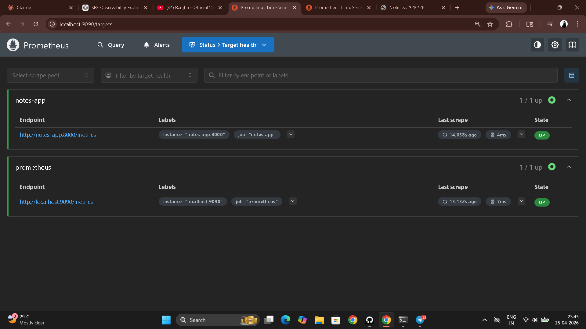

# Day 73 – Observability and Prometheus

---

## Task 1 – Observability vs Traditional Monitoring

**Traditional monitoring** sets thresholds and alerts when a number crosses a line. You know *that* something is wrong. You don't know *why*.

**Observability** is the ability to understand the internal state of a system from its external outputs. You can ask arbitrary questions about your system's behavior — even questions you didn't think to ask when you designed the monitoring. You know *why* something is wrong.

**The three pillars:**

| Pillar | What it is | What it answers | Tools |
|--------|-----------|----------------|-------|
| **Metrics** | Numerical measurements over time | *What* is broken — high error rate on `/api/users` | Prometheus, Datadog, CloudWatch |
| **Logs** | Timestamped text records of events | *Why* it broke — stack trace showing DB timeout | Loki, ELK Stack, Fluentd |
| **Traces** | Journey of a single request across services | *Where* it broke — payment service call took 12s | OpenTelemetry, Jaeger, Zipkin |

You need all three because they answer different questions. Metrics alert you, logs explain the error, traces pinpoint which service in the chain caused it.

**Five-day architecture (Days 73–77):**

```
[notes-app]  ──metrics──►  [Prometheus :9090]  ──────────►  [Grafana :3000]
[Host]       ──metrics──►  [Node Exporter :9100] ──────────►  (dashboards)
[Docker]     ──metrics──►  [cAdvisor :8080] ─────────────►  (dashboards)

[notes-app]  ──logs───►   [Promtail]  ──────►  [Loki :3100]  ──►  [Grafana]

[notes-app]  ──traces──►  [OTEL Collector]  ──────────────►  [Grafana/Debug]
```

---

## Task 2 – Prometheus with Docker

**`prometheus.yml`**

```yaml
global:
  scrape_interval: 15s
  evaluation_interval: 15s

scrape_configs:
  - job_name: "prometheus"
    static_configs:
      - targets: ["localhost:9090"]
```

**`docker-compose.yml`**

```yaml
services:
  prometheus:
    image: prom/prometheus:latest
    container_name: prometheus
    ports:
      - "9090:9090"
    volumes:
      - ./prometheus.yml:/etc/prometheus/prometheus.yml
      - prometheus_data:/prometheus
    command:
      - '--config.file=/etc/prometheus/prometheus.yml'
      - '--storage.tsdb.retention.time=30d'
      - '--storage.tsdb.retention.size=1GB'
    restart: unless-stopped

volumes:
  prometheus_data:
```

```bash
docker compose up -d
# Open http://localhost:9090
# Status > Targets → prometheus: UP
```


---

## Task 3 – Prometheus Concepts

**Metric types:**

| Type | Behavior | Real example |
|------|---------|-------------|
| **Counter** | Only goes up, resets on restart | `http_requests_total` — total requests served since start |
| **Gauge** | Goes up and down | `node_memory_Active_bytes` — current RAM in use |
| **Histogram** | Buckets of value distributions | `http_request_duration_seconds` — how many requests took <100ms, <500ms, <1s |
| **Summary** | Percentile calculations on client side | Request latency p50, p95, p99 |

**Counter vs Gauge:**
- **Counter** — a taxi odometer. Only ever increases. Resets when the taxi restarts. You calculate speed from it with `rate()`.
- **Gauge** — the taxi speedometer. Shows the current value right now. Goes up and down. You read it directly.

**PromQL queries on Prometheus itself:**

```promql
# Total metrics Prometheus is collecting
count({__name__=~".+"})

# Prometheus process memory in bytes
process_resident_memory_bytes

# All HTTP requests to the Prometheus server
prometheus_http_requests_total

# Break down by handler
prometheus_http_requests_total{handler="/api/v1/query"}
```


---

## Task 4 – PromQL Basics

```promql
# Instant vector — current value for all scrape targets
up
# Returns: 1 (UP) or 0 (DOWN) per target

# Range vector — all values over the last 5 minutes
prometheus_http_requests_total[5m]

# Rate — per-second rate of a counter over 5 minutes
rate(prometheus_http_requests_total[5m])

# Sum all rates across labels
sum(rate(prometheus_http_requests_total[5m]))

# Filter by label — successful requests only
prometheus_http_requests_total{code="200"}

# Filter by label — non-200 responses
prometheus_http_requests_total{code!="200"}

# Arithmetic — bytes to megabytes
process_resident_memory_bytes / 1024 / 1024

# Top 5 most-requested handlers
topk(5, prometheus_http_requests_total)
```

**Exercise — per-second rate of non-200 requests over last 5 minutes:**

```promql
rate(prometheus_http_requests_total{code!="200"}[5m])
```

**Key rules:**
- `rate()` only works on counters — applying it to a gauge gives meaningless results
- Always `rate()` before `sum()`: `sum(rate(...))` ✓ — `rate(sum(...))` ✗
- `[5m]` is a range selector — required by `rate()`, `increase()`, `avg_over_time()`

---

## Task 5 – Add the Notes App as a Scrape Target

**Updated `docker-compose.yml`**

```yaml
services:
  prometheus:
    image: prom/prometheus:latest
    container_name: prometheus
    ports:
      - "9090:9090"
    volumes:
      - ./prometheus.yml:/etc/prometheus/prometheus.yml
      - prometheus_data:/prometheus
    command:
      - '--config.file=/etc/prometheus/prometheus.yml'
      - '--storage.tsdb.retention.time=30d'
    restart: unless-stopped

  notes-app:
    image: trainwithshubham/notes-app:latest
    container_name: notes-app
    ports:
      - "8000:8000"
    restart: unless-stopped

volumes:
  prometheus_data:
```

**Updated `prometheus.yml`**

```yaml
global:
  scrape_interval: 15s
  evaluation_interval: 15s

scrape_configs:
  - job_name: "prometheus"
    static_configs:
      - targets: ["localhost:9090"]

  - job_name: "notes-app"
    static_configs:
      - targets: ["notes-app:8000"]
```

```bash
docker compose up -d

# Generate traffic
curl http://localhost:8000
curl http://localhost:8000
curl http://localhost:8000

# Status > Targets → two targets: prometheus UP, notes-app UP
```



**Note:** Not all applications expose Prometheus metrics natively. Node Exporter exports host metrics, cAdvisor exports Docker container metrics, and OTEL Collector exports traces/metrics from apps that don't have built-in Prometheus support — all covered in the coming days.

---

## Task 6 – Data Retention and Storage

```bash
# Check Prometheus disk usage
docker exec prometheus du -sh /prometheus

# View TSDB status
# UI: Status > TSDB Status
```

**Retention configuration (already in compose above):**

```yaml
command:
  - '--config.file=/etc/prometheus/prometheus.yml'
  - '--storage.tsdb.retention.time=30d'
  - '--storage.tsdb.retention.size=1GB'
```

**What happens when retention is exceeded:** Prometheus deletes the oldest blocks first to stay within the configured time or size limit. It's a rolling window — new data comes in, old data falls off. You never run out of disk if `--storage.tsdb.retention.size` is set.

**Why the volume mount is critical:** Without `prometheus_data:/prometheus`, all metrics data is stored inside the container's writable layer. `docker compose down` (not `stop`) wipes the container — all historical metrics gone. The named volume persists the TSDB across container restarts, upgrades, and recreations. This is why the volume is defined separately and named rather than anonymous.