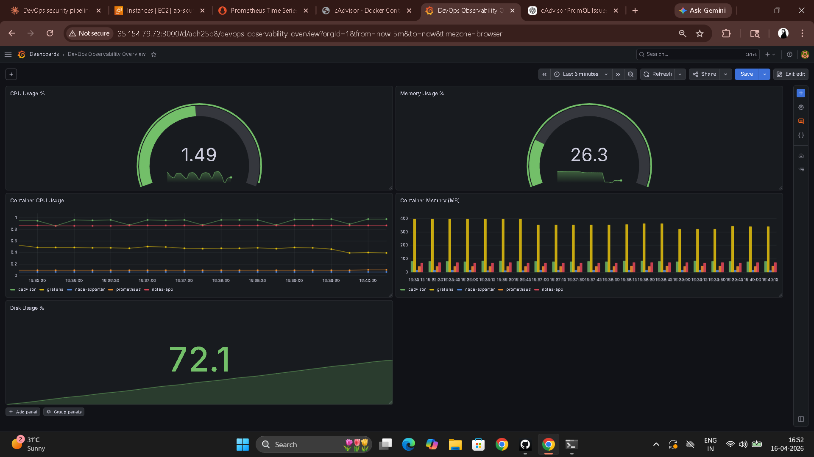
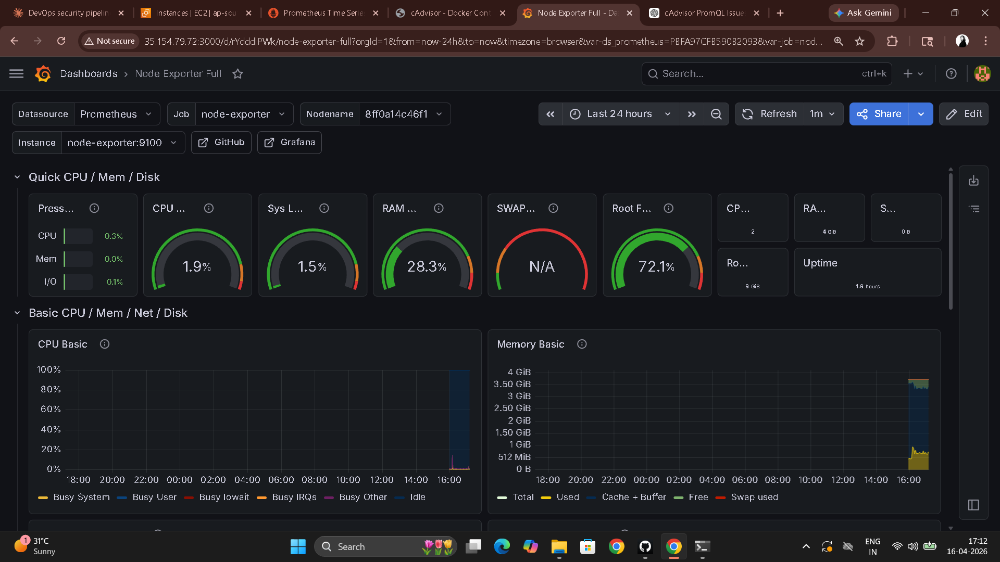
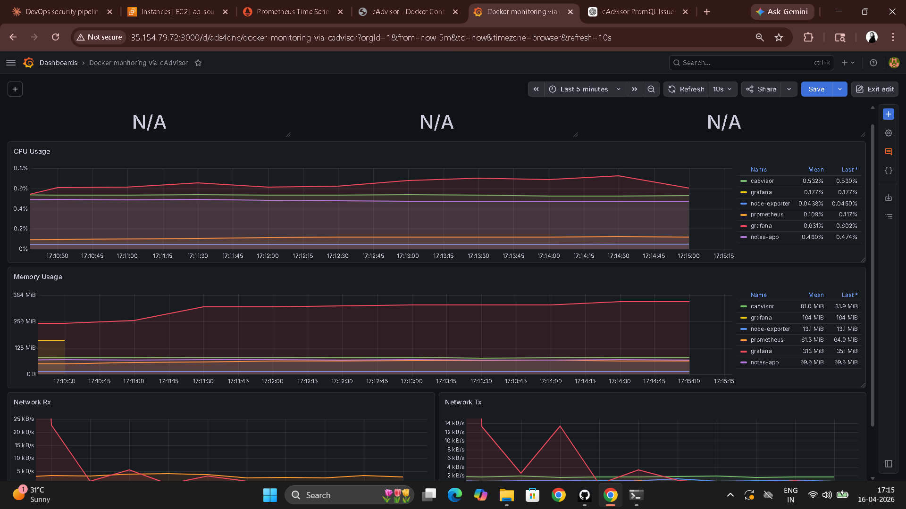

# Day 74 – Node Exporter, cAdvisor, and Grafana Dashboards

---

## Task 1 – Node Exporter for Host Metrics

**Updated `docker-compose.yml` — add Node Exporter:**

```yaml
  node-exporter:
    image: prom/node-exporter:latest
    container_name: node-exporter
    ports:
      - "9100:9100"
    volumes:
      - /proc:/host/proc:ro
      - /sys:/host/sys:ro
      - /:/rootfs:ro
    command:
      - '--path.procfs=/host/proc'
      - '--path.sysfs=/host/sys'
      - '--path.rootfs=/rootfs'
      - '--collector.filesystem.mount-points-exclude=^/(sys|proc|dev|host|etc)($$|/)'
    restart: unless-stopped
```

**Why read-only volume mounts:**

| Mount | What it exposes | Why ro |
|-------|----------------|--------|
| `/proc` | Kernel + process info (CPU stats, memory) | Node Exporter reads only |
| `/sys` | Hardware and driver details | Node Exporter reads only |
| `/` (rootfs) | Filesystem usage (disk space) | Node Exporter reads only |

**Updated `prometheus.yml`:**

```yaml
global:
  scrape_interval: 15s
  evaluation_interval: 15s

scrape_configs:
  - job_name: "prometheus"
    static_configs:
      - targets: ["localhost:9090"]

  - job_name: "node-exporter"
    static_configs:
      - targets: ["node-exporter:9100"]

  - job_name: "notes-app"
    static_configs:
      - targets: ["notes-app:8000"]
```

```bash
docker compose up -d
curl http://localhost:9100/metrics | head -20
# Status > Targets → node-exporter: UP
```

**Key PromQL queries for host metrics:**

```promql
# CPU idle time per core
node_cpu_seconds_total{mode="idle"}

# Memory: total and available
node_memory_MemTotal_bytes
node_memory_MemAvailable_bytes

# Memory usage percentage
(1 - node_memory_MemAvailable_bytes / node_memory_MemTotal_bytes) * 100

# Disk usage percentage
(1 - node_filesystem_avail_bytes / node_filesystem_size_bytes) * 100

# Network bytes received per second
rate(node_network_receive_bytes_total[5m])
```

---

## Task 2 – cAdvisor for Container Metrics

**Add to `docker-compose.yml`:**

```yaml
  cadvisor:
    image: gcr.io/cadvisor/cadvisor:latest
    container_name: cadvisor
    ports:
      - "8080:8080"
    volumes:
      - /var/run/docker.sock:/var/run/docker.sock:ro
      - /sys:/sys:ro
      - /var/lib/docker/:/var/lib/docker:ro
    restart: unless-stopped
```

**Why these mounts:**

| Mount | Purpose |
|-------|---------|
| `docker.sock` | Lets cAdvisor discover and query running containers |
| `/sys` | Kernel-level container stats via cgroups |
| `/var/lib/docker/` | Container filesystem and layer information |

**Add to `prometheus.yml`:**

```yaml
  - job_name: "cadvisor"
    static_configs:
      - targets: ["cadvisor:8080"]
```

```bash
docker compose up -d
# Open http://localhost:8080 → Docker Containers
```

**Key PromQL queries for container metrics:**

```promql
# CPU usage per container
rate(container_cpu_usage_seconds_total{name!=""}[5m])

# Memory usage per container
container_memory_usage_bytes{name!=""}

# Network received per container
rate(container_network_receive_bytes_total{name!=""}[5m])

# Top 3 containers by memory
topk(3, container_memory_usage_bytes{name!=""})
```

`{name!=""}` filters out aggregated/system-level cAdvisor entries — shows only named containers.

**Node Exporter vs cAdvisor:**

| | Node Exporter | cAdvisor |
|---|---|---|
| What it monitors | The host OS — CPU, memory, disk, network | Docker containers — per-container resource usage |
| Metrics prefix | `node_` | `container_` |
| Use when | You need to know if the host is healthy | You need to know which container is consuming resources |
| Replaces | `top`, `iostat`, `vmstat` | `docker stats` |

---

## Task 3 – Grafana Setup

**Add Grafana to `docker-compose.yml`:**

```yaml
  grafana:
    image: grafana/grafana-enterprise:latest
    container_name: grafana
    ports:
      - "3000:3000"
    volumes:
      - grafana_data:/var/lib/grafana
      - ./grafana/provisioning:/etc/grafana/provisioning
    environment:
      - GF_SECURITY_ADMIN_USER=admin
      - GF_SECURITY_ADMIN_PASSWORD=admin123
    restart: unless-stopped
```

```bash
docker compose up -d
# Open http://localhost:3000  →  admin / admin123
# Connections > Data Sources > Add > Prometheus
# URL: http://prometheus:9090   ← container name, not localhost
# Save & Test → "Successfully queried the Prometheus API"
```

---

## Task 4 – Custom Dashboard

**Panel 1 — CPU Usage (Gauge)**
```promql
100 - (avg(rate(node_cpu_seconds_total{mode="idle"}[5m])) * 100)
```
Thresholds: green < 60, yellow < 80, red >= 80

**Panel 2 — Memory Usage (Gauge)**
```promql
(1 - node_memory_MemAvailable_bytes / node_memory_MemTotal_bytes) * 100
```

**Panel 3 — Container CPU Usage (Time Series)**
```promql
rate(container_cpu_usage_seconds_total{name!=""}[5m]) * 100
```
Legend: `{{name}}`

**Panel 4 — Container Memory (Bar Chart)**
```promql
container_memory_usage_bytes{name!=""} / 1024 / 1024
```
Legend: `{{name}}`

**Panel 5 — Disk Usage (Stat)**
```promql
(1 - node_filesystem_avail_bytes{mountpoint="/"} / node_filesystem_size_bytes{mountpoint="/"}) * 100
```

Saved as: **DevOps Observability Overview**



---

## Task 5 – Auto-Provision Datasource via YAML

```bash
mkdir -p grafana/provisioning/datasources
mkdir -p grafana/provisioning/dashboards
```

**`grafana/provisioning/datasources/datasources.yml`**

```yaml
apiVersion: 1

datasources:
  - name: Prometheus
    type: prometheus
    access: proxy
    url: http://prometheus:9090
    isDefault: true
    editable: false
```

```bash
docker compose up -d grafana
# Connections > Data Sources → Prometheus already configured
```

**Why YAML provisioning beats manual UI setup:**

Manual UI configuration is not reproducible — a new team member or a new machine requires the same clicking again. With YAML provisioning the datasource is declared as code, committed to git, and automatically configured on every `docker compose up`. Same principle as IaC for infrastructure — no undocumented manual state.

---

## Task 6 – Import Community Dashboards

```
Dashboards > New > Import
Dashboard ID: 1860  →  Node Exporter Full
Select datasource: Prometheus
Import
```

```
Dashboard ID: 193  →  Docker monitoring via cAdvisor
Select datasource: Prometheus
Import
```





---

## Complete docker-compose.yml

```yaml
services:
  prometheus:
    image: prom/prometheus:latest
    container_name: prometheus
    ports:
      - "9090:9090"
    volumes:
      - ./prometheus.yml:/etc/prometheus/prometheus.yml
      - prometheus_data:/prometheus
    command:
      - '--config.file=/etc/prometheus/prometheus.yml'
      - '--storage.tsdb.retention.time=30d'
      - '--storage.tsdb.retention.size=1GB'
    restart: unless-stopped

  node-exporter:
    image: prom/node-exporter:latest
    container_name: node-exporter
    ports:
      - "9100:9100"
    volumes:
      - /proc:/host/proc:ro
      - /sys:/host/sys:ro
      - /:/rootfs:ro
    command:
      - '--path.procfs=/host/proc'
      - '--path.sysfs=/host/sys'
      - '--path.rootfs=/rootfs'
      - '--collector.filesystem.mount-points-exclude=^/(sys|proc|dev|host|etc)($$|/)'
    restart: unless-stopped

  cadvisor:
    image: gcr.io/cadvisor/cadvisor:latest
    container_name: cadvisor
    ports:
      - "8080:8080"
    volumes:
      - /var/run/docker.sock:/var/run/docker.sock:ro
      - /sys:/sys:ro
      - /var/lib/docker/:/var/lib/docker:ro
    restart: unless-stopped

  grafana:
    image: grafana/grafana-enterprise:latest
    container_name: grafana
    ports:
      - "3000:3000"
    volumes:
      - grafana_data:/var/lib/grafana
      - ./grafana/provisioning:/etc/grafana/provisioning
    environment:
      - GF_SECURITY_ADMIN_USER=admin
      - GF_SECURITY_ADMIN_PASSWORD=admin123
    restart: unless-stopped

  notes-app:
    image: trainwithshubham/notes-app:latest
    container_name: notes-app
    ports:
      - "8000:8000"
    restart: unless-stopped

volumes:
  prometheus_data:
  grafana_data:
```

```bash
docker compose ps
# All 5 services running
```