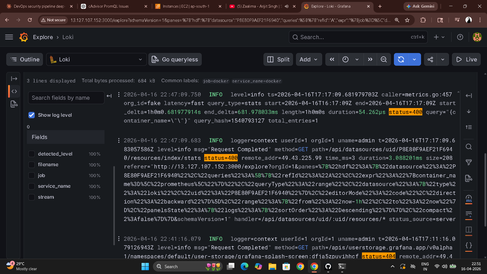
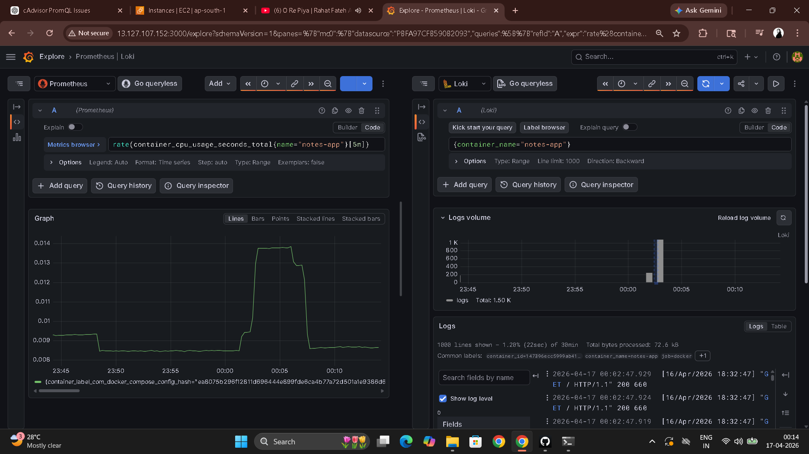

# Day 75 – Log Management with Loki and Promtail

---

## Task 1 – The Logging Pipeline

```
[Docker Containers]
       |
       | (write JSON logs to /var/lib/docker/containers/)
       v
  [Promtail]
       |
       | (reads log files, adds labels, pushes to Loki)
       v
    [Loki]
       |
       | (stores logs, indexes labels only)
       v
   [Grafana]
       |
       | (queries Loki with LogQL, displays logs)
       v
   [You]
```

**Why Loki only indexes labels instead of full text:**

Traditional log systems like Elasticsearch index every word in every log line. That makes search fast but storage and compute costs grow with log volume — indexing 100GB of logs requires substantial RAM and disk just for the index.

Loki indexes only labels (container name, job, filename) — tiny, fixed-size index. The full log content is stored compressed in chunks. When you search with `|= "error"`, Loki uses the label index to find the right chunks, then scans only those chunks for the keyword.

Trade-off: keyword search is slower than Elasticsearch because Loki does a grep-style scan rather than index lookup. But for DevOps workloads — where you're usually filtering by container/service first, then searching — the performance is acceptable at a fraction of the cost.

---

## Task 2 – Loki Configuration

```bash
mkdir -p loki
```

**`loki/loki-config.yml`**

```yaml
auth_enabled: false          # Single-tenant, no auth needed

server:
  http_listen_port: 3100

common:
  ring:
    instance_addr: 127.0.0.1
    kvstore:
      store: inmemory          # In-memory ring for single-instance setup
  replication_factor: 1        # No replication — single instance
  path_prefix: /loki

schema_config:
  configs:
    - from: 2020-10-24
      store: tsdb              # TSDB for log index
      object_store: filesystem # Chunks stored on local disk
      schema: v13
      index:
        prefix: index_
        period: 24h

storage_config:
  filesystem:
    directory: /loki/chunks    # Where log chunks are stored
```

**Add Loki to `docker-compose.yml`:**

```yaml
  loki:
    image: grafana/loki:latest
    container_name: loki
    ports:
      - "3100:3100"
    volumes:
      - ./loki/loki-config.yml:/etc/loki/loki-config.yml
      - loki_data:/loki
    command: -config.file=/etc/loki/loki-config.yml
    restart: unless-stopped
```

Add `loki_data` to volumes section:

```yaml
volumes:
  prometheus_data:
  grafana_data:
  loki_data:
```

```bash
docker compose up -d loki
curl http://localhost:3100/ready
# ready
```

---

## Task 3 – Promtail Configuration

```bash
mkdir -p promtail
```

**`promtail/promtail-config.yml`**

```yaml
server:
  http_listen_port: 9080
  grpc_listen_port: 0

positions:
  filename: /tmp/positions.yaml    # Tracks which lines have been shipped

clients:
  - url: http://loki:3100/loki/api/v1/push

scrape_configs:
  - job_name: docker
    static_configs:
      - targets:
          - localhost
        labels:
          job: docker
          __path__: /var/lib/docker/containers/*/*-json.log
    pipeline_stages:
      - docker: {}    # Parses Docker JSON log format, extracts timestamp + stream
```

**Add Promtail to `docker-compose.yml`:**

```yaml
  promtail:
    image: grafana/promtail:latest
    container_name: promtail
    volumes:
      - ./promtail/promtail-config.yml:/etc/promtail/promtail-config.yml
      - /var/lib/docker/containers:/var/lib/docker/containers:ro
      - /var/run/docker.sock:/var/run/docker.sock
    command: -config.file=/etc/promtail/promtail-config.yml
    restart: unless-stopped
```

**Why these volume mounts:**

| Mount | Purpose |
|-------|---------|
| `/var/lib/docker/containers` (ro) | Docker's JSON log files — Promtail reads but never writes |
| `/var/run/docker.sock` | Discovers container names and labels for Promtail metadata |

```bash
docker compose up -d

# Generate logs
for i in $(seq 1 20); do curl -s http://localhost:8000 > /dev/null; done
```

---

## Task 4 – Loki as Grafana Datasource (Provisioned)

**Updated `grafana/provisioning/datasources/datasources.yml`:**

```yaml
apiVersion: 1

datasources:
  - name: Prometheus
    type: prometheus
    access: proxy
    url: http://prometheus:9090
    isDefault: true
    editable: false

  - name: Loki
    type: loki
    access: proxy
    url: http://loki:3100
    editable: false
```

```bash
docker compose restart grafana
# Connections > Data Sources → Prometheus and Loki both present
```

---

## Task 5 – LogQL Queries

Go to Grafana > Explore > select Loki datasource.

```logql
# All Docker container logs
{job="docker"}

# Logs from one specific container
{container_name="prometheus"}

# Lines containing "error"
{job="docker"} |= "error"

# Exclude health check noise
{job="docker"} != "health"

# Regex — HTTP 4xx or 5xx lines
{job="docker"} |~ "status=[45]\\d{2}"

# Count log lines per 5 minutes
count_over_time({job="docker"}[5m])

# Rate of log lines per second
rate({job="docker"}[5m])

# Top 5 containers by log volume
topk(5, sum by (container_name) (rate({job="docker"}[5m])))
```

**Exercise answers:**

```logql
# Error logs from notes-app in last 1 hour
{container_name="notes-app"} |= "error"

# Count of error lines per minute
count_over_time({container_name="notes-app"} |= "error" [1m])
```



---

## Task 6 – Correlate Metrics and Logs

**Add logs panel to Day 74 dashboard:**

- New panel → datasource: Loki
- Query: `{job="docker"}`
- Visualization: Logs
- Title: "Container Logs"

**Explore split view:**

1. Go to Explore → click the split button
2. Left panel (Prometheus): `rate(container_cpu_usage_seconds_total{name="notes-app"}[5m])`
3. Right panel (Loki): `{container_name="notes-app"}`
4. Click a CPU spike in the left panel → both panels zoom to that time range

**How side-by-side metrics + logs helps incident response:**

Without correlation: you see a CPU spike in Grafana, switch to a separate log system, manually set the same time range, and hope you find the relevant logs. Two systems, two context switches, time lost.

With Grafana as the single pane: click the anomaly, logs from that exact moment appear in the adjacent panel. You can confirm causation in seconds instead of minutes. This matters a lot at 3am during an incident.



---

## Loki vs ELK Stack

| | Loki | ELK Stack (Elasticsearch) |
|---|---|---|
| Indexing | Labels only — very cheap | Full text — expensive at scale |
| Query language | LogQL | Lucene / KQL |
| Search power | Label filter + grep scan | Full inverted index — fast keyword search |
| Operational complexity | Low — single binary | High — Elasticsearch, Logstash, Kibana each |
| Cost at scale | Low | High |
| Use when | Container/cloud logs with structured labels | Full-text search required, complex log analytics |

---

## Complete docker-compose.yml (Days 73-75)

```yaml
services:
  prometheus:
    image: prom/prometheus:latest
    container_name: prometheus
    ports:
      - "9090:9090"
    volumes:
      - ./prometheus.yml:/etc/prometheus/prometheus.yml
      - prometheus_data:/prometheus
    command:
      - '--config.file=/etc/prometheus/prometheus.yml'
      - '--storage.tsdb.retention.time=30d'
      - '--storage.tsdb.retention.size=1GB'
    restart: unless-stopped

  node-exporter:
    image: prom/node-exporter:latest
    container_name: node-exporter
    ports:
      - "9100:9100"
    volumes:
      - /proc:/host/proc:ro
      - /sys:/host/sys:ro
      - /:/rootfs:ro
    command:
      - '--path.procfs=/host/proc'
      - '--path.sysfs=/host/sys'
      - '--path.rootfs=/rootfs'
      - '--collector.filesystem.mount-points-exclude=^/(sys|proc|dev|host|etc)($$|/)'
    restart: unless-stopped

  cadvisor:
    image: gcr.io/cadvisor/cadvisor:latest
    container_name: cadvisor
    ports:
      - "8080:8080"
    volumes:
      - /var/run/docker.sock:/var/run/docker.sock:ro
      - /sys:/sys:ro
      - /var/lib/docker/:/var/lib/docker:ro
    restart: unless-stopped

  loki:
    image: grafana/loki:latest
    container_name: loki
    ports:
      - "3100:3100"
    volumes:
      - ./loki/loki-config.yml:/etc/loki/loki-config.yml
      - loki_data:/loki
    command: -config.file=/etc/loki/loki-config.yml
    restart: unless-stopped

  promtail:
    image: grafana/promtail:latest
    container_name: promtail
    volumes:
      - ./promtail/promtail-config.yml:/etc/promtail/promtail-config.yml
      - /var/lib/docker/containers:/var/lib/docker/containers:ro
      - /var/run/docker.sock:/var/run/docker.sock
    command: -config.file=/etc/promtail/promtail-config.yml
    restart: unless-stopped

  grafana:
    image: grafana/grafana-enterprise:latest
    container_name: grafana
    ports:
      - "3000:3000"
    volumes:
      - grafana_data:/var/lib/grafana
      - ./grafana/provisioning:/etc/grafana/provisioning
    environment:
      - GF_SECURITY_ADMIN_USER=admin
      - GF_SECURITY_ADMIN_PASSWORD=admin123
    restart: unless-stopped

  notes-app:
    image: trainwithshubham/notes-app:latest
    container_name: notes-app
    ports:
      - "8000:8000"
    restart: unless-stopped

volumes:
  prometheus_data:
  grafana_data:
  loki_data:
```