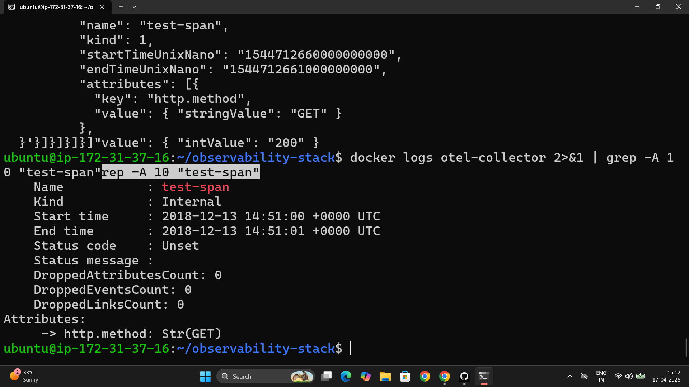
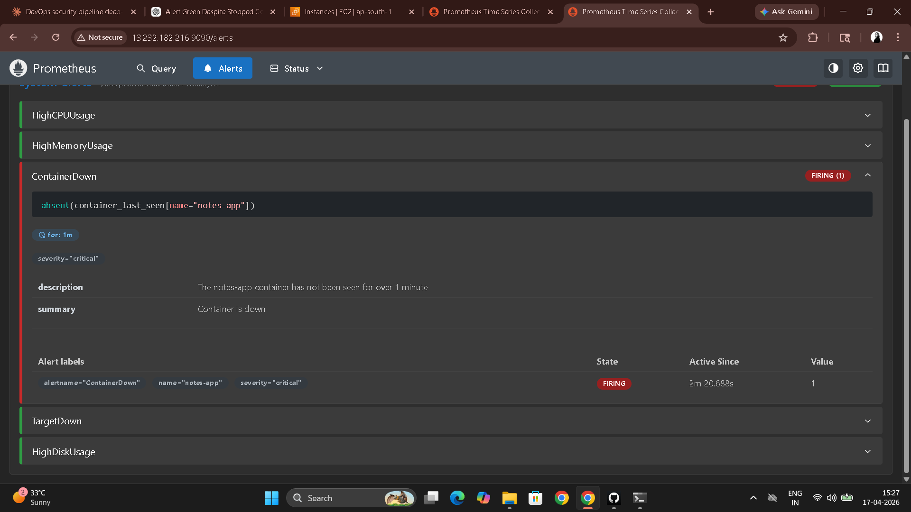
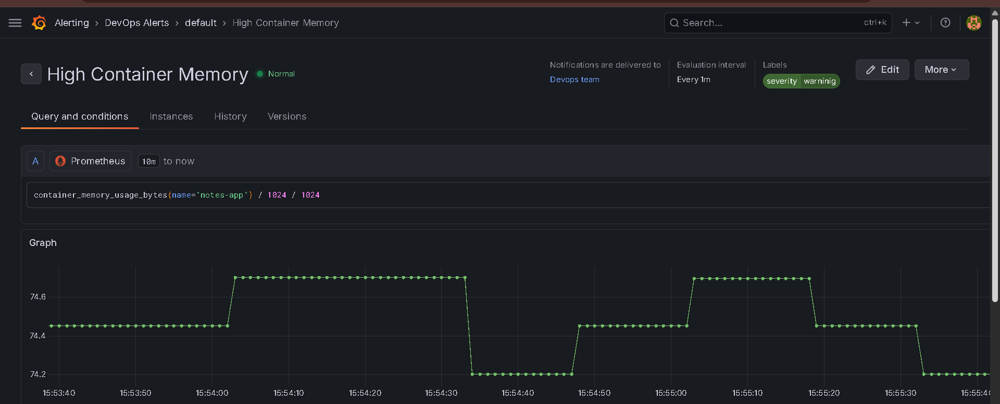
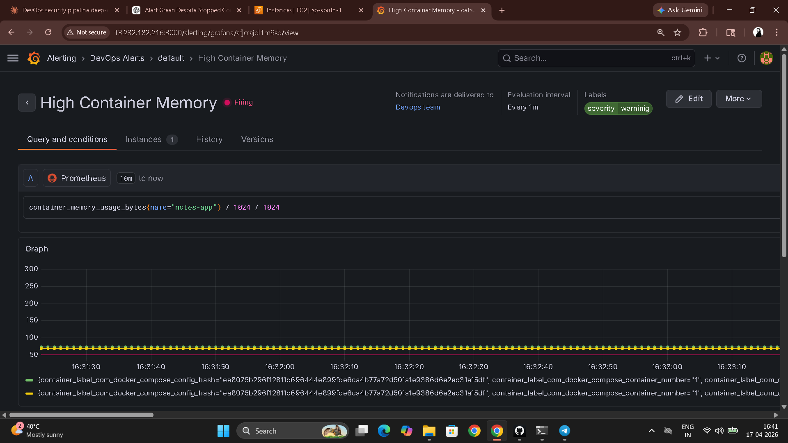

# Day 76 – OpenTelemetry and Alerting

---

## Task 1 – OpenTelemetry Concepts

**What OpenTelemetry is:**

A vendor-neutral, open-source framework for generating, collecting, and exporting telemetry data (metrics, logs, traces). It is not a storage backend — it collects and ships to backends like Prometheus, Jaeger, Loki, and Datadog.

**OTEL Collector pipeline — three components:**

| Component | Role | Examples |
|-----------|------|---------|
| Receivers | Accept incoming telemetry | OTLP, Prometheus, Jaeger |
| Processors | Transform data | Batch, filter, sample |
| Exporters | Send to backends | Prometheus, debug console, Jaeger |

**OTLP (OpenTelemetry Protocol):** Standard wire format for telemetry. gRPC on port 4317, HTTP on port 4318.

**Distributed trace:** Tracks a single request across multiple services. Each step = a span. Spans carry: trace ID, span ID, parent span ID, start time, duration, and attributes.

```
User request
  └── API Gateway (span 1, 15ms)
        └── Auth Service (span 2, 8ms)
              └── Database (span 3, 6ms)
```

---

## Task 2 – OTEL Collector Configuration

```bash
mkdir -p otel-collector
```

**`otel-collector/otel-collector-config.yml`**

```yaml
receivers:
  otlp:
    protocols:
      grpc:
        endpoint: 0.0.0.0:4317    # Accepts gRPC OTLP
      http:
        endpoint: 0.0.0.0:4318    # Accepts HTTP OTLP

processors:
  batch:                           # Batches data before exporting (reduces overhead)

exporters:
  prometheus:
    endpoint: "0.0.0.0:8889"      # Prometheus scrapes metrics from here
  debug:
    verbosity: detailed            # Traces + logs printed to stdout

service:
  pipelines:
    metrics:
      receivers: [otlp]
      processors: [batch]
      exporters: [prometheus]
    traces:
      receivers: [otlp]
      processors: [batch]
      exporters: [debug]
    logs:
      receivers: [otlp]
      processors: [batch]
      exporters: [debug]
```

**Add to `docker-compose.yml`:**

```yaml
  otel-collector:
    image: otel/opentelemetry-collector-contrib:latest
    container_name: otel-collector
    ports:
      - "4317:4317"    # OTLP gRPC
      - "4318:4318"    # OTLP HTTP
      - "8889:8889"    # Prometheus exporter
    volumes:
      - ./otel-collector/otel-collector-config.yml:/etc/otelcol-contrib/config.yaml
    restart: unless-stopped
```

**Add to `prometheus.yml`:**

```yaml
  - job_name: "otel-collector"
    static_configs:
      - targets: ["otel-collector:8889"]
```

```bash
docker compose up -d
docker logs otel-collector 2>&1 | tail -5
# Status > Targets → otel-collector: UP
```

---

## Task 3 – Send Test Traces and Metrics

**Send a test trace:**

```bash
curl -X POST http://localhost:4318/v1/traces \
  -H "Content-Type: application/json" \
  -d '{
    "resourceSpans": [{
      "resource": {
        "attributes": [{"key": "service.name", "value": {"stringValue": "my-test-service"}}]
      },
      "scopeSpans": [{
        "spans": [{
          "traceId": "5b8efff798038103d269b633813fc60c",
          "spanId": "eee19b7ec3c1b174",
          "name": "test-span",
          "kind": 1,
          "startTimeUnixNano": "1544712660000000000",
          "endTimeUnixNano": "1544712661000000000",
          "attributes": [
            {"key": "http.method", "value": {"stringValue": "GET"}},
            {"key": "http.status_code", "value": {"intValue": "200"}}
          ]
        }]
      }]
    }]
  }'

# See the trace in collector debug output
docker logs otel-collector 2>&1 | grep -A 10 "test-span"
```

**Send test metrics:**

```bash
curl -X POST http://localhost:4318/v1/metrics \
  -H "Content-Type: application/json" \
  -d '{
    "resourceMetrics": [{
      "resource": {
        "attributes": [{"key": "service.name", "value": {"stringValue": "my-test-service"}}]
      },
      "scopeMetrics": [{
        "metrics": [{
          "name": "test_requests_total",
          "sum": {
            "dataPoints": [{"asInt": "42", "startTimeUnixNano": "1544712660000000000", "timeUnixNano": "1544712661000000000"}],
            "aggregationTemporality": 2,
            "isMonotonic": true
          }
        }]
      }]
    }]
  }'
```

```promql
# Query in Prometheus — the metric traveled:
# curl → OTEL Collector (OTLP receiver) → Prometheus exporter → Prometheus scrape
test_requests_total
```



---

## Task 4 – Prometheus Alerting Rules

**`alert-rules.yml`**

```yaml
groups:
  - name: system-alerts
    rules:

      - alert: HighCPUUsage
        expr: 100 - (avg(rate(node_cpu_seconds_total{mode="idle"}[5m])) * 100) > 80
        for: 2m                   # Must be true for 2 min before firing (avoids flapping)
        labels:
          severity: warning
        annotations:
          summary: "High CPU usage detected"
          description: "CPU above 80% for 2+ minutes. Current: {{ $value }}%"

      - alert: HighMemoryUsage
        expr: (1 - node_memory_MemAvailable_bytes / node_memory_MemTotal_bytes) * 100 > 85
        for: 2m
        labels:
          severity: warning
        annotations:
          summary: "High memory usage"
          description: "Memory above 85%. Current: {{ $value }}%"

      - alert: ContainerDown
        expr: absent(container_last_seen{name="notes-app"})
        for: 1m
        labels:
          severity: critical
        annotations:
          summary: "notes-app container is down"
          description: "notes-app not seen for over 1 minute"

      - alert: TargetDown
        expr: up == 0
        for: 1m
        labels:
          severity: critical
        annotations:
          summary: "Scrape target unreachable"
          description: "{{ $labels.job }} target {{ $labels.instance }} is down"

      - alert: HighDiskUsage
        expr: (1 - node_filesystem_avail_bytes{mountpoint="/"} / node_filesystem_size_bytes{mountpoint="/"}) * 100 > 90
        for: 5m
        labels:
          severity: critical
        annotations:
          summary: "Disk space critically low"
          description: "Root filesystem above 90%. Current: {{ $value }}%"
```

**Alert rule fields:**

| Field | Purpose |
|-------|---------|
| `expr` | PromQL condition that triggers the alert |
| `for` | How long condition must hold before firing — prevents flapping |
| `labels` | Metadata for routing (severity) |
| `annotations` | Human-readable description — `{{ $value }}` injects the current metric value |

**Updated `prometheus.yml` with rules:**

```yaml
global:
  scrape_interval: 15s
  evaluation_interval: 15s

rule_files:
  - /etc/prometheus/alert-rules.yml

scrape_configs:
  - job_name: "prometheus"
    static_configs:
      - targets: ["localhost:9090"]
  - job_name: "node-exporter"
    static_configs:
      - targets: ["node-exporter:9100"]
  - job_name: "cadvisor"
    static_configs:
      - targets: ["cadvisor:8080"]
  - job_name: "otel-collector"
    static_configs:
      - targets: ["otel-collector:8889"]
  - job_name: "notes-app"
    static_configs:
      - targets: ["notes-app:8000"]
```

**Updated Prometheus service in `docker-compose.yml`:**

```yaml
  prometheus:
    volumes:
      - ./prometheus.yml:/etc/prometheus/prometheus.yml
      - ./alert-rules.yml:/etc/prometheus/alert-rules.yml
      - prometheus_data:/prometheus
```

```bash
docker compose up -d prometheus
# Status > Rules → 5 alert rules listed
# Alerts → all Inactive

# Test TargetDown alert
docker compose stop notes-app
# Wait 1-2 min → Alerts → TargetDown moves to Firing
docker compose start notes-app
```



---

## Task 5 – Grafana Alerts and Notifications

**Create contact point:**

```
Alerting > Contact points > Add contact point
Name: DevOps Team
Integration: Email (or Slack webhook)
Save
```

**Create alert rule:**

```
Alerting > Alert rules > New alert rule
Name: High Container Memory
Query: container_memory_usage_bytes{name="notes-app"} / 1024 / 1024
Condition: IS ABOVE 100   (fires if notes-app uses >100MB RAM)
Evaluate: every 1m, for 2m
Label: severity = warning
Contact point: DevOps Team
Save
```

**Create notification policy:**

```
Alerting > Notification policies
Default contact point: DevOps Team
Nested policy: severity=critical → separate contact point (or higher urgency)
```

**Prometheus alerts vs Grafana alerts:**

| | Prometheus Alerts | Grafana Alerts |
|---|---|---|
| Evaluated by | Prometheus server | Grafana server |
| Data sources | Prometheus only | Prometheus, Loki, and any datasource |
| Notifications | Requires Alertmanager for routing | Built-in contact points (email, Slack, PagerDuty) |
| Use when | Simple metric thresholds, GitOps alert rules | Multi-source alerts, team notifications without extra services |

For most small-to-medium setups: Grafana alerts for notifications, Prometheus rules for defining conditions.




---

## Task 6 – Full Stack Architecture

```
METRICS PIPELINE
[Node Exporter :9100]   ──►  [Prometheus :9090]  ──►  [Grafana :3000 Dashboards]
[cAdvisor :8080]         ──►  [Prometheus :9090]  ──►  [Alert Rules → Notifications]
[OTEL Collector :8889]  ──►  [Prometheus :9090]

LOGS PIPELINE
[Docker Containers]  ──►  [Promtail]  ──►  [Loki :3100]  ──►  [Grafana Explore]

TRACES PIPELINE
[curl / App OTLP]  ──►  [OTEL Collector :4317/4318]  ──►  [Debug Output]
                                                       ──►  [Future: Jaeger/Tempo]
```

**All 8 services:**

| Service | Port | Purpose |
|---------|------|---------|
| Prometheus | 9090 | Metrics storage and querying |
| Node Exporter | 9100 | Host system metrics |
| cAdvisor | 8080 | Container metrics |
| Grafana | 3000 | Visualization and alerting |
| Loki | 3100 | Log storage |
| Promtail | 9080 | Log collection agent |
| OTEL Collector | 4317/4318/8889 | Telemetry collection and export |
| Notes App | 8000 | Sample application |

```bash
docker compose ps
# All 8 containers running
```