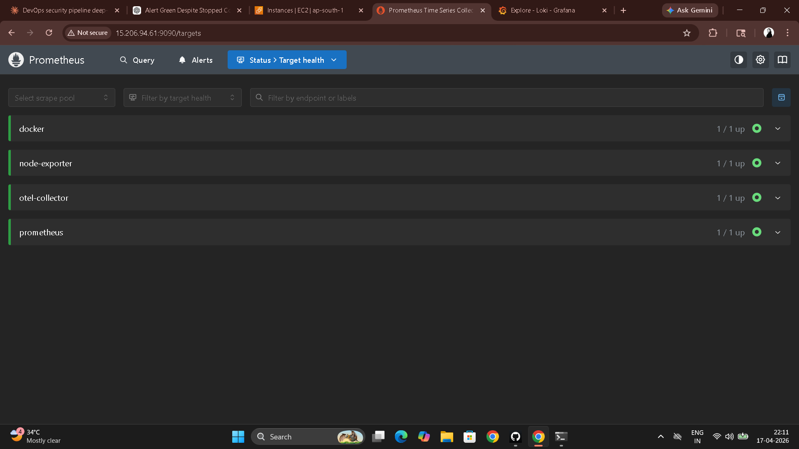
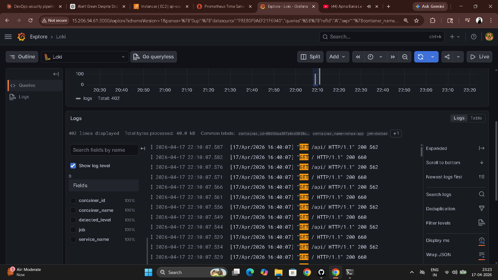
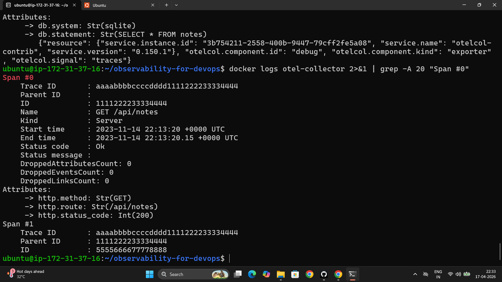
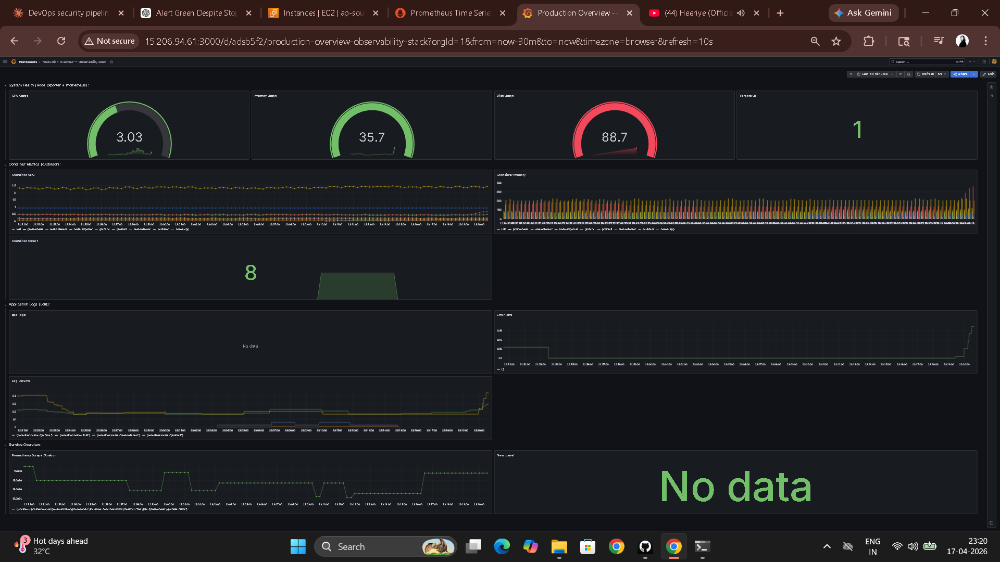

# Day 77 – Observability Project: Full Stack with Docker Compose

---

## Full Stack Architecture

```
METRICS PIPELINE
[Node Exporter :9100]   ──► [Prometheus :9090] ──► [Grafana :3000]
[cAdvisor :8080]         ──► [Prometheus :9090] ──► [Alert Rules]
[OTEL Collector :8889]  ──► [Prometheus :9090]

LOGS PIPELINE
[Docker Containers] ──► [Promtail] ──► [Loki :3100] ──► [Grafana Explore]

TRACES PIPELINE
[App OTLP] ──► [OTEL Collector :4317/4318] ──► [debug stdout]
                                             ──► [Future: Jaeger/Tempo]

ALL THREE PILLARS ──► [Grafana :3000 — single pane of glass]
```

---

## Task 1 – Launch the Reference Stack

```bash
git clone https://github.com/LondheShubham153/observability-for-devops.git
cd observability-for-devops
tree -I 'node_modules|build|staticfiles|__pycache__'
docker compose up -d
docker compose ps
```

**Service inventory:**

| Service | Port | Validation |
|---------|------|-----------|
| Prometheus | 9090 | http://localhost:9090 |
| Node Exporter | 9100 | `curl http://localhost:9100/metrics \| head -5` |
| cAdvisor | 8080 | http://localhost:8080 |
| Grafana | 3000 | http://localhost:3000 (admin/admin) |
| Loki | 3100 | `curl http://localhost:3100/ready` |
| Promtail | 9080 | `curl http://localhost:9080/targets` |
| OTEL Collector | 4317/4318/8889 | `docker logs otel-collector` |
| Notes App | 8000 | http://localhost:8000 |

---

## Task 2 – Validate the Metrics Pipeline

```
Prometheus UI → Status > Targets → all 4 jobs: UP
```

**Validation queries:**

```promql
# All scrape targets up
up

# Host CPU usage
100 - (avg(rate(node_cpu_seconds_total{mode="idle"}[5m])) * 100)

# Memory usage percentage
(1 - node_memory_MemAvailable_bytes / node_memory_MemTotal_bytes) * 100

# Container CPU per container
rate(container_cpu_usage_seconds_total{name!=""}[5m]) * 100

# Top 3 memory-hungry containers
topk(3, container_memory_usage_bytes{name!=""})
```



---

## Task 3 – Validate the Logs Pipeline

```bash
# Generate traffic
for i in $(seq 1 50); do
  curl -s http://localhost:8000 > /dev/null
  curl -s http://localhost:8000/api/ > /dev/null
done
```

**LogQL queries in Grafana Explore (datasource: Loki):**

```logql
# All container logs
{job="docker"}

# Only notes-app logs
{container_name="notes-app"}

# Errors across all containers
{job="docker"} |= "error"

# HTTP GET requests from the app
{container_name="notes-app"} |= "GET"

# Log volume per container
sum by (container_name) (rate({job="docker"}[5m]))
```

```bash
# Check Promtail targets
curl -s http://localhost:9080/targets | head -30
```



---

## Task 4 – Validate the Traces Pipeline

**Send a two-span trace (HTTP request + database child span):**

```bash
curl -X POST http://localhost:4318/v1/traces \
  -H "Content-Type: application/json" \
  -d '{
    "resourceSpans": [{
      "resource": {
        "attributes": [{"key": "service.name", "value": {"stringValue": "notes-app"}}]
      },
      "scopeSpans": [{
        "spans": [
          {
            "traceId": "aaaabbbbccccdddd1111222233334444",
            "spanId": "1111222233334444",
            "name": "GET /api/notes",
            "kind": 2,
            "startTimeUnixNano": "1700000000000000000",
            "endTimeUnixNano": "1700000000150000000",
            "attributes": [
              {"key": "http.method", "value": {"stringValue": "GET"}},
              {"key": "http.route", "value": {"stringValue": "/api/notes"}},
              {"key": "http.status_code", "value": {"intValue": "200"}}
            ]
          },
          {
            "traceId": "aaaabbbbccccdddd1111222233334444",
            "spanId": "5555666677778888",
            "parentSpanId": "1111222233334444",
            "name": "SELECT notes FROM database",
            "kind": 3,
            "startTimeUnixNano": "1700000000020000000",
            "endTimeUnixNano": "1700000000120000000",
            "attributes": [
              {"key": "db.system", "value": {"stringValue": "sqlite"}},
              {"key": "db.statement", "value": {"stringValue": "SELECT * FROM notes"}}
            ]
          }
        ]
      }]
    }]
  }'

# Verify in collector logs
docker logs otel-collector 2>&1 | grep -A 20 "GET /api/notes"
```

The debug output shows both spans, their parent-child relationship, and timing — parent span 150ms total, child database span 100ms. This is how you'd see a slow query causing a slow API response.



---

## Task 5 – Production Overview Dashboard

**Dashboard: "Production Overview — Observability Stack"**
Time range: Last 30 minutes | Auto-refresh: 10s

**Row 1 — System Health**

| Panel | Type | Query |
|-------|------|-------|
| CPU Usage | Gauge | `100 - (avg(rate(node_cpu_seconds_total{mode="idle"}[5m])) * 100)` |
| Memory Usage | Gauge | `(1 - node_memory_MemAvailable_bytes / node_memory_MemTotal_bytes) * 100` |
| Disk Usage | Gauge | `(1 - node_filesystem_avail_bytes{mountpoint="/"} / node_filesystem_size_bytes{mountpoint="/"}) * 100` |
| Targets Up | Stat | `sum(up) / count(up)` |

**Row 2 — Container Metrics**

| Panel | Type | Query |
|-------|------|-------|
| Container CPU | Time series | `rate(container_cpu_usage_seconds_total{name!=""}[5m]) * 100` — legend: `{{name}}` |
| Container Memory | Bar chart | `container_memory_usage_bytes{name!=""} / 1024 / 1024` — legend: `{{name}}` |
| Container Count | Stat | `count(container_last_seen{name!=""})` |

**Row 3 — Application Logs (Loki datasource)**

| Panel | Type | Query |
|-------|------|-------|
| App Logs | Logs | `{container_name="notes-app"}` |
| Error Rate | Time series | `sum(rate({job="docker"} |= "error" [5m]))` |
| Log Volume | Time series | `sum by (container_name) (rate({job="docker"}[5m]))` |

**Row 4 — Service Overview**

| Panel | Type | Query |
|-------|------|-------|
| Scrape Duration | Time series | `prometheus_target_interval_length_seconds{quantile="0.99"}` |



---

## Task 6 – Config Comparison

| Component | What to compare |
|-----------|----------------|
| `prometheus.yml` | Scrape jobs: self + node-exporter + cadvisor + otel-collector + notes-app |
| `loki-config.yml` | storage_config filesystem path, schema v13, replication_factor 1 |
| `promtail-config.yml` | __path__ glob, pipeline_stages docker: {} parser |
| `otel-collector-config.yml` | Three pipelines: metrics→prometheus, traces→debug, logs→debug |
| `datasources.yml` | Both Prometheus and Loki provisioned, isDefault on Prometheus |
| `docker-compose.yml` | All 8 services, named volumes, restart policies, volume mounts |

---

## 5-Day Observability Block Summary

| Day | What Was Built |
|-----|---------------|
| 73 | Prometheus in Docker, prometheus.yml, PromQL fundamentals, scrape targets |
| 74 | Node Exporter (host), cAdvisor (containers), Grafana dashboards, provisioning |
| 75 | Loki log storage, Promtail collection agent, LogQL, metrics + logs correlation |
| 76 | OTEL Collector, OTLP traces, Prometheus alerting rules, Grafana alert routing |
| 77 | Full stack integration, unified dashboard, reference repo validation |

---

## What to Add for Production

1. **Alertmanager** — routes Prometheus alerts to Slack, PagerDuty, email with deduplication and silencing
2. **Grafana Tempo** — trace storage backend replacing the debug exporter, enables trace search and span analysis
3. **HTTPS/TLS** — TLS termination for Grafana, Prometheus, and Loki endpoints
4. **Authentication** — Grafana LDAP/SSO, Prometheus basic auth or OAuth proxy
5. **Log retention policies** — Loki compaction config, storage limits, lifecycle rules for S3 backend
6. **High availability** — Prometheus federation or Thanos for long-term storage, Loki in distributed mode
7. **Dashboard-as-code** — export dashboard JSON, commit to git, provision via grafana/provisioning/dashboards/

---

## Managed Services Comparison

| | This Stack (self-hosted) | Datadog / New Relic | AWS CloudWatch |
|---|---|---|---|
| Cost | Infrastructure only | Per-host pricing | Per-metric/log pricing |
| Setup time | Hours | Minutes | Minutes |
| Customization | Full control | Limited to product features | Limited |
| Operational burden | You maintain it | Vendor maintains it | Vendor maintains it |
| Use when | Cost-sensitive, full control needed | Large team, willing to pay for ease | Already on AWS, minimal ops |

---

## Clean Up

```bash
docker compose down -v
# -v removes named volumes (Prometheus TSDB, Grafana data, Loki data)
# Only use when done — all historical data is deleted
```