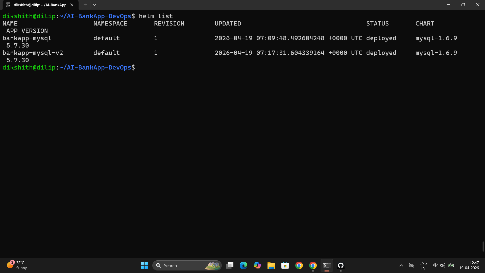
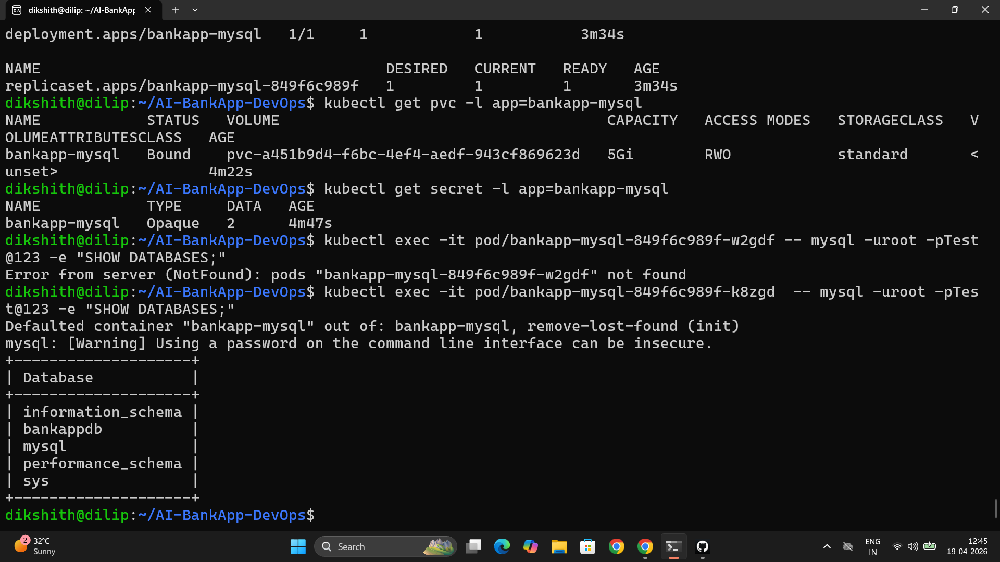
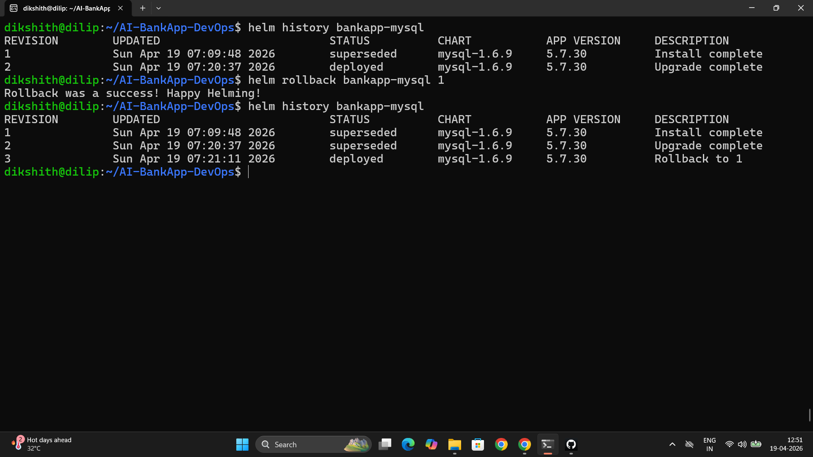

# Day 78 – Introduction to Helm and Chart Basics

---

## Task 1 – Helm Concepts

**What Helm is:**

Helm is the package manager for Kubernetes — like `apt` for Ubuntu. It bundles all the Kubernetes resources an application needs (Deployment, Service, ConfigMap, Secret, PVC) into a single versioned package called a chart.

**Core concepts:**

| Concept | What it is |
|---------|-----------|
| **Chart** | A package of Kubernetes manifest templates — one chart describes a full application |
| **Release** | A running instance of a chart. Install the same chart twice = two independent releases |
| **Repository** | A remote store of charts, like Docker Hub for images |
| **Values** | Configuration that customizes a chart per deployment — replicas, image tag, resource limits |

**Why Helm over raw manifests:**

The AI-BankApp has 12 separate YAML files in `k8s/`. Changing an image tag means editing `bankapp-deployment.yml`. Switching environments means manually updating `configmap.yml`, `secrets.yml`, and resource limits across files. Helm solves this:

- Templating: one chart serves dev, staging, and prod with different `values.yaml` files
- Versioning: `helm rollback` restores any previous revision — no manual `git revert`
- Dependencies: a chart can depend on other charts (app chart depends on MySQL chart)
- Community: thousands of pre-built charts for MySQL, Redis, Prometheus, ArgoCD

---

## Task 2 – Install Helm and Explore the AI-BankApp

```bash
# Clone the AI-BankApp (feat/gitops branch)
git clone -b feat/gitops https://github.com/TrainWithShubham/AI-BankApp-DevOps.git
cd AI-BankApp-DevOps

# Create Kind cluster (1 control plane + 2 workers)
kind create cluster --config setup-k8s/kind-config.yml

# Install Helm
curl https://raw.githubusercontent.com/helm/helm/main/scripts/get-helm-3 | bash
helm version

# Verify connectivity
kubectl cluster-info
helm list
```

**The 12 raw manifests in `k8s/`:**

```
bankapp-deployment.yml    # Hardcoded image, replicas, env vars
configmap.yml             # Hardcoded DB_HOST, DB_NAME
gateway.yml               # Ingress/gateway config
mysql-deployment.yml      # MySQL — hardcoded credentials
namespace.yml             # Namespace definition
ollama-deployment.yml     # Ollama AI service
pv.yml                    # PersistentVolume — node-specific path
pvc.yml                   # PersistentVolumeClaim
secrets.yml               # base64 credentials in plain git
service.yml               # Service definitions
hpa.yml                   # HPA with hardcoded thresholds
cert-manager.yml          # TLS certificate config
```

Every environment change requires editing multiple files. One Helm chart with a values file per environment solves this entirely.

---

## Task 3 – Deploy MySQL with Helm

> **Note on Bitnami charts:** Bitnami moved most charts to a restricted/paid tier from August 2025. Free pulls are rate-limited. This guide uses `stable/mysql` from the legacy Helm stable repository (`https://charts.helm.sh/stable`) which remains freely accessible. It is deprecated but sufficient for learning Helm concepts. For production, use a Bitnami subscription, the official MySQL Operator, or maintained charts on Artifact Hub.

```bash
# Add the stable repo
helm repo add stable https://charts.helm.sh/stable
helm repo update

# Search for MySQL
helm search repo stable/mysql
```

**One command replaces: `mysql-deployment.yml` + `secrets.yml` + `pvc.yml` + `pv.yml` + `service.yml`**

```bash
helm install bankapp-mysql stable/mysql \
  --set mysqlRootPassword=Test@123 \
  --set mysqlDatabase=bankappdb \
  --set persistence.size=5Gi \
  --set resources.requests.memory=256Mi \
  --set resources.requests.cpu=250m \
  --set resources.limits.memory=512Mi \
  --set resources.limits.cpu=500m
```

```bash
# Verify what was created
helm list
kubectl get all -l app=bankapp-mysql
kubectl get pvc -l app=bankapp-mysql
kubectl get secret -l app=bankapp-mysql

# Verify MySQL is functional (use actual pod name from kubectl get pods)
kubectl exec -it pod/<bankapp-mysql-pod-name> -- mysql -uroot -pTest@123 -e "SHOW DATABASES;"
# bankappdb should appear in output
```




---

## Task 4 – Values Files

**`mysql-values.yaml`**

```yaml
mysqlRootPassword: Test@123       # MySQL root password
mysqlDatabase: bankappdb          # Database created on first start

resources:
  limits:
    cpu: 500m
    memory: 512Mi
  requests:
    cpu: 250m
    memory: 256Mi

persistence:
  size: 5Gi
  storageClass: ""                # Empty = use cluster default StorageClass

metrics:
  enabled: true                   # Exposes /metrics for Prometheus scraping
  serviceMonitor:
    enabled: false                # No ServiceMonitor CRD needed here
```

```bash
# Deploy with values file
helm install bankapp-mysql-v2 stable/mysql -f mysql-values.yaml

# Inspect all configurable options
helm show values stable/mysql | head -80

# Clean up second release
helm uninstall bankapp-mysql-v2
```

`--set` is for quick one-off overrides. `-f values.yaml` is for anything that should be version-controlled and repeatable.

---

## Task 5 – Upgrade, Rollback, Uninstall

```bash
# Upgrade existing release (--reuse-values carries forward previous settings)
helm upgrade bankapp-mysql stable/mysql \
  --set mysqlRootPassword=Test@123 \
  --set mysqlDatabase=bankappdb \
  --reuse-values

# View revision history
helm history bankapp-mysql
# REVISION  STATUS      DESCRIPTION
# 1         superseded  Install complete
# 2         deployed    Upgrade complete

# Rollback to revision 1
helm rollback bankapp-mysql 1

# History after rollback
helm history bankapp-mysql
# REVISION  STATUS      DESCRIPTION
# 1         superseded  Install complete
# 2         superseded  Upgrade complete
# 3         deployed    Rollback to 1  ← new revision, history preserved
```



`helm rollback` is atomic — restores the exact set of Kubernetes resources from any revision with one command. With `kubectl apply` there is no built-in rollback; you would need `git revert` + manual re-apply with no guarantee of correctness.

---

## Task 6 – Chart Structure

```bash
helm pull bitnami/mysql --untar
ls mysql/
```

**Chart directory:**

```
mysql/
├── Chart.yaml              # Chart metadata — name, version, appVersion
├── values.yaml             # Default configuration values
├── charts/                 # Subchart dependencies
└── templates/
    ├── primary/
    │   ├── statefulset.yaml    # Go template → StatefulSet manifest
    │   └── svc.yaml            # Go template → Service manifest
    ├── _helpers.tpl            # Reusable named template helpers
    ├── NOTES.txt               # Post-install message shown to user
    └── secrets.yaml            # Go template → Secret manifest
```

**Go template syntax in `templates/primary/statefulset.yaml`:**

```yaml
replicas: {{ .Values.primary.replicaCount }}
image: "{{ .Values.image.repository }}:{{ .Values.image.tag }}"
```

`{{ .Values.primary.replicaCount }}` pulls from `values.yaml`. `--set primary.replicaCount=3` overrides it at render time.

**`Chart.yaml` — `version` vs `appVersion`:**

```yaml
apiVersion: v2
name: mysql
description: A Helm chart for MySQL
version: 12.2.1       # Chart version — increments when templates or structure change
appVersion: "8.0.40"  # MySQL application version packaged inside the chart
```

`version` is the version of the Helm chart itself — its templates, defaults, and configuration schema. `appVersion` is the version of the software the chart installs. The chart can release `v12.2.2` to fix a template bug while still shipping MySQL `8.0.40`. They increment independently.

**AI-BankApp raw vs Helm comparison:**

| Aspect | `k8s/mysql-deployment.yml` (raw) | stable/mysql Helm chart |
|--------|----------------------------------|--------------------------|
| Secrets | Hardcoded base64 in `secrets.yml`, in git | Generated by Helm, never in the repo |
| Storage | Manual `pv.yml` + `pvc.yml` | `persistence.size` value |
| Replicas | Hardcoded in YAML | `replicaCount` value |
| Metrics | Not included | `metrics.enabled: true` |
| Rollback | Manual `git revert` + re-apply | `helm rollback` |
| Multi-environment | Copy + edit files | Different `values.yaml` per env |

```bash
# Clean up
helm uninstall bankapp-mysql
rm -rf mysql/
```

---

## Why the AI-BankApp's 12 YAML Files Benefit from Helm

**Problems with the current raw YAML approach:**

1. Running `kubectl apply -f` on each of 12 files separately — no single install command
2. No built-in rollback — undoing a bad deploy requires manual `git revert` and re-apply
3. Passwords hardcoded or stored as base64 in `secrets.yml` — visible in git history
4. Values scattered across multiple files — changing the image tag requires finding every reference
5. No reuse — deploying to dev, staging, and prod means three copies of the same 12 files

**What Helm gives the AI-BankApp:**

1. `helm install bankapp ./bankapp-chart` — one command installs all 12 resources in the right order
2. `helm rollback bankapp 1` — instant rollback to any previous revision
3. Secrets generated at deploy time and never written to git
4. One `values.yaml` per environment — `dev-values.yaml`, `prod-values.yaml` — same chart serves all
5. The chart is shareable: any team member or CI pipeline runs the same chart with the same result