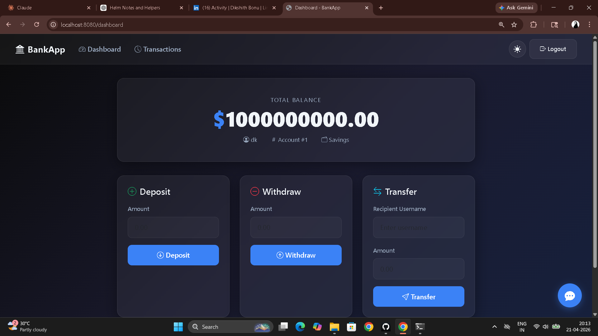

# Day 79 – Creating a Custom Helm Chart for AI-BankApp

---

## Task 1 – Scaffold and Study Raw Manifests

```bash
cd AI-BankApp-DevOps
ls k8s/
```

**Manifest inventory:**

| File | Purpose |
|------|---------|
| `namespace.yml` | Creates `bankapp` namespace |
| `configmap.yml` | MySQL host, port, database, Ollama URL |
| `secrets.yml` | MySQL credentials (hardcoded base64) |
| `pv.yml` | StorageClass (gp3 via EBS CSI) |
| `pvc.yml` | PVCs for MySQL (5Gi) and Ollama (10Gi) |
| `bankapp-deployment.yml` | BankApp with init containers, probes, envFrom |
| `mysql-deployment.yml` | MySQL with EBS volume mount, probes |
| `ollama-deployment.yml` | Ollama with postStart model pull, probes |
| `service.yml` | ClusterIP services for all 3 components |
| `hpa.yml` | HPA for BankApp (2-4 replicas, 70% CPU) |
| `gateway.yml` | Envoy Gateway + HTTPRoute + TLS |
| `cert-manager.yml` | Let's Encrypt ClusterIssuer |

```bash
mkdir helm-chart && cd helm-chart
helm create bankapp

# Remove generated templates — writing our own from raw manifests
rm -rf bankapp/templates/*.yaml bankapp/templates/tests/
# Keep _helpers.tpl and NOTES.txt
```

---

## Task 2 – Chart.yaml and values.yaml

**`bankapp/Chart.yaml`**

```yaml
apiVersion: v2
name: bankapp
description: AI-BankApp -- Spring Boot banking application with MySQL and Ollama AI chatbot
type: application
version: 0.1.0
appVersion: "1.0.0"
maintainers:
  - name: TrainWithShubham
    url: https://github.com/TrainWithShubham
keywords:
  - bankapp
  - spring-boot
  - mysql
  - ollama
  - ai
```

**`bankapp/values.yaml`**

```yaml
# BankApp configuration
bankapp:
  replicaCount: 4
  image:
    repository: trainwithshubham/ai-bankapp-eks
    tag: "latest"
    pullPolicy: Always
  resources:
    requests:
      memory: "256Mi"
      cpu: "250m"
    limits:
      memory: "512Mi"
      cpu: "500m"
  service:
    type: ClusterIP
    port: 8080
  autoscaling:
    enabled: true
    minReplicas: 2
    maxReplicas: 4
    targetCPUUtilization: 70

# MySQL configuration
mysql:
  enabled: true
  image:
    repository: mysql
    tag: "8.0"
  resources:
    requests:
      memory: "256Mi"
      cpu: "250m"
    limits:
      memory: "512Mi"
      cpu: "500m"
  persistence:
    size: 5Gi
    storageClass: gp3

# Ollama AI configuration
ollama:
  enabled: true
  image:
    repository: ollama/ollama
    tag: "latest"
  model: tinyllama          # Switchable — no YAML editing required
  resources:
    requests:
      memory: "2Gi"
      cpu: "900m"
    limits:
      memory: "2.5Gi"
      cpu: "1500m"
  persistence:
    size: 10Gi
    storageClass: gp3

# Shared configuration
config:
  mysqlDatabase: bankappdb
  ollamaUrl: ""             # Auto-generated from service name if empty

# Secrets — templated and b64enc'd, never hardcoded base64 in git
secrets:
  mysqlRootPassword: Test@123
  mysqlUser: root
  mysqlPassword: Test@123

# Storage
storageClass:
  create: true
  name: gp3
  provisioner: ebs.csi.aws.com

# Gateway (optional — for EKS with Envoy Gateway)
gateway:
  enabled: false
  hostname: ""
  tls:
    enabled: false
```

**Raw `secrets.yml` vs Helm:** Raw manifests store manually encoded base64 values in git — visible to anyone with repo access. The Helm chart stores plaintext in `values.yaml` and uses `b64enc` in the template to encode at render time. Override per environment with `-f prod-values.yaml` — nothing sensitive hardcoded.

---

## Task 3 – Core Templates

**`bankapp/templates/configmap.yaml`**

```yaml
apiVersion: v1
kind: ConfigMap
metadata:
  name: {{ include "bankapp.fullname" . }}-config
  namespace: {{ .Release.Namespace }}
  labels:
    {{- include "bankapp.labels" . | nindent 4 }}
data:
  MYSQL_HOST: {{ include "bankapp.fullname" . }}-mysql
  MYSQL_PORT: "3306"
  MYSQL_DATABASE: {{ .Values.config.mysqlDatabase | quote }}
  OLLAMA_URL: {{ default (printf "http://%s-ollama:11434" (include "bankapp.fullname" .)) .Values.config.ollamaUrl | quote }}
  SERVER_FORWARD_HEADERS_STRATEGY: "native"
```

**`bankapp/templates/secrets.yaml`**

```yaml
apiVersion: v1
kind: Secret
metadata:
  name: {{ include "bankapp.fullname" . }}-secret
  namespace: {{ .Release.Namespace }}
  labels:
    {{- include "bankapp.labels" . | nindent 4 }}
type: Opaque
data:
  MYSQL_ROOT_PASSWORD: {{ .Values.secrets.mysqlRootPassword | b64enc | quote }}
  MYSQL_USER: {{ .Values.secrets.mysqlUser | b64enc | quote }}
  MYSQL_PASSWORD: {{ .Values.secrets.mysqlPassword | b64enc | quote }}
```

`b64enc` encodes automatically — no manual `echo -n "password" | base64` needed.

**`bankapp/templates/storage.yaml`**

```yaml
{{- if .Values.storageClass.create }}
apiVersion: storage.k8s.io/v1
kind: StorageClass
metadata:
  name: {{ .Values.storageClass.name }}
provisioner: {{ .Values.storageClass.provisioner }}
parameters:
  type: gp3
  fsType: ext4
reclaimPolicy: Delete
volumeBindingMode: WaitForFirstConsumer
allowVolumeExpansion: true
{{- end }}
---
{{- if .Values.mysql.enabled }}
apiVersion: v1
kind: PersistentVolumeClaim
metadata:
  name: {{ include "bankapp.fullname" . }}-mysql-pvc
  namespace: {{ .Release.Namespace }}
  labels:
    {{- include "bankapp.labels" . | nindent 4 }}
spec:
  storageClassName: {{ .Values.mysql.persistence.storageClass }}
  accessModes:
    - ReadWriteOnce
  resources:
    requests:
      storage: {{ .Values.mysql.persistence.size }}
{{- end }}
---
{{- if .Values.ollama.enabled }}
apiVersion: v1
kind: PersistentVolumeClaim
metadata:
  name: {{ include "bankapp.fullname" . }}-ollama-pvc
  namespace: {{ .Release.Namespace }}
  labels:
    {{- include "bankapp.labels" . | nindent 4 }}
spec:
  storageClassName: {{ .Values.ollama.persistence.storageClass }}
  accessModes:
    - ReadWriteOnce
  resources:
    requests:
      storage: {{ .Values.ollama.persistence.size }}
{{- end }}
```

---

## Task 4 – Deployment Templates

**`bankapp/templates/bankapp-deployment.yaml`**

```yaml
apiVersion: apps/v1
kind: Deployment
metadata:
  name: {{ include "bankapp.fullname" . }}
  namespace: {{ .Release.Namespace }}
  labels:
    {{- include "bankapp.labels" . | nindent 4 }}
spec:
  {{- if not .Values.bankapp.autoscaling.enabled }}
  replicas: {{ .Values.bankapp.replicaCount }}
  {{- end }}
  selector:
    matchLabels:
      app: {{ include "bankapp.fullname" . }}
  template:
    metadata:
      labels:
        app: {{ include "bankapp.fullname" . }}
    spec:
      initContainers:
        - name: wait-for-mysql
          image: busybox:1.36
          command: ["/bin/sh", "-c", "until nc -z {{ include \"bankapp.fullname\" . }}-mysql 3306; do sleep 2; done"]
          resources:
            requests: { memory: "32Mi", cpu: "50m" }
            limits: { memory: "64Mi", cpu: "100m" }
        {{- if .Values.ollama.enabled }}
        - name: wait-for-ollama
          image: busybox:1.36
          command: ["/bin/sh", "-c", "until nc -z {{ include \"bankapp.fullname\" . }}-ollama 11434; do sleep 2; done"]
          resources:
            requests: { memory: "32Mi", cpu: "50m" }
            limits: { memory: "64Mi", cpu: "100m" }
        {{- end }}
      containers:
        - name: bankapp
          image: "{{ .Values.bankapp.image.repository }}:{{ .Values.bankapp.image.tag }}"
          imagePullPolicy: {{ .Values.bankapp.image.pullPolicy }}
          ports:
            - containerPort: 8080
          envFrom:
            - configMapRef:
                name: {{ include "bankapp.fullname" . }}-config
            - secretRef:
                name: {{ include "bankapp.fullname" . }}-secret
          {{- with .Values.bankapp.resources }}
          resources:
            {{- toYaml . | nindent 12 }}
          {{- end }}
          readinessProbe:
            httpGet:
              path: /actuator/health
              port: 8080
            initialDelaySeconds: 30
            failureThreshold: 15
          livenessProbe:
            httpGet:
              path: /actuator/health
              port: 8080
            initialDelaySeconds: 60
            periodSeconds: 10
            failureThreshold: 5
```

**`bankapp/templates/mysql-deployment.yaml`**

```yaml
{{- if .Values.mysql.enabled }}
apiVersion: apps/v1
kind: Deployment
metadata:
  name: {{ include "bankapp.fullname" . }}-mysql
  namespace: {{ .Release.Namespace }}
  labels:
    {{- include "bankapp.labels" . | nindent 4 }}
spec:
  selector:
    matchLabels:
      app: {{ include "bankapp.fullname" . }}-mysql
  strategy:
    type: Recreate
  template:
    metadata:
      labels:
        app: {{ include "bankapp.fullname" . }}-mysql
    spec:
      containers:
        - name: mysql
          image: "{{ .Values.mysql.image.repository }}:{{ .Values.mysql.image.tag }}"
          ports:
            - containerPort: 3306
          env:
            - name: MYSQL_ROOT_PASSWORD
              valueFrom:
                secretKeyRef:
                  name: {{ include "bankapp.fullname" . }}-secret
                  key: MYSQL_ROOT_PASSWORD
            - name: MYSQL_DATABASE
              valueFrom:
                configMapKeyRef:
                  name: {{ include "bankapp.fullname" . }}-config
                  key: MYSQL_DATABASE
          {{- with .Values.mysql.resources }}
          resources:
            {{- toYaml . | nindent 12 }}
          {{- end }}
          volumeMounts:
            - name: mysql-storage
              mountPath: /var/lib/mysql
          readinessProbe:
            exec:
              command: ["mysqladmin", "ping", "-h", "localhost"]
            initialDelaySeconds: 15
            failureThreshold: 10
          livenessProbe:
            exec:
              command: ["mysqladmin", "ping", "-h", "localhost"]
            initialDelaySeconds: 30
            periodSeconds: 10
            failureThreshold: 5
      volumes:
        - name: mysql-storage
          persistentVolumeClaim:
            claimName: {{ include "bankapp.fullname" . }}-mysql-pvc
{{- end }}
```

**`bankapp/templates/ollama-deployment.yaml`**

```yaml
{{- if .Values.ollama.enabled }}
apiVersion: apps/v1
kind: Deployment
metadata:
  name: {{ include "bankapp.fullname" . }}-ollama
  namespace: {{ .Release.Namespace }}
  labels:
    {{- include "bankapp.labels" . | nindent 4 }}
spec:
  selector:
    matchLabels:
      app: {{ include "bankapp.fullname" . }}-ollama
  strategy:
    type: Recreate
  template:
    metadata:
      labels:
        app: {{ include "bankapp.fullname" . }}-ollama
    spec:
      containers:
        - name: ollama
          image: "{{ .Values.ollama.image.repository }}:{{ .Values.ollama.image.tag }}"
          ports:
            - containerPort: 11434
          {{- with .Values.ollama.resources }}
          resources:
            {{- toYaml . | nindent 12 }}
          {{- end }}
          volumeMounts:
            - name: ollama-storage
              mountPath: /root/.ollama
          lifecycle:
            postStart:
              exec:
                command:
                  - /bin/sh
                  - -c
                  - |
                    until ollama list > /dev/null 2>&1; do sleep 2; done
                    ollama pull {{ .Values.ollama.model }}
          readinessProbe:
            exec:
              command: ["/bin/sh", "-c", "ollama list | grep -q {{ .Values.ollama.model }}"]
            initialDelaySeconds: 30
            failureThreshold: 30
          livenessProbe:
            httpGet:
              path: /
              port: 11434
            initialDelaySeconds: 60
            periodSeconds: 10
            failureThreshold: 5
      volumes:
        - name: ollama-storage
          persistentVolumeClaim:
            claimName: {{ include "bankapp.fullname" . }}-ollama-pvc
{{- end }}
```

The Ollama model name is `{{ .Values.ollama.model }}` — switch from `tinyllama` to `llama3` with `--set ollama.model=llama3`, no YAML editing.

---

## Task 5 – Services and HPA Templates

**`bankapp/templates/services.yaml`**

```yaml
apiVersion: v1
kind: Service
metadata:
  name: {{ include "bankapp.fullname" . }}-mysql
  namespace: {{ .Release.Namespace }}
spec:
  selector:
    app: {{ include "bankapp.fullname" . }}-mysql
  ports:
    - port: 3306
---
{{- if .Values.ollama.enabled }}
apiVersion: v1
kind: Service
metadata:
  name: {{ include "bankapp.fullname" . }}-ollama
  namespace: {{ .Release.Namespace }}
spec:
  selector:
    app: {{ include "bankapp.fullname" . }}-ollama
  ports:
    - port: 11434
{{- end }}
---
apiVersion: v1
kind: Service
metadata:
  name: {{ include "bankapp.fullname" . }}-service
  namespace: {{ .Release.Namespace }}
spec:
  type: {{ .Values.bankapp.service.type }}
  sessionAffinity: ClientIP
  sessionAffinityConfig:
    clientIP:
      timeoutSeconds: 3600
  selector:
    app: {{ include "bankapp.fullname" . }}
  ports:
    - port: {{ .Values.bankapp.service.port }}
      targetPort: 8080
```

**`bankapp/templates/hpa.yaml`**

```yaml
{{- if .Values.bankapp.autoscaling.enabled }}
apiVersion: autoscaling/v2
kind: HorizontalPodAutoscaler
metadata:
  name: {{ include "bankapp.fullname" . }}-hpa
  namespace: {{ .Release.Namespace }}
  labels:
    {{- include "bankapp.labels" . | nindent 4 }}
spec:
  scaleTargetRef:
    apiVersion: apps/v1
    kind: Deployment
    name: {{ include "bankapp.fullname" . }}
  minReplicas: {{ .Values.bankapp.autoscaling.minReplicas }}
  maxReplicas: {{ .Values.bankapp.autoscaling.maxReplicas }}
  metrics:
    - type: Resource
      resource:
        name: cpu
        target:
          type: Utilization
          averageUtilization: {{ .Values.bankapp.autoscaling.targetCPUUtilization }}
  behavior:
    scaleUp:
      stabilizationWindowSeconds: 30
      policies:
        - type: Pods
          value: 2
          periodSeconds: 60
    scaleDown:
      stabilizationWindowSeconds: 300
      policies:
        - type: Pods
          value: 1
          periodSeconds: 60
{{- end }}
```

---

## Task 6 – Validate and Deploy

```bash
# Lint the chart
helm lint bankapp/

# Render templates locally — verify all {{ }} resolved
helm template my-bankapp bankapp/

# Render with overrides — Ollama disabled removes its Deployment, Service, PVC, and init container
helm template my-bankapp bankapp/ \
  --set bankapp.image.tag=abc1234 \
  --set bankapp.replicaCount=2 \
  --set ollama.enabled=false

# Dry run against cluster
helm install my-bankapp bankapp/ --dry-run --debug -n bankapp --create-namespace

# Deploy on Kind (override StorageClass — Kind uses its own)
helm install my-bankapp bankapp/ \
  -n bankapp --create-namespace \
  --set storageClass.create=false \
  --set mysql.persistence.storageClass=standard \
  --set ollama.persistence.storageClass=standard

# Verify
helm list -n bankapp
kubectl get all -n bankapp
kubectl get pvc -n bankapp
kubectl get configmap,secret -n bankapp
kubectl get pods -n bankapp -w

# Access the app
kubectl port-forward svc/my-bankapp-bankapp-service -n bankapp 8080:8080
# http://localhost:8080
```



```bash
# Clean up
helm uninstall my-bankapp -n bankapp
```

---

## Go Template Syntax Cheat Sheet

| Syntax | What it does |
|--------|-------------|
| `{{ .Values.key }}` | Reference a value from `values.yaml` |
| `{{ .Release.Name }}` | The helm release name |
| `{{ .Release.Namespace }}` | Namespace the release is deployed to |
| `{{ .Chart.Name }}` | Chart name from `Chart.yaml` |
| `{{- if .Values.enabled }}` | Conditional — `{{-` trims leading whitespace |
| `{{- end }}` | Close a conditional block |
| `{{ include "name" . }}` | Call a named template helper (pipeable) |
| `{{ toYaml . | nindent 12 }}` | Convert object to YAML, indent 12 spaces |
| `{{ .Values.key \| b64enc \| quote }}` | Base64 encode a string and wrap in quotes |
| `{{ .Values.key \| quote }}` | Wrap a string value in quotes |
| `{{ default "fallback" .Values.key }}` | Use fallback if value is empty |
| `{{ printf "http://%s:port" .Values.name }}` | String formatting |

---

## Raw k8s/ vs Helm Chart — Side by Side

**`k8s/secrets.yml` (raw):**
```yaml
apiVersion: v1
kind: Secret
data:
  MYSQL_ROOT_PASSWORD: VGVzdEAxMjM=   # Manually encoded, hardcoded in git
  MYSQL_USER: cm9vdA==
  MYSQL_PASSWORD: VGVzdEAxMjM=
```

**`bankapp/templates/secrets.yaml` (Helm):**
```yaml
apiVersion: v1
kind: Secret
data:
  MYSQL_ROOT_PASSWORD: {{ .Values.secrets.mysqlRootPassword | b64enc | quote }}
  MYSQL_USER: {{ .Values.secrets.mysqlUser | b64enc | quote }}
  MYSQL_PASSWORD: {{ .Values.secrets.mysqlPassword | b64enc | quote }}
```

**`k8s/ollama-deployment.yml` (raw):**
```yaml
lifecycle:
  postStart:
    exec:
      command: ["/bin/sh","-c","until ollama list...;do sleep 2;done && ollama pull tinyllama"]
```

**`bankapp/templates/ollama-deployment.yaml` (Helm):**
```yaml
lifecycle:
  postStart:
    exec:
      command: ["/bin/sh","-c","until ollama list...;do sleep 2;done && ollama pull {{ .Values.ollama.model }}"]
```

Model is now a configurable value — change it without touching any template.

---

## Effect of `ollama.enabled=false`

Setting `--set ollama.enabled=false` removes from the rendered output:

- `ollama-deployment.yaml` — entire Deployment not rendered (`{{- if .Values.ollama.enabled }}`)
- Ollama Service in `services.yaml` — not rendered
- Ollama PVC in `storage.yaml` — not rendered
- `wait-for-ollama` init container in `bankapp-deployment.yaml` — not rendered

One boolean controls an entire component across four template files. In the raw manifests, "disabling Ollama" means manually deleting four separate YAML files and removing the init container section by hand — with no safety net.