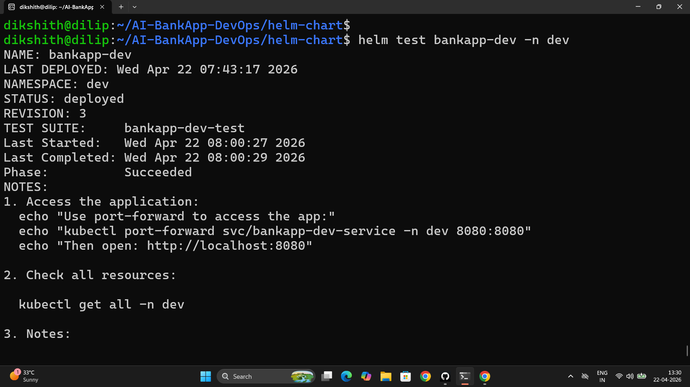

# Day 80 – Helm Project: Multi-Environment Deployment and CI/CD

---

## Task 1 – Environment-Specific Values Files

**`bankapp/values-dev.yaml`**

```yaml
bankapp:
  replicaCount: 1
  image:
    repository: trainwithshubham/ai-bankapp-eks
    tag: "latest"
    pullPolicy: Always
  resources:
    requests:
      memory: "256Mi"
      cpu: "100m"
    limits:
      memory: "512Mi"
      cpu: "250m"
  autoscaling:
    enabled: false

mysql:
  enabled: true
  resources:
    requests:
      memory: "128Mi"
      cpu: "100m"
    limits:
      memory: "256Mi"
      cpu: "250m"
  persistence:
    size: 2Gi
    storageClass: standard

ollama:
  enabled: true
  model: tinyllama
  resources:
    requests:
      memory: "1Gi"
      cpu: "500m"
    limits:
      memory: "1.5Gi"
      cpu: "1000m"
  persistence:
    size: 5Gi
    storageClass: standard

storageClass:
  create: false
```

**`bankapp/values-staging.yaml`**

```yaml
bankapp:
  replicaCount: 2
  image:
    repository: trainwithshubham/ai-bankapp-eks
    tag: "v1.2.0"
    pullPolicy: IfNotPresent
  resources:
    requests:
      memory: "256Mi"
      cpu: "250m"
    limits:
      memory: "512Mi"
      cpu: "500m"
  autoscaling:
    enabled: true
    minReplicas: 2
    maxReplicas: 3
    targetCPUUtilization: 75

mysql:
  enabled: true
  resources:
    requests:
      memory: "256Mi"
      cpu: "250m"
    limits:
      memory: "512Mi"
      cpu: "500m"
  persistence:
    size: 5Gi
    storageClass: gp3

ollama:
  enabled: true
  model: tinyllama
  persistence:
    size: 10Gi
    storageClass: gp3

secrets:
  mysqlRootPassword: StagingPass@456
  mysqlUser: root
  mysqlPassword: StagingPass@456

storageClass:
  create: true
```

**`bankapp/values-prod.yaml`**

```yaml
bankapp:
  replicaCount: 4
  image:
    repository: trainwithshubham/ai-bankapp-eks
    tag: "v1.2.0"
    pullPolicy: IfNotPresent
  resources:
    requests:
      memory: "256Mi"
      cpu: "250m"
    limits:
      memory: "512Mi"
      cpu: "500m"
  autoscaling:
    enabled: true
    minReplicas: 2
    maxReplicas: 4
    targetCPUUtilization: 70

mysql:
  enabled: true
  resources:
    requests:
      memory: "512Mi"
      cpu: "500m"
    limits:
      memory: "1Gi"
      cpu: "1000m"
  persistence:
    size: 20Gi
    storageClass: gp3

ollama:
  enabled: true
  model: tinyllama
  resources:
    requests:
      memory: "2Gi"
      cpu: "900m"
    limits:
      memory: "2.5Gi"
      cpu: "1500m"
  persistence:
    size: 10Gi
    storageClass: gp3

secrets:
  mysqlRootPassword: ProdSecure@789
  mysqlUser: root
  mysqlPassword: ProdSecure@789

storageClass:
  create: true

gateway:
  enabled: true
```

**Environment comparison:**

| Setting | Dev | Staging | Prod |
|---------|-----|---------|------|
| BankApp replicas | 1 (fixed) | 2-3 (HPA) | 2-4 (HPA) |
| Image tag | `latest` | `v1.2.0` | `v1.2.0` |
| MySQL storage | 2Gi | 5Gi | 20Gi |
| MySQL memory limit | 256Mi | 512Mi | 1Gi |
| Ollama memory limit | 1.5Gi | default | 2.5Gi |
| StorageClass create | false (Kind default) | true (EBS) | true (EBS) |
| Gateway | disabled | disabled | enabled |

```bash
# Dev deploy (Kind)
helm install bankapp-dev bankapp/ -f bankapp/values-dev.yaml -n dev --create-namespace

# Staging — render to verify replicas
helm template bankapp-staging bankapp/ -f bankapp/values-staging.yaml | grep "replicas:"

# Prod — render to verify replicas
helm template bankapp-prod bankapp/ -f bankapp/values-prod.yaml | grep "replicas:"
```

---

## Task 2 – Helm Hooks

**`bankapp/templates/pre-install-job.yaml`**

```yaml
apiVersion: batch/v1
kind: Job
metadata:
  name: {{ include "bankapp.fullname" . }}-db-ready
  namespace: {{ .Release.Namespace }}
  labels:
    {{- include "bankapp.labels" . | nindent 4 }}
  annotations:
    "helm.sh/hook": pre-install,pre-upgrade        # Runs before install AND before upgrade
    "helm.sh/hook-weight": "0"                      # Order if multiple hooks — lower runs first
    "helm.sh/hook-delete-policy": before-hook-creation   # Delete old job before re-running
spec:
  template:
    spec:
      containers:
        - name: db-check
          image: busybox:1.36
          command:
            - /bin/sh
            - -c
            - |
              echo "Waiting for MySQL to be ready..."
              until nc -z {{ include "bankapp.fullname" . }}-mysql 3306; do
                echo "MySQL not ready, retrying in 3s..."
                sleep 3
              done
              echo "MySQL is ready!"
          resources:
            requests: { memory: "32Mi", cpu: "50m" }
            limits: { memory: "64Mi", cpu: "100m" }
      restartPolicy: Never
  backoffLimit: 10
```

**Hook annotation meanings:**

| Annotation | Value | Effect |
|-----------|-------|--------|
| `helm.sh/hook` | `pre-install,pre-upgrade` | Runs before install and before every upgrade |
| `helm.sh/hook-weight` | `"0"` | Lower weight runs first when multiple hooks exist |
| `helm.sh/hook-delete-policy` | `before-hook-creation` | Cleans up the Job from the previous run before creating new one |

**Other hook types:**

| Hook | Use case |
|------|---------|
| `post-install` | Run database schema migrations after deploy |
| `pre-delete` | Backup the database before `helm uninstall` |
| `test` | Health check — runs with `helm test` |

Hooks provide defense-in-depth alongside init containers — the hook confirms MySQL is accessible before any chart resources are created, and the init container confirms it again at pod startup.

**`bankapp/templates/tests/test-connection.yaml`**

```yaml
apiVersion: v1
kind: Pod
metadata:
  name: {{ include "bankapp.fullname" . }}-test
  namespace: {{ .Release.Namespace }}
  labels:
    {{- include "bankapp.labels" . | nindent 4 }}
  annotations:
    "helm.sh/hook": test
spec:
  containers:
    - name: test
      image: busybox:1.36
      command: ['sh', '-c', 'wget -qO- http://{{ include "bankapp.fullname" . }}-service:8080/actuator/health']
  restartPolicy: Never
```

```bash
# Run after deploying dev
helm test bankapp-dev -n dev
```




---

## Task 3 – Package and Version the Chart

```bash
# Lint before packaging
helm lint bankapp/

# Package — creates bankapp-0.1.0.tgz
helm package bankapp/
```

Bump version in `bankapp/Chart.yaml` after adding hooks:

```yaml
version: 0.2.0       # Chart structure changed (added hooks and test)
appVersion: "1.1.0"  # App version updated
```

```bash
# Re-package — now have bankapp-0.1.0.tgz and bankapp-0.2.0.tgz
helm package bankapp/

# Install from package
helm install my-bankapp bankapp-0.2.0.tgz -f bankapp/values-dev.yaml -n bankapp --create-namespace

# Create chart repository index for GitHub Pages distribution
mkdir chart-repo
cp bankapp-*.tgz chart-repo/
helm repo index chart-repo/ --url https://your-username.github.io/helm-charts
cat chart-repo/index.yaml
```

---

## Task 4 – Helm in the AI-BankApp GitOps Pipeline

**Current pipeline (raw manifests):**

```
Code push
  → GitHub Actions builds Docker image
  → Tags with git commit SHA
  → Updates image tag in k8s/bankapp-deployment.yml via sed
  → Commits change back to repo
  → ArgoCD detects change, syncs raw YAML to EKS
```

**With Helm:**

```
Code push
  → GitHub Actions builds Docker image
  → Tags with git commit SHA
  → Updates bankapp.image.tag in helm-chart/bankapp/values-prod.yaml via yq
  → Commits change back to repo
  → ArgoCD detects change, runs helm upgrade on EKS
```

**CI step with Helm:**

```yaml
- name: Update Helm values with new image tag
  run: |
    TAG=${{ steps.tag.outputs.sha_short }}
    yq -i '.bankapp.image.tag = "'$TAG'"' helm-chart/bankapp/values-prod.yaml

- name: Commit updated Helm values
  run: |
    git config user.name "github-actions[bot]"
    git config user.email "github-actions[bot]@users.noreply.github.com"
    git add helm-chart/bankapp/values-prod.yaml
    git diff --staged --quiet || git commit -m "ci: update bankapp image to $TAG [skip ci]"
    git push
```

**ArgoCD Application — current vs Helm:**

```yaml
# Current: raw manifests
source:
  path: k8s

# With Helm
source:
  path: helm-chart/bankapp
  helm:
    valueFiles:
      - values-prod.yaml
```

**Advantages of ArgoCD syncing a Helm chart vs raw manifests:**

1. ArgoCD renders the chart templates and tracks drift against the rendered output — if someone manually patches a resource, ArgoCD detects and reconciles it
2. Environment-specific values are version-controlled alongside the chart — the entire desired state per environment is explicit
3. Rollback is `helm rollback` — restores the exact Kubernetes resource set from any revision, not just `git revert` + re-apply
4. ArgoCD shows the diff between current and desired rendered state — reviewers see actual manifest changes, not just values file changes

---

## Task 5 – Production Best Practices

**Always use `helm upgrade --install` in CI/CD:**

```bash
helm upgrade --install bankapp bankapp/ \
  -f bankapp/values-prod.yaml \
  --set bankapp.image.tag=$GIT_SHA \
  -n bankapp --create-namespace \
  --wait --timeout 300s \
  --atomic
```

| Flag | What it does |
|------|-------------|
| `--install` | Creates if missing, upgrades if exists — safe to run on every deploy |
| `--set bankapp.image.tag=$GIT_SHA` | Pins to exact git commit — no `latest` in production |
| `--wait` | Blocks until all pods are Ready |
| `--timeout 300s` | 5-minute deadline before failing |
| `--atomic` | Auto-rollbacks to previous release if upgrade fails |

**Use `helm diff` before upgrading:**

```bash
helm plugin install https://github.com/databus23/helm-diff
helm diff upgrade bankapp bankapp/ -f bankapp/values-prod.yaml
```

Shows exactly what would change before committing to the upgrade. Never upgrade production blind.

**Never store real secrets in `values.yaml`. Use instead:**

- External Secrets Operator + AWS Secrets Manager
- Sealed Secrets (encrypted secrets safe to commit to git)
- HashiCorp Vault with the Vault Agent injector

The `values.yaml` defaults are safe for local dev. CI/CD pipelines should override via `--set` using pipeline secrets (GitHub Actions secrets, Vault, etc.).

---

## Task 6 – Three-Day Helm Summary

| Day | Concept | AI-BankApp connection |
|-----|---------|----------------------|
| 78 | Helm install, repos, values, upgrade, rollback | Deployed MySQL via stable/mysql chart — one command replaced 5 YAML files |
| 79 | Custom chart from scratch, Go templates | Converted 12 raw k8s/ manifests into one chart with conditional components |
| 80 | Multi-env values, hooks, packaging, CI/CD integration | Production-ready chart with dev/staging/prod configs and GitOps pipeline |

**Helm vs raw manifests vs Kustomize:**

| Approach | Best for | AI-BankApp example |
|---------|---------|-------------------|
| Raw manifests | Simple, single-env | Current `k8s/` directory — 12 hardcoded files |
| Helm | Multi-env, complex apps with dependencies | The chart built on days 79-80 — 3 services, HPA, hooks, env-specific sizing |
| Kustomize | Overlays on existing manifests without rewriting | Patching `k8s/` per environment without converting to Go templates |

```bash
# Clean up
helm uninstall bankapp-dev -n dev
kubectl delete namespace dev
kind delete cluster --name tws-cluster
```