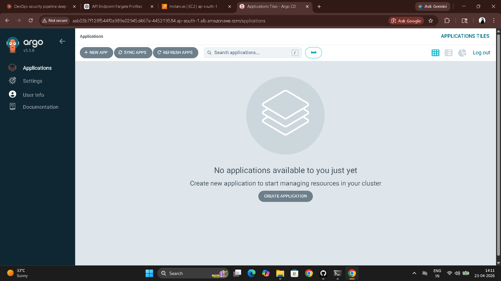
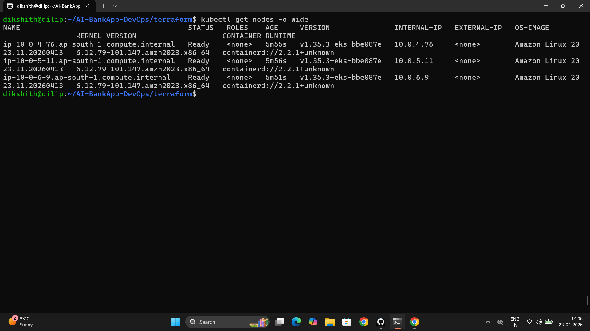
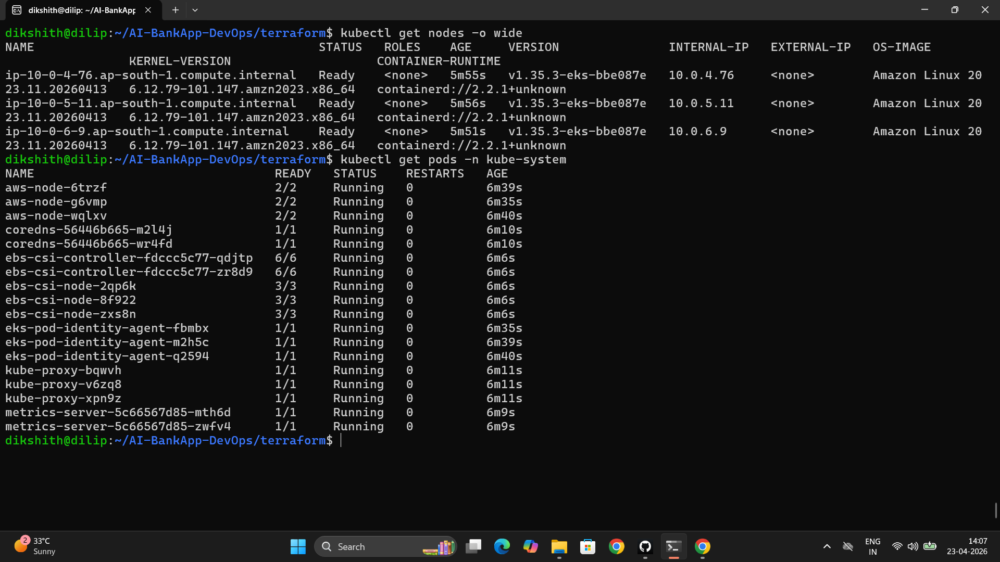
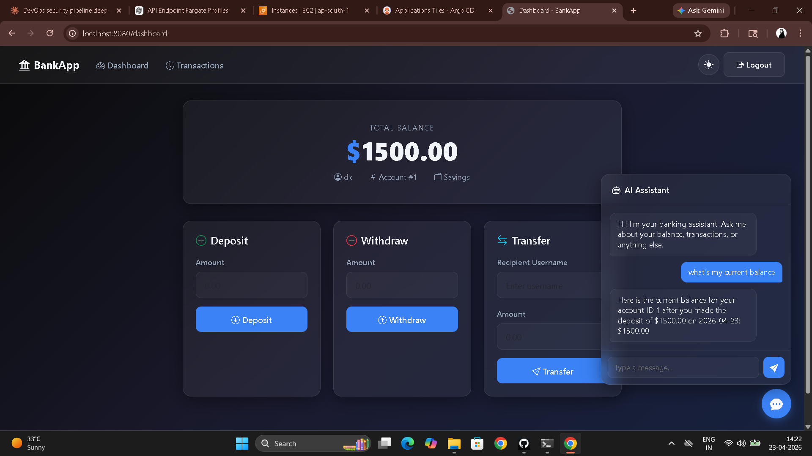
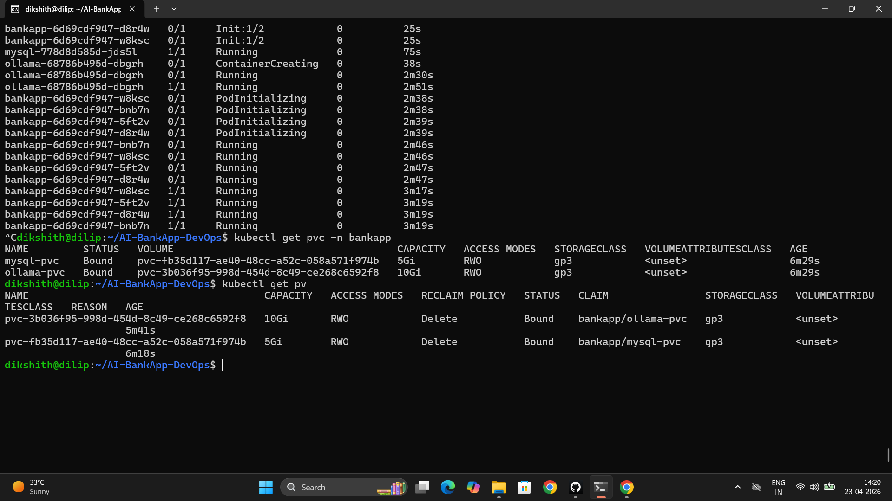

# Day 81 – Introduction to Amazon EKS with Terraform

---

## Task 1 – EKS Architecture

**What "managed Kubernetes" means:**

AWS manages the control plane — API server, etcd, scheduler, controller manager — running in an AWS-owned VPC, patched and upgraded by AWS, spread across multiple AZs for HA. You manage the data plane: the worker nodes where your pods actually run.

**EKS components:**

| Component | Who manages it | What it does |
|-----------|---------------|-------------|
| Control Plane | AWS | API server, etcd, scheduler — fully managed |
| Managed Node Group | AWS + You | EC2 provisioning, scaling, and updates handled by AWS |
| Self-Managed Nodes | You | Full control but full responsibility |
| Fargate Profiles | AWS | Serverless — no nodes to manage |
| VPC + Subnets | You (Terraform) | Network isolation, routing, AZ placement |
| IAM / IRSA | You (Terraform) | Pod-level AWS permissions without static credentials |

**EKS add-ons the AI-BankApp uses:**

| Add-on | Purpose |
|--------|---------|
| `coredns` | DNS resolution inside the cluster |
| `kube-proxy` | Network routing rules for Services |
| `vpc-cni` | AWS VPC CNI — assigns real VPC IPs to pods |
| `eks-pod-identity-agent` | Enables pod-level IAM roles (IRSA) |
| `aws-ebs-csi-driver` | Allows pods to mount EBS volumes — required for MySQL and Ollama |
| `metrics-server` | Powers `kubectl top` and HPA |

**Architecture:**

```
AWS Region (us-west-2)
│
└── VPC (10.0.0.0/16)
    │
    ├── Public Subnets (10.0.1-3.0/24 — 3 AZs)
    │   └── NAT Gateway, Load Balancers (tagged: kubernetes.io/role/elb)
    │
    ├── Private Subnets (10.0.4-6.0/24 — 3 AZs)
    │   └── Worker Nodes (t3.medium x3)
    │       └── Pods (vpc-cni assigns VPC IPs)
    │
    └── Intra Subnets (10.0.7-9.0/24 — 3 AZs)
        └── EKS Control Plane ENIs (API server, etcd)

EKS Control Plane (managed by AWS)
  └── API Server → communicates to kubelets on worker nodes
  └── Add-ons: coredns, kube-proxy, vpc-cni, ebs-csi, metrics-server
```

---

## Task 2 – Study the AI-BankApp Terraform Configuration

```bash
git clone -b feat/gitops https://github.com/TrainWithShubham/AI-BankApp-DevOps.git
cd AI-BankApp-DevOps/terraform
ls
```

**File-by-file breakdown:**

**`variables.tf` + `terraform.tfvars`**

```hcl
# Defaults from terraform.tfvars
aws_region         = "us-west-2"
cluster_name       = "bankapp-eks"
cluster_version    = "1.35"
node_instance_type = "t3.medium"
node_desired_count = 3
node_max_count     = 5
```

Externalizes every environment-specific value — change region or instance type with one file, not scattered through configs.

**`vpc.tf` — Networking foundation**

Uses `terraform-aws-modules/vpc/aws`. Provisions 3 AZs with 3 subnet tiers:

- **Public subnets** (`10.0.1-3.0/24`) — Load balancers and NAT Gateways, tagged `kubernetes.io/role/elb` so the AWS Load Balancer Controller discovers them
- **Private subnets** (`10.0.4-6.0/24`) — Worker nodes, tagged `kubernetes.io/role/internal-elb` for internal load balancers
- **Intra subnets** (`10.0.7-9.0/24`) — EKS control plane ENIs — no internet access, isolated to cluster-internal traffic

NAT Gateway in public subnets allows private-subnet nodes to pull images and reach AWS APIs without a public IP.

**`eks.tf` — The cluster itself**

Uses `terraform-aws-modules/eks/aws ~> 21.0`. Key decisions:

- `AL2023` AMI — Amazon Linux 2023, the current recommended node OS
- `t3.medium` (2 vCPU, 4GB RAM) — handles ~17 pods per node based on VPC ENI limits
- All 6 add-ons installed as EKS managed add-ons — AWS handles patching and compatibility
- IRSA configured for the EBS CSI driver — the driver gets its own IAM role bound to its service account, no static credentials
- `cluster_endpoint_public_access = true` — allows `kubectl` from your laptop
- `cluster_endpoint_private_access = true` — nodes communicate to control plane within the VPC

**`argocd.tf` — ArgoCD via Helm**

Installs ArgoCD using the `argo-cd` Helm chart with a LoadBalancer Service, deployed after the EKS module completes (using `depends_on`). You will configure ArgoCD Applications on Day 84.

**`outputs.tf` — Helper commands**

Outputs the exact `aws eks update-kubeconfig` command and the ArgoCD password retrieval command — no need to remember the syntax.

---

## Task 3 – Provision the EKS Cluster

```bash
# Verify tools
terraform --version    # >= 1.0
aws --version
kubectl version --client
helm version

# Configure AWS credentials
aws configure
aws sts get-caller-identity

# Provision
cd terraform
terraform init
terraform plan        # Review: ~30+ resources
terraform apply       # 15-20 minutes
terraform output
```

**Resources created:**

- 1 VPC with 9 subnets, NAT gateway, internet gateway
- 1 EKS cluster (control plane managed by AWS)
- 1 managed node group (3x `t3.medium` across 3 AZs)
- 6 EKS add-ons
- IAM roles and policies for cluster, nodes, and EBS CSI driver (IRSA)
- ArgoCD Helm release

---

## Task 4 – Connect to the Cluster

```bash
aws eks update-kubeconfig --name bankapp-eks --region us-west-2

kubectl config current-context
kubectl cluster-info
kubectl get nodes -o wide
# 3 nodes, STATUS: Ready, spread across us-west-2a/b/c
```

```bash
# Explore add-ons
kubectl get pods -n kube-system
kubectl get daemonsets -n kube-system
kubectl get pods -n kube-system -l app.kubernetes.io/name=aws-ebs-csi-driver
kubectl top nodes

# ArgoCD
kubectl get pods -n argocd
kubectl get svc -n argocd
kubectl -n argocd get secret argocd-initial-admin-secret -o jsonpath="{.data.password}" | base64 -d
kubectl get svc -n argocd argocd-server -o jsonpath='{.status.loadBalancer.ingress[0].hostname}'
```







---

## Task 5 – Deploy AI-BankApp Manually

```bash
cd ../  # repo root

kubectl apply -f k8s/namespace.yml
kubectl apply -f k8s/pv.yml
kubectl apply -f k8s/pvc.yml
kubectl apply -f k8s/configmap.yml
kubectl apply -f k8s/secrets.yml
kubectl apply -f k8s/mysql-deployment.yml
kubectl apply -f k8s/service.yml
kubectl apply -f k8s/ollama-deployment.yml
kubectl apply -f k8s/bankapp-deployment.yml
kubectl apply -f k8s/hpa.yml

kubectl get pods -n bankapp -w
```

**Startup sequence:**

1. MySQL starts and becomes healthy (15-30 seconds)
2. Ollama starts and pulls TinyLlama model via `postStart` lifecycle hook (2-5 minutes)
3. BankApp init containers wait for both services, then the app starts (30-60 seconds after dependencies)

```bash
# Verify EBS volumes are bound
kubectl get pvc -n bankapp
kubectl get pv
# 5Gi (MySQL) and 10Gi (Ollama) EBS volumes in correct AZs

# Verify HPA
kubectl get hpa -n bankapp

# Access the app
kubectl port-forward svc/bankapp-service -n bankapp 8080:8080
# http://localhost:8080
```




---

## Task 6 – EKS Cost Breakdown

| Component | Approximate cost |
|-----------|-----------------|
| EKS Control Plane | $0.10/hr (~$73/month) |
| t3.medium nodes (3x) | $0.042/hr each ($91/month total) |
| NAT Gateway | $0.045/hr + data transfer (~$33/month) |
| EBS volumes (15Gi total) | ~$1.50/month |
| LoadBalancer (ArgoCD) | $0.025/hr (~$18/month) |
| **Total** | **~$220/month ($7/day)** |

**Why NAT Gateway is surprisingly expensive:**

A NAT Gateway charges per hour of existence ($0.045/hr = $32/month) plus per-GB of data processed ($0.045/GB). Every time a node pulls a Docker image, receives an AWS API response, or downloads a package, that data flows through the NAT Gateway and is charged. In a cluster pulling multiple large images (Ollama is ~2GB), data transfer costs accumulate quickly. This is also why private subnets are still preferred over public subnets for nodes — the security benefit outweighs the NAT cost, but the NAT cost must be budgeted.

**Clean up — delete workload but keep cluster for Days 82-83:**

```bash
kubectl delete -f k8s/hpa.yml
kubectl delete -f k8s/bankapp-deployment.yml
kubectl delete -f k8s/ollama-deployment.yml
kubectl delete -f k8s/mysql-deployment.yml
kubectl delete -f k8s/service.yml
kubectl delete -f k8s/secrets.yml
kubectl delete -f k8s/configmap.yml
kubectl delete -f k8s/pvc.yml
kubectl delete -f k8s/pv.yml
kubectl delete -f k8s/namespace.yml
```

**Destroy everything when done with Days 82-83:**

```bash
cd terraform
terraform destroy
```

Always delete Kubernetes LoadBalancer Services before `terraform destroy` — an active ELB blocks VPC deletion and causes the destroy to hang.