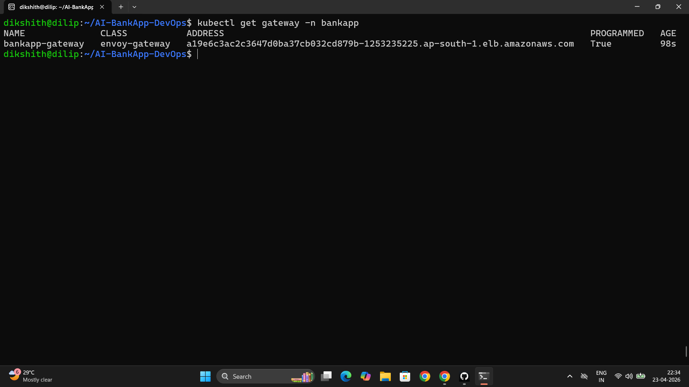
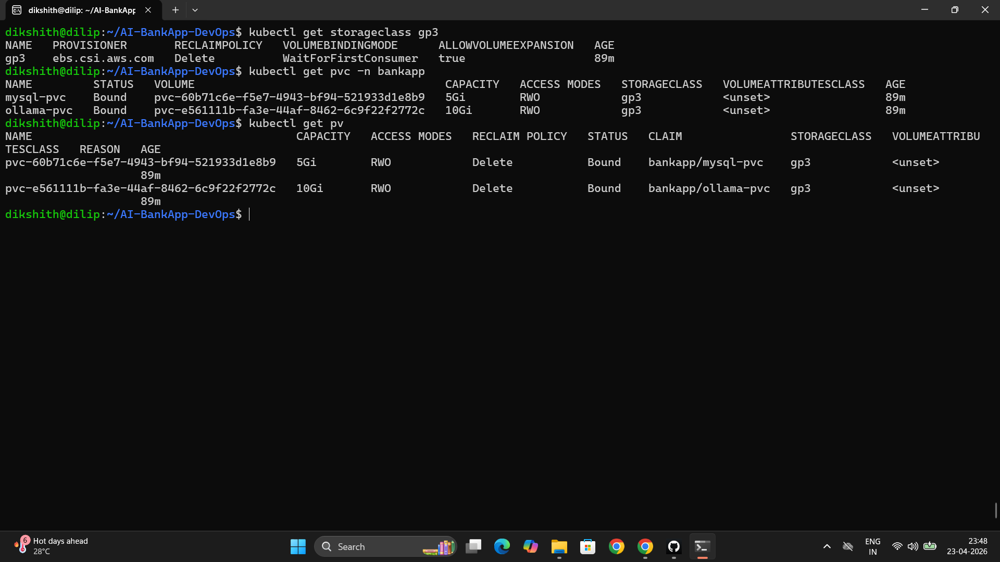
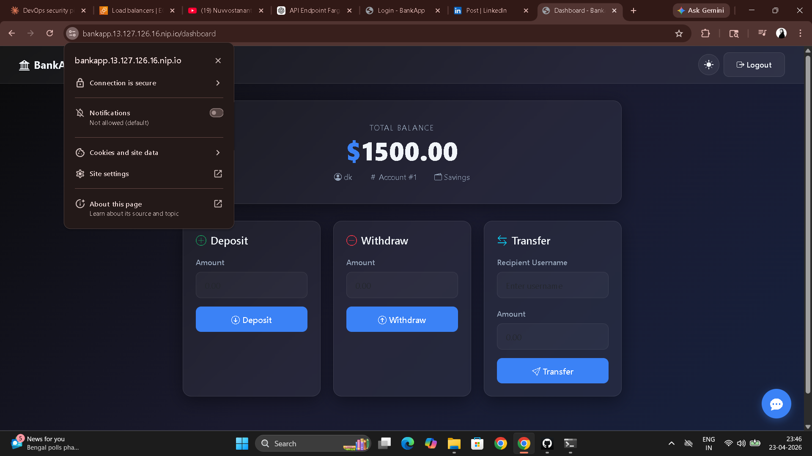

# Day 82 – EKS Networking with Gateway API and Persistent Storage

---

## Task 1 – Gateway API vs Ingress

**Comparison:**

| Feature | Ingress | Gateway API |
|---------|---------|-------------|
| API maturity | Stable but limited | GA since Kubernetes 1.26 |
| Traffic splitting | Not supported | Built-in weighted backends |
| Header matching | Annotation-dependent | Native HTTPRoute rules |
| Role separation | Single resource for everything | GatewayClass (infra) → Gateway (ops) → HTTPRoute (dev) |
| TLS management | Annotation-based | Native TLS config in Gateway listeners |
| Session affinity | Not standardized | BackendTrafficPolicy (Envoy-specific) |

Gateway API separates concerns by role — infrastructure team manages GatewayClass, platform team manages Gateway, developers manage HTTPRoute. Ingress mixes all three in one resource, forcing annotations for anything beyond basic routing.

**AI-BankApp Gateway architecture:**

```
[Internet]
    |
[AWS NLB]  (auto-created by Envoy Gateway when Gateway resource is applied)
    |
[Gateway: bankapp-gateway]
    |-- Listener: HTTP  port 80
    |-- Listener: HTTPS port 443 (TLS terminated, cert from cert-manager)
    |
[HTTPRoute: bankapp-route]
    |
[BackendTrafficPolicy: bankapp-session]
(cookie-based session affinity — BANKAPP_AFFINITY cookie)
    |
[Service: bankapp-service:8080]
    |
[Pods: bankapp x2-4]
```

---

## Task 2 – Install Envoy Gateway

```bash
helm install envoy-gateway oci://docker.io/envoyproxy/gateway-helm \
  --version v1.4.0 \
  -n envoy-gateway-system --create-namespace \
  --wait

kubectl get pods -n envoy-gateway-system
kubectl get gatewayclass
# envoy-gateway GatewayClass registered

# Install Gateway API CRDs if not already present
kubectl get crd gateways.gateway.networking.k8s.io 2>/dev/null || \
  kubectl apply -f https://github.com/kubernetes-sigs/gateway-api/releases/download/v1.2.1/standard-install.yaml
```

---

## Task 3 – Gateway API Resources

Redeploy the AI-BankApp if needed:

```bash
kubectl apply -f k8s/namespace.yml
kubectl apply -f k8s/pv.yml && kubectl apply -f k8s/pvc.yml
kubectl apply -f k8s/configmap.yml && kubectl apply -f k8s/secrets.yml
kubectl apply -f k8s/mysql-deployment.yml && kubectl apply -f k8s/service.yml
kubectl apply -f k8s/ollama-deployment.yml
kubectl apply -f k8s/bankapp-deployment.yml && kubectl apply -f k8s/hpa.yml
```

**`k8s/gateway.yml` — four resources explained:**

**1. GatewayClass — which controller handles Gateways:**

```yaml
apiVersion: gateway.networking.k8s.io/v1
kind: GatewayClass
metadata:
  name: envoy-gateway
spec:
  controllerName: gateway.envoyproxy.io/gatewayclass-controller
```

Registers Envoy Gateway as the implementation. Other implementations (Istio, Contour) have their own controller name — GatewayClass is how the cluster knows which one to use.

**2. Gateway — the actual load balancer with listeners:**

```yaml
apiVersion: gateway.networking.k8s.io/v1
kind: Gateway
metadata:
  name: bankapp-gateway
  namespace: bankapp
spec:
  gatewayClassName: envoy-gateway
  listeners:
    - name: http
      protocol: HTTP
      port: 80
    - name: https
      protocol: HTTPS
      port: 443
      hostname: <your-ip>.nip.io
      tls:
        mode: Terminate
        certificateRefs:
          - name: bankapp-tls
```

When applied, Envoy Gateway creates an AWS NLB automatically. The HTTPS listener terminates TLS at the NLB edge — backend pods receive plain HTTP.

**3. HTTPRoute — routes traffic to the BankApp service:**

```yaml
apiVersion: gateway.networking.k8s.io/v1
kind: HTTPRoute
metadata:
  name: bankapp-route
  namespace: bankapp
spec:
  parentRefs:
    - name: bankapp-gateway
      sectionName: https
    - name: bankapp-gateway
      sectionName: http
  rules:
    - matches:
        - path:
            type: PathPrefix
            value: /
      backendRefs:
        - name: bankapp-service
          port: 8080
```

`parentRefs` binds this route to both listeners. Unlike Ingress where routing rules and gateway config are mixed in one resource, HTTPRoute is managed independently — developers can update routing without touching the Gateway.

**4. BackendTrafficPolicy — cookie-based session affinity:**

```yaml
apiVersion: gateway.envoyproxy.io/v1alpha1
kind: BackendTrafficPolicy
metadata:
  name: bankapp-session
  namespace: bankapp
spec:
  targetRefs:
    - group: gateway.networking.k8s.io
      kind: HTTPRoute
      name: bankapp-route
  loadBalancer:
    type: ConsistentHash
    consistentHash:
      type: Cookie
      cookie:
        name: BANKAPP_AFFINITY
        ttl: 3600s
```

**Why cookie-based session affinity is required for the AI-BankApp:**

The AI-BankApp uses Spring Security with form-based login. HTTP session data (authentication state, CSRF tokens) is stored in-memory on the pod that handled the login. Without session affinity, a user's next request might hit a different pod — that pod has no record of the session, and the user is treated as unauthenticated. The `BANKAPP_AFFINITY` cookie ensures all requests from a user are consistently routed to the same pod for the duration of their session (1 hour TTL).

```bash
kubectl apply -f k8s/gateway.yml
kubectl get gateway -n bankapp -w

export GATEWAY_IP=$(kubectl get gateway bankapp-gateway -n bankapp -o jsonpath='{.status.addresses[0].value}')
echo "App URL: http://$GATEWAY_IP"
curl http://$GATEWAY_IP
```



---

## Task 4 – TLS with cert-manager

```bash
helm repo add jetstack https://charts.jetstack.io
helm repo update

helm install cert-manager jetstack/cert-manager \
  -n cert-manager --create-namespace \
  --set crds.enabled=true \
  --wait

kubectl get pods -n cert-manager
```

**`k8s/cert-manager.yml` — Let's Encrypt ClusterIssuer:**

```yaml
apiVersion: cert-manager.io/v1
kind: ClusterIssuer
metadata:
  name: letsencrypt-prod
spec:
  acme:
    server: https://acme-v02.api.letsencrypt.org/directory
    email: your-email@example.com
    privateKeySecretRef:
      name: letsencrypt-account-key
    solvers:
      - http01:
          gatewayHTTPRoute:
            parentRefs:
              - group: gateway.networking.k8s.io
                kind: Gateway
                name: bankapp-gateway
                namespace: bankapp
```

**How the HTTP-01 challenge flow works:**

1. cert-manager requests a certificate from Let's Encrypt for `<ip>.nip.io`
2. Let's Encrypt responds with a challenge token and instructs cert-manager to serve it at `http://<hostname>/.well-known/acme-challenge/<token>`
3. cert-manager creates a temporary HTTPRoute pointing to a challenge-response pod
4. Let's Encrypt verifies the response is reachable
5. cert-manager receives the signed certificate and stores it in the `bankapp-tls` Secret
6. The Gateway uses this Secret for HTTPS termination — renewed automatically before expiry

```bash
# For testing without a real domain — use nip.io wildcard DNS
export HOSTNAME="${GATEWAY_IP}.nip.io"
echo "HTTPS URL: https://$HOSTNAME"
# Update gateway.yml hostname and apply cert-manager.yml
```

---

## Task 5 – EBS Persistent Storage in Action

**Storage flow: StorageClass → PVC → PV → EBS Volume → Pod**

```
developer writes PVC (mysql-pvc: 5Gi, storageClass: gp3)
    |
    v
EBS CSI Driver (runs as DaemonSet, has IRSA permissions to create EBS)
    |
    v
AWS EBS Volume created in same AZ as the scheduled pod
(WaitForFirstConsumer delays creation until pod is placed)
    |
    v
PersistentVolume created and bound to PVC
    |
    v
Pod mounts the EBS volume at /var/lib/mysql
```

```bash
kubectl get storageclass gp3
kubectl get pvc -n bankapp
kubectl get pv

# Find EBS volumes in AWS
aws ec2 describe-volumes \
  --filters "Name=tag:kubernetes.io/created-by,Values=ebs.csi.aws.com" \
  --query "Volumes[*].{ID:VolumeId,Size:Size,AZ:AvailabilityZone,State:State}" \
  --output table \
  --region us-west-2
```

**Key EBS behaviors on EKS:**

| Behavior | Why it matters |
|---------|---------------|
| `WaitForFirstConsumer` | Volume created in the same AZ as the pod — prevents cross-AZ attachment failure |
| `ReadWriteOnce` | EBS attaches to exactly one node — MySQL and Ollama use `Recreate` strategy (old pod must terminate before new one starts) |
| `gp3` | 3000 IOPS baseline, cheaper than gp2, adjustable IOPS independent of size |
| `allowVolumeExpansion: true` | Grow volumes without recreating pods — edit the PVC spec, no downtime |

**Test persistence — delete MySQL pod and verify data survives:**

```bash
# Check data
kubectl exec -n bankapp deploy/mysql -- mysql -uroot -pTest@123 -e "SHOW DATABASES;"

# Delete pod
kubectl delete pod -n bankapp -l app=mysql

# Watch it recreate
kubectl get pods -n bankapp -l app=mysql -w

# Verify data intact — output identical to first check
kubectl exec -n bankapp deploy/mysql -- mysql -uroot -pTest@123 -e "SHOW DATABASES;"
```

The EBS volume persists independently of the pod lifecycle. The Deployment recreates the pod, which attaches the same EBS volume — data is fully intact.





---

## Task 6 – HPA and Resource Budget

```bash
kubectl get hpa -n bankapp
kubectl top nodes
kubectl top pods -n bankapp
```

**Resource budget on 3x t3.medium (2 vCPU, 4GB RAM each = 6 vCPU, 12GB total):**

| Component | CPU Request | Memory Request | Instances |
|-----------|------------|----------------|-----------|
| BankApp | 250m | 256Mi | 2-4 pods |
| MySQL | 250m | 256Mi | 1 pod |
| Ollama | 900m | 2Gi | 1 pod |
| Init containers | 50m | 32Mi | temporary |
| System pods | ~500m | ~500Mi | per node |
| **Total requests** | **~2.9 cores** | **~7.5Gi** | at 4 BankApp pods |

Ollama at 900m CPU request + 2Gi memory is the heaviest single consumer. With 4 BankApp pods running, total memory requests approach the cluster limit. The HPA's 70% CPU target ensures pods scale before resource exhaustion.

**Clean up workload (keep cluster for Day 83):**

```bash
kubectl delete -f k8s/gateway.yml 2>/dev/null
kubectl delete -f k8s/hpa.yml
kubectl delete -f k8s/bankapp-deployment.yml
kubectl delete -f k8s/ollama-deployment.yml
kubectl delete -f k8s/mysql-deployment.yml
kubectl delete -f k8s/service.yml
kubectl delete -f k8s/secrets.yml
kubectl delete -f k8s/configmap.yml
kubectl delete -f k8s/pvc.yml
kubectl delete -f k8s/pv.yml
kubectl delete -f k8s/namespace.yml
```