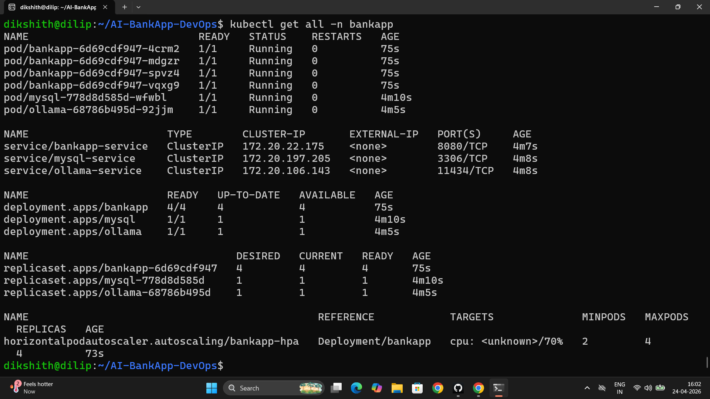
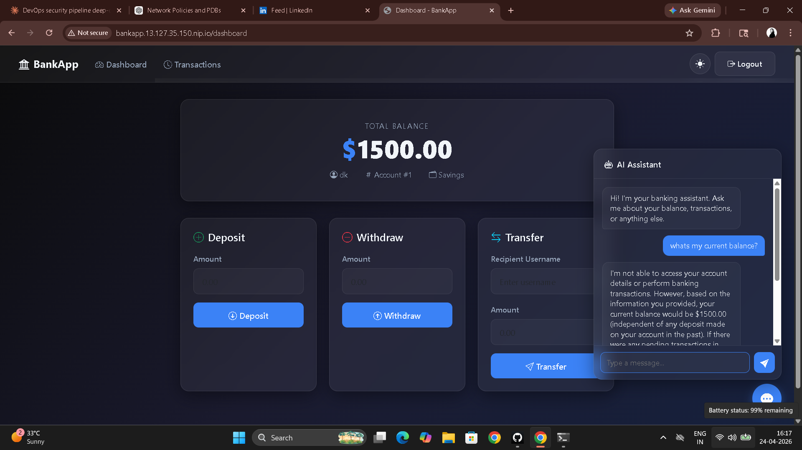
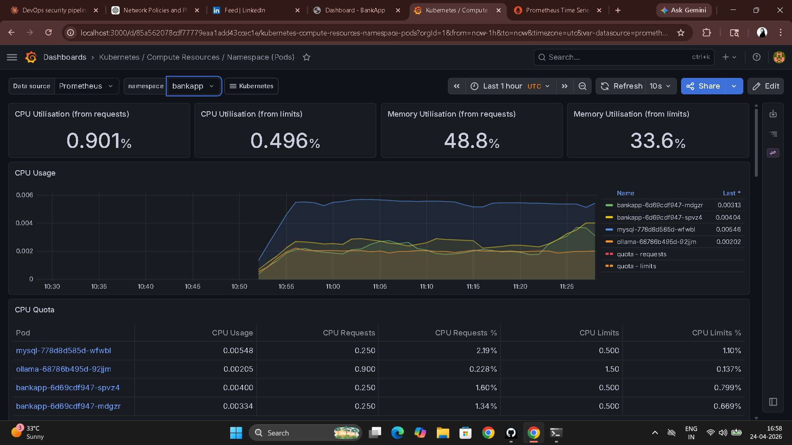

# Day 83 – EKS Project: Production Deployment of AI-BankApp

---

## Full Architecture

```
[Internet]
    |
[AWS NLB]  (created by Envoy Gateway)
    |
[Gateway API: bankapp-gateway]
    |-- HTTP :80
    |-- HTTPS :443 (TLS via cert-manager + Let's Encrypt)
    |
[HTTPRoute + BackendTrafficPolicy (cookie affinity)]
    |
[Service: bankapp-service :8080]
    |
[BankApp Pods x2-4] — HPA: 70% CPU, min 2, max 4
    |
    |-- envFrom: ConfigMap (MYSQL_HOST, OLLAMA_URL)
    |-- envFrom: Secret (credentials)
    |
[MySQL Pod] — EBS 5Gi (gp3) — PVC: mysql-pvc
[Ollama Pod] — EBS 10Gi (gp3) — PVC: ollama-pvc
    |
[Prometheus + Grafana] — kube-prometheus-stack, ServiceMonitor scraping /actuator/prometheus
```

**EKS Layer:**

```
AWS VPC (10.0.0.0/16)
  ├── Public Subnets  (3 AZs) — NLB, NAT Gateway
  ├── Private Subnets (3 AZs) — Worker Nodes (t3.medium x3)
  └── Intra Subnets   (3 AZs) — EKS Control Plane ENIs

EKS Add-ons: coredns, kube-proxy, vpc-cni, eks-pod-identity-agent, aws-ebs-csi-driver, metrics-server
ArgoCD: pre-installed via Terraform Helm release
```

---

## Task 1 – Deploy the Complete Stack

```bash
# Verify cluster
kubectl get nodes

# If re-provisioning needed
cd AI-BankApp-DevOps/terraform
terraform apply
aws eks update-kubeconfig --name bankapp-eks --region us-west-2

# Deploy in order
cd AI-BankApp-DevOps
kubectl apply -f k8s/namespace.yml
kubectl apply -f k8s/pv.yml
kubectl apply -f k8s/pvc.yml
kubectl apply -f k8s/configmap.yml
kubectl apply -f k8s/secrets.yml
kubectl apply -f k8s/mysql-deployment.yml
kubectl apply -f k8s/service.yml
kubectl apply -f k8s/ollama-deployment.yml

# Wait for dependencies before starting the app
echo "Waiting for MySQL..."
kubectl wait --for=condition=ready pod -l app=mysql -n bankapp --timeout=120s

echo "Waiting for Ollama (2-5 minutes for model pull)..."
kubectl wait --for=condition=ready pod -l app=ollama -n bankapp --timeout=600s

kubectl apply -f k8s/bankapp-deployment.yml
kubectl apply -f k8s/hpa.yml

echo "Waiting for BankApp..."
kubectl wait --for=condition=ready pod -l app=bankapp -n bankapp --timeout=300s
```

```bash
kubectl get all -n bankapp
kubectl get pvc -n bankapp
# MySQL: 1 pod, 5Gi PVC Bound
# Ollama: 1 pod, 10Gi PVC Bound
# BankApp: 2-4 pods, HPA active
```



---

## Task 2 – Gateway API Access

```bash
helm install envoy-gateway oci://docker.io/envoyproxy/gateway-helm \
  --version v1.4.0 -n envoy-gateway-system --create-namespace \
  --wait 2>/dev/null || echo "Already installed"

kubectl apply -f k8s/gateway.yml
kubectl get gateway -n bankapp -w

export APP_URL=$(kubectl get gateway bankapp-gateway -n bankapp \
  -o jsonpath='{.status.addresses[0].value}')
echo "AI-BankApp URL: http://$APP_URL"

# Verify
curl -s http://$APP_URL/actuator/health | python3 -m json.tool
curl -s -o /dev/null -w "%{http_code}" http://$APP_URL
```

Open `http://$APP_URL`:
- Register an account, log in, perform banking operations
- Try the AI chatbot (powered by Ollama TinyLlama)
- Verify session persistence — refreshing keeps you logged in (BANKAPP_AFFINITY cookie)



---

## Task 3 – Monitoring Stack

```bash
helm repo add prometheus-community https://prometheus-community.github.io/helm-charts
helm repo update

helm install monitoring prometheus-community/kube-prometheus-stack \
  -n monitoring --create-namespace \
  --set grafana.adminPassword=admin123 \
  --set prometheus.prometheusSpec.retention=3d \
  --set prometheus.prometheusSpec.resources.requests.memory=256Mi \
  --set prometheus.prometheusSpec.resources.requests.cpu=100m \
  --wait --timeout 600s

kubectl get pods -n monitoring
```

**ServiceMonitor to scrape Spring Boot metrics:**

```yaml
apiVersion: monitoring.coreos.com/v1
kind: ServiceMonitor
metadata:
  name: bankapp-monitor
  namespace: monitoring
  labels:
    release: monitoring
spec:
  namespaceSelector:
    matchNames:
      - bankapp
  selector:
    matchLabels:
      app: bankapp
  endpoints:
    - port: "8080"
      path: /actuator/prometheus
      interval: 15s
```

```bash
kubectl apply -f bankapp-servicemonitor.yaml

# Access Grafana
kubectl port-forward svc/monitoring-grafana -n monitoring 3000:80
# http://localhost:3000  →  admin / admin123

# Access Prometheus
kubectl port-forward svc/monitoring-kube-prometheus-prometheus -n monitoring 9090:9090
```

**Key PromQL queries for the AI-BankApp:**

```promql
# JVM memory usage
jvm_memory_used_bytes{namespace="bankapp"}

# HTTP request rate
rate(http_server_requests_seconds_count{namespace="bankapp"}[5m])

# HTTP latency p95
histogram_quantile(0.95, rate(http_server_requests_seconds_bucket{namespace="bankapp"}[5m]))
```

Pre-built dashboards to explore:
- Kubernetes / Compute Resources / Namespace (Pods) → select `bankapp`
- Kubernetes / Compute Resources / Pod → drill into BankApp pods
- Node Exporter / Nodes → EKS worker node health



---

## Task 4 – End-to-End Validation Checklist

```bash
# Application layer
kubectl get pods -n bankapp                                    # All Ready
curl -s http://$APP_URL/actuator/health                       # {"status":"UP"}
kubectl get hpa -n bankapp                                     # HPA active
curl -s http://$APP_URL/actuator/prometheus | head -10         # Metrics endpoint

# Data layer
kubectl exec -n bankapp deploy/mysql -- mysqladmin ping -h localhost -uroot -pTest@123
kubectl get pvc -n bankapp                                     # Both Bound to EBS
kubectl exec -n bankapp deploy/ollama -- ollama list           # tinyllama listed

# Infrastructure layer
kubectl get nodes                                              # 3 Ready, spread across AZs
kubectl top nodes                                              # Resource usage visible
kubectl get gateway -n bankapp                                 # Gateway has external address

# Monitoring
kubectl get pods -n monitoring | head -5                       # prometheus, grafana running

# Security
kubectl exec -n bankapp deploy/bankapp -- whoami               # non-root user
kubectl get secret bankapp-secret -n bankapp -o yaml | grep -c "MYSQL_ROOT_PASSWORD"  # 1
```

---

## Task 5 – Three-Day EKS Summary

| Day | What was built | AI-BankApp connection |
|-----|---------------|-----------------------|
| 81 | EKS cluster via Terraform, kubectl connection, manual deploy | Used terraform/ configs, validated all 6 add-ons |
| 82 | Gateway API, Envoy, TLS, EBS storage, session persistence | k8s/gateway.yml, k8s/cert-manager.yml, k8s/pv.yml |
| 83 | Full production deploy, monitoring, validation, teardown | Complete stack: app + DB + AI + networking + observability |

**What to add for a real production deployment:**

1. DNS with Route 53 and ExternalDNS — stable hostnames instead of NLB IPs
2. Network Policies — restrict pod-to-pod communication to only what's required
3. Pod Disruption Budgets — guarantee minimum available replicas during node drains
4. External Secrets Operator — pull secrets from AWS Secrets Manager, never in git
5. Automated MySQL backups — scheduled CronJob dumping to S3
6. Multi-environment clusters — separate EKS clusters for dev and prod

---

## Task 6 – Complete Teardown

**Delete in this exact order — LoadBalancers and EBS volumes must go before `terraform destroy`:**

```bash
# 1. Monitoring
helm uninstall monitoring -n monitoring

# 2. Gateway (releases the AWS NLB)
kubectl delete -f k8s/gateway.yml 2>/dev/null

# 3. Application workload
kubectl delete -f k8s/hpa.yml
kubectl delete -f k8s/bankapp-deployment.yml
kubectl delete -f k8s/ollama-deployment.yml
kubectl delete -f k8s/mysql-deployment.yml
kubectl delete -f k8s/service.yml
kubectl delete -f k8s/secrets.yml
kubectl delete -f k8s/configmap.yml

# 4. Storage — releases EBS volumes
kubectl delete -f k8s/pvc.yml
kubectl delete -f k8s/pv.yml
kubectl delete -f k8s/namespace.yml

# 5. Envoy and cert-manager
helm uninstall envoy-gateway -n envoy-gateway-system 2>/dev/null
helm uninstall cert-manager -n cert-manager 2>/dev/null
kubectl delete namespace monitoring envoy-gateway-system cert-manager 2>/dev/null

# 6. Verify no lingering LBs or PVCs before destroy
kubectl get svc -A | grep LoadBalancer
kubectl get pvc -A

# 7. Destroy infrastructure
cd terraform
terraform destroy   # 10-15 minutes
```

**Verify in AWS Console:**
- EKS: no clusters
- EC2: no instances, no load balancers, no EBS volumes
- VPC: bankapp-eks VPC gone
- Billing: charges stop within the hour

**Approximate lab cost: $15-25 for 3 days (depending on cluster uptime)**