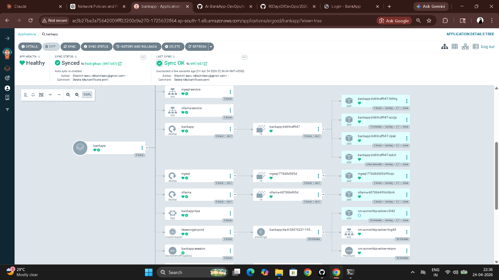

# Day 84 – Introduction to GitOps and ArgoCD

---

## Task 1 – GitOps Principles

**What GitOps is:**

GitOps is a deployment methodology where Git is the single source of truth for both infrastructure and application state. An operator (ArgoCD) watches a Git repository and continuously ensures the live cluster matches what is committed. If someone changes something directly in the cluster, the operator detects the drift and reverts it. All changes go through Git — pull requests, code review, and full audit trail.

**GitOps vs traditional CI/CD:**

| Aspect | Traditional CI/CD | GitOps |
|--------|------------------|--------|
| Deployment trigger | CI pipeline runs `kubectl apply` | Git commit triggers sync |
| Source of truth | Pipeline scripts | Git repository |
| Drift detection | None | Continuous reconciliation |
| Rollback | Re-run pipeline or manual kubectl | `git revert` |
| Audit trail | Pipeline logs | Git history |
| Access control | CI server has broad cluster access | Only ArgoCD has cluster credentials |
| Security | Developers need cluster access | Developers push to Git, never to the cluster |

**The four GitOps principles (OpenGitOps):**

1. **Declarative** — desired state is expressed in Kubernetes YAML, not imperative commands
2. **Versioned and immutable** — desired state stored in Git, every change is auditable
3. **Pulled automatically** — ArgoCD pulls from Git, CI never pushes to the cluster
4. **Continuously reconciled** — ArgoCD continuously compares desired vs actual and corrects drift

**The AI-BankApp GitOps flow:**

```
Developer pushes code to feat/gitops
         |
    [GitHub Actions CI]
    - Build Maven project
    - Run tests
    - Build Docker image
    - Push to DockerHub (tagged with git SHA)
    - Update image tag in k8s/bankapp-deployment.yml
    - Commit change back to Git
         |
    [ArgoCD watches the repo every 3 minutes]
    - Detects new commit
    - Compares k8s/ manifests with live cluster
    - Syncs the change (rolling update)
    - BankApp pods restart with new image
         |
    [Zero human intervention after the initial git push]
```

---

## Task 2 – Access ArgoCD on EKS

ArgoCD was pre-installed by Terraform (`terraform/argocd.tf`).

```bash
kubectl get pods -n argocd
# argocd-server
# argocd-repo-server
# argocd-application-controller
# argocd-applicationset-controller
# argocd-redis
# argocd-dex-server

# Get admin password
kubectl -n argocd get secret argocd-initial-admin-secret \
  -o jsonpath="{.data.password}" | base64 -d && echo

# Option A — LoadBalancer URL
export ARGOCD_URL=$(kubectl get svc argocd-server -n argocd \
  -o jsonpath='{.status.loadBalancer.ingress[0].hostname}')
echo "ArgoCD URL: http://$ARGOCD_URL"

# Option B — port-forward
kubectl port-forward svc/argocd-server -n argocd 8443:443
# https://localhost:8443  (accept self-signed cert)
```

```bash
# Install ArgoCD CLI
curl -sSL -o argocd https://github.com/argoproj/argo-cd/releases/latest/download/argocd-linux-amd64
chmod +x argocd && sudo mv argocd /usr/local/bin/
argocd version --client

# Log in
argocd login $ARGOCD_URL --username admin --password <password> --insecure
```

**ArgoCD UI sections to explore:**

- **Applications** — all managed applications
- **Settings > Repositories** — Git repos ArgoCD can access
- **Settings > Clusters** — the EKS cluster is registered as in-cluster by default


---

## Task 3 – The Application Manifest

**`argocd/application.yml`:**

```yaml
apiVersion: argoproj.io/v1alpha1
kind: Application
metadata:
  name: bankapp
  namespace: argocd
spec:
  project: default
  source:
    repoURL: https://github.com/TrainWithShubham/AI-BankApp-DevOps.git
    targetRevision: feat/gitops
    path: k8s
  destination:
    server: https://kubernetes.default.svc
    namespace: bankapp
  syncPolicy:
    automated:
      prune: true
      selfHeal: true
    syncOptions:
      - CreateNamespace=true
      - ServerSideApply=true
```

**Every field explained:**

| Field | Value | Purpose |
|-------|-------|---------|
| `source.repoURL` | AI-BankApp GitHub repo | Where ArgoCD fetches manifests |
| `source.targetRevision` | `feat/gitops` | Git branch to watch |
| `source.path` | `k8s` | Directory containing the manifests |
| `destination.server` | `kubernetes.default.svc` | Deploy to the local in-cluster |
| `destination.namespace` | `bankapp` | Target namespace |
| `automated` | enabled | ArgoCD syncs automatically on Git changes |
| `prune: true` | enabled | Delete cluster resources removed from Git |
| `selfHeal: true` | enabled | Revert manual changes made directly to the cluster |
| `CreateNamespace=true` | enabled | Creates `bankapp` namespace if it doesn't exist |
| `ServerSideApply=true` | enabled | Uses server-side apply — avoids annotation conflicts when multiple tools touch the same resource |

---

## Task 4 – Deploy the AI-BankApp via ArgoCD

```bash
# Clean slate
kubectl delete namespace bankapp 2>/dev/null

# Fork the repo first:
# https://github.com/TrainWithShubham/AI-BankApp-DevOps → Fork

# Create the Application (update repoURL to your fork)
cat <<EOF | kubectl apply -f -
apiVersion: argoproj.io/v1alpha1
kind: Application
metadata:
  name: bankapp
  namespace: argocd
spec:
  project: default
  source:
    repoURL: https://github.com/<your-username>/AI-BankApp-DevOps.git
    targetRevision: feat/gitops
    path: k8s
  destination:
    server: https://kubernetes.default.svc
    namespace: bankapp
  syncPolicy:
    automated:
      prune: true
      selfHeal: true
    syncOptions:
      - CreateNamespace=true
      - ServerSideApply=true
EOF

# Watch via CLI
argocd app get bankapp
argocd app wait bankapp

# Watch pods
kubectl get pods -n bankapp -w
```

After 5-10 minutes:

```bash
argocd app get bankapp
# Health: Healthy
# Sync: Synced
```

---

## Task 5 – ArgoCD Live View

In the ArgoCD UI, click `bankapp`. The resource tree:

```
bankapp (Application)
  |-- Namespace: bankapp
  |-- StorageClass: gp3
  |-- PVC: mysql-pvc (Bound)
  |-- PVC: ollama-pvc (Bound)
  |-- ConfigMap: bankapp-config
  |-- Secret: bankapp-secret
  |-- Deployment: mysql → ReplicaSet → Pod
  |-- Deployment: ollama → ReplicaSet → Pod
  |-- Deployment: bankapp → ReplicaSet → Pods (x4)
  |-- Service: mysql-service
  |-- Service: ollama-service
  |-- Service: bankapp-service
  |-- HPA: bankapp-hpa
```

Click any resource to see: live logs, events, current YAML, and the diff from the last sync.

```bash
# Sync history — every revision synced with commit SHA and timestamp
argocd app history bankapp
```



---

## Task 6 – Test Self-Healing

**Test 1 — Manually scale the Deployment:**

```bash
kubectl scale deployment bankapp -n bankapp --replicas=1
kubectl get pods -n bankapp -w
```

Within 3-5 minutes ArgoCD detects the drift (`replicas` in cluster = 1, in Git = 4) and syncs back to the Git value. The UI shows an OutOfSync → Synced event.

**Test 2 — Delete a ConfigMap:**

```bash
kubectl delete configmap bankapp-config -n bankapp
```

ArgoCD recreates it from Git within the next reconciliation cycle (~3 minutes).

**Test 3 — Edit a ConfigMap value:**

```bash
kubectl edit configmap bankapp-config -n bankapp
# Change MYSQL_DATABASE to wrong_db
```

ArgoCD overwrites it back to the value in Git.

**In each test:** ArgoCD's sync event log in the UI shows "Synced (drift detected)" with a timestamp and the exact resources that were corrected. The `selfHeal: true` flag is what enables automatic reversion — without it, ArgoCD would only report the drift but not fix it.


**The GitOps guarantee these tests prove:**

The cluster always matches Git. No manual change survives. The only valid way to change the cluster state is to change Git — which means a pull request, a review, and an audit trail..


