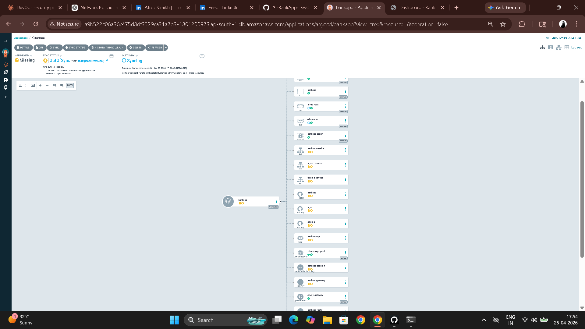
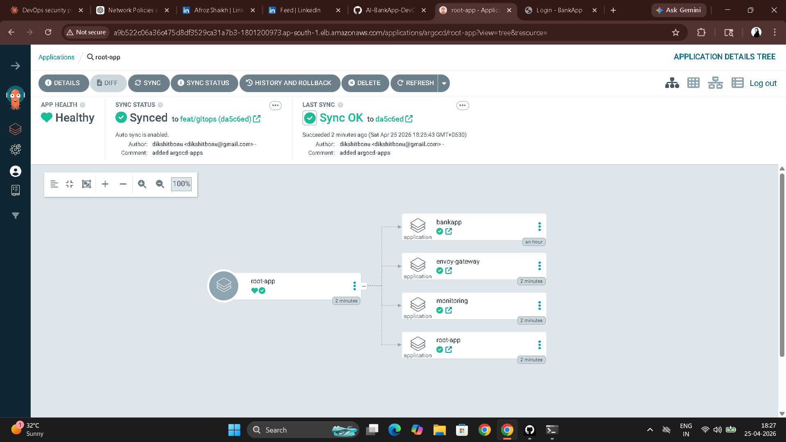

# Day 85 – ArgoCD Deep Dive: Sync Strategies, Rollbacks, and Multi-App Management

---

## Task 1 – Sync Strategies

**Automated vs manual sync:**

| | Automated sync | Manual sync |
|---|---|---|
| Trigger | Git commit, within 3 minutes | Human clicks Sync or runs `argocd app sync` |
| Drift correction | Automatic (`selfHeal: true`) | ArgoCD reports drift, does not fix it |
| Use case | Dev and staging — fast iteration | Production — human review gate before apply |
| Config | `syncPolicy.automated: {}` | `syncPolicy: {}` (no automated block) |

**Switch to manual sync:**

```bash
argocd app set bankapp --sync-policy none

# Make a change in your fork (e.g. edit k8s/configmap.yml)
# Push the commit — wait 3 minutes

argocd app get bankapp
# Status: OutOfSync — drift detected but NOT applied

# See exactly what differs
argocd app diff bankapp

# Dry run
argocd app sync bankapp --dry-run

# Apply for real
argocd app sync bankapp
```

**Switch back to automated:**

```bash
argocd app set bankapp --sync-policy automated --self-heal --auto-prune
```

---

## Task 2 – Sync Waves and Resource Ordering

Sync wave annotations control the order ArgoCD creates resources. Negative numbers run first. Same-wave resources deploy in parallel. ArgoCD waits for each wave to be healthy before starting the next.

**Wave annotations added to AI-BankApp manifests:**

| Wave | Resources | Why |
|------|-----------|-----|
| `-2` | Namespace, StorageClass | Infrastructure must exist first |
| `-1` | PVCs, ConfigMap, Secret | Configuration before workloads |
| `0` | MySQL Deployment, Ollama Deployment, Services | Databases and networking |
| `1` | BankApp Deployment | Application — depends on wave 0 being healthy |
| `2` | HPA | Scaling policy applied after app is running |

**Adding the annotations (example for mysql-deployment.yml):**

```yaml
metadata:
  name: mysql
  namespace: bankapp
  annotations:
    argocd.argoproj.io/sync-wave: "0"
```

Apply the same pattern to each file in `k8s/` with the wave number from the table above, then commit and push. ArgoCD re-syncs and the UI shows each wave progressing in order.



---

## Task 3 – Rollbacks

```bash
# Check sync history
argocd app history bankapp
# ID  DATE                  REVISION
# 1   2026-04-10 10:00:00  abc1234
# 2   2026-04-10 10:15:00  def5678  (sync wave annotations added)

# Rollback to revision 1
argocd app rollback bankapp 1

# Check status
argocd app get bankapp
# Sync Status: OutOfSync
# (cluster matches old commit, not latest HEAD)
```

**ArgoCD rollback vs `git revert` — the GitOps-correct approach:**

| | ArgoCD rollback | `git revert` |
|---|---|---|
| What it changes | Cluster state only | Git history |
| GitOps principle | Violates — Git no longer matches cluster | Correct — Git is still the source of truth |
| Audit trail | Temporary, no commit created | Full commit history preserved |
| Next sync | ArgoCD will re-apply the latest Git commit and undo the rollback | ArgoCD syncs the revert commit — permanent |
| When to use | Emergency temporary fix | The correct permanent solution |

**Proper GitOps rollback:**

```bash
git revert HEAD
git push
```

This creates a new commit that undoes the last change. ArgoCD syncs the revert commit and the cluster is updated. Git history shows: deploy → revert. Full audit trail intact.

---

## Task 4 – App of Apps Pattern

The App of Apps pattern uses one parent ArgoCD Application that manages child Applications. Adding a new app to the cluster is a Git commit, not a CLI command.

**Directory structure:**

```
argocd-apps/
  root-app.yaml         # Parent — watches this directory
  bankapp.yaml          # Child — AI-BankApp
  monitoring.yaml       # Child — kube-prometheus-stack
  envoy-gateway.yaml    # Child — Envoy Gateway
```

**`argocd-apps/root-app.yaml` — the parent:**

```yaml
apiVersion: argoproj.io/v1alpha1
kind: Application
metadata:
  name: root-app
  namespace: argocd
spec:
  project: default
  source:
    repoURL: https://github.com/<your-username>/AI-BankApp-DevOps.git
    targetRevision: feat/gitops
    path: argocd-apps
  destination:
    server: https://kubernetes.default.svc
    namespace: argocd
  syncPolicy:
    automated:
      prune: true
      selfHeal: true
```

**`argocd-apps/bankapp.yaml`:**

```yaml
apiVersion: argoproj.io/v1alpha1
kind: Application
metadata:
  name: bankapp
  namespace: argocd
  finalizers:
    - resources-finalizer.argocd.argoproj.io
spec:
  project: default
  source:
    repoURL: https://github.com/<your-username>/AI-BankApp-DevOps.git
    targetRevision: feat/gitops
    path: k8s
  destination:
    server: https://kubernetes.default.svc
    namespace: bankapp
  syncPolicy:
    automated:
      prune: true
      selfHeal: true
    syncOptions:
      - CreateNamespace=true
      - ServerSideApply=true
```

**`argocd-apps/monitoring.yaml`:**

```yaml
apiVersion: argoproj.io/v1alpha1
kind: Application
metadata:
  name: monitoring
  namespace: argocd
  finalizers:
    - resources-finalizer.argocd.argoproj.io
spec:
  project: default
  source:
    repoURL: https://prometheus-community.github.io/helm-charts
    chart: kube-prometheus-stack
    targetRevision: "65.*"
    helm:
      values: |
        grafana:
          adminPassword: admin123
        prometheus:
          prometheusSpec:
            retention: 3d
            resources:
              requests:
                memory: 256Mi
                cpu: 100m
  destination:
    server: https://kubernetes.default.svc
    namespace: monitoring
  syncPolicy:
    automated:
      prune: true
      selfHeal: true
    syncOptions:
      - CreateNamespace=true
      - ServerSideApply=true
```

```bash
# Push argocd-apps/ to your fork, then apply the root app
kubectl apply -f argocd-apps/root-app.yaml

# ArgoCD reads the directory, creates all child Applications
argocd app list
# NAME           NAMESPACE  HEALTH   SYNC
# root-app       argocd     Healthy  Synced
# bankapp        bankapp    Healthy  Synced
# monitoring     monitoring Healthy  Synced
# envoy-gateway  envoy-...  Healthy  Synced
```

**App of Apps architecture:**

```
Git repo: argocd-apps/
    |
[root-app] (ArgoCD Application)
    |-- watches argocd-apps/ directory
    |
    |-- creates --> [bankapp Application]      → deploys k8s/ manifests
    |-- creates --> [monitoring Application]   → deploys kube-prometheus-stack
    |-- creates --> [envoy-gateway Application] → deploys Envoy Gateway
```

Adding a new app = add a new YAML file to `argocd-apps/` and push. `root-app` picks it up and creates the Application automatically.



---

## Task 5 – Notifications

```bash
# Check if notifications controller is running
kubectl get pods -n argocd -l app.kubernetes.io/component=notifications-controller
```

**Notification triggers and templates:**

```yaml
apiVersion: v1
kind: ConfigMap
metadata:
  name: argocd-notifications-cm
  namespace: argocd
data:
  trigger.on-sync-succeeded: |
    - when: app.status.operationState.phase in ['Succeeded']
      send: [app-sync-succeeded]
  trigger.on-sync-failed: |
    - when: app.status.operationState.phase in ['Error', 'Failed']
      send: [app-sync-failed]
  trigger.on-health-degraded: |
    - when: app.status.health.status == 'Degraded'
      send: [app-health-degraded]
  template.app-sync-succeeded: |
    message: "Application {{.app.metadata.name}} sync succeeded. Revision: {{.app.status.sync.revision}}"
  template.app-sync-failed: |
    message: "Application {{.app.metadata.name}} sync FAILED! Check ArgoCD for details."
  template.app-health-degraded: |
    message: "Application {{.app.metadata.name}} health is DEGRADED. Investigate immediately."
```

```bash
kubectl apply -n argocd -f notification-config.yaml

# Subscribe bankapp to notifications
kubectl annotate application bankapp -n argocd \
  notifications.argoproj.io/subscribe.on-sync-succeeded.webhook="" \
  notifications.argoproj.io/subscribe.on-sync-failed.webhook="" \
  notifications.argoproj.io/subscribe.on-health-degraded.webhook=""
```

For Slack: add a `service.slack` entry to the ConfigMap with your webhook URL. The trigger/template/subscribe pattern is identical.

---

## Task 6 – Projects and RBAC

**Create a project for the BankApp team:**

```bash
argocd proj create bankapp-team \
  --description "AI-BankApp team project" \
  --src "https://github.com/<your-username>/AI-BankApp-DevOps.git" \
  --dest "https://kubernetes.default.svc,bankapp" \
  --dest "https://kubernetes.default.svc,monitoring"

# Move the application to this project
argocd app set bankapp --project bankapp-team
```

The `bankapp-team` project can only source from the AI-BankApp repo and can only deploy to `bankapp` and `monitoring` namespaces. Deploying to `kube-system` or `argocd` is blocked at the project level.

**RBAC policy in `argocd-rbac-cm`:**

```yaml
policy.csv: |
  p, role:bankapp-dev, applications, get,      bankapp-team/*, allow
  p, role:bankapp-dev, applications, sync,     bankapp-team/*, allow
  p, role:bankapp-dev, applications, rollback, bankapp-team/*, deny
  g, bankapp-developers, role:bankapp-dev
```

`bankapp-developers` can view and sync applications but cannot rollback — rollback requires a senior team member. Teams cannot accidentally affect other teams' applications because Project source and destination restrictions are enforced at the ArgoCD API level.

**How Projects prevent cross-team interference:**

Each team's applications live in their own Project. A developer in `bankapp-team` cannot create an Application that deploys to `kube-system` or reads from another team's Git repo — the Project policies block it at the API level before anything reaches the Kubernetes API server.