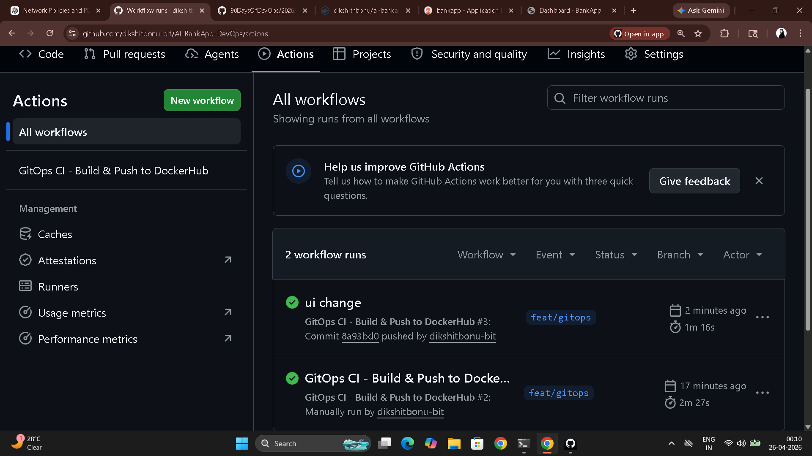
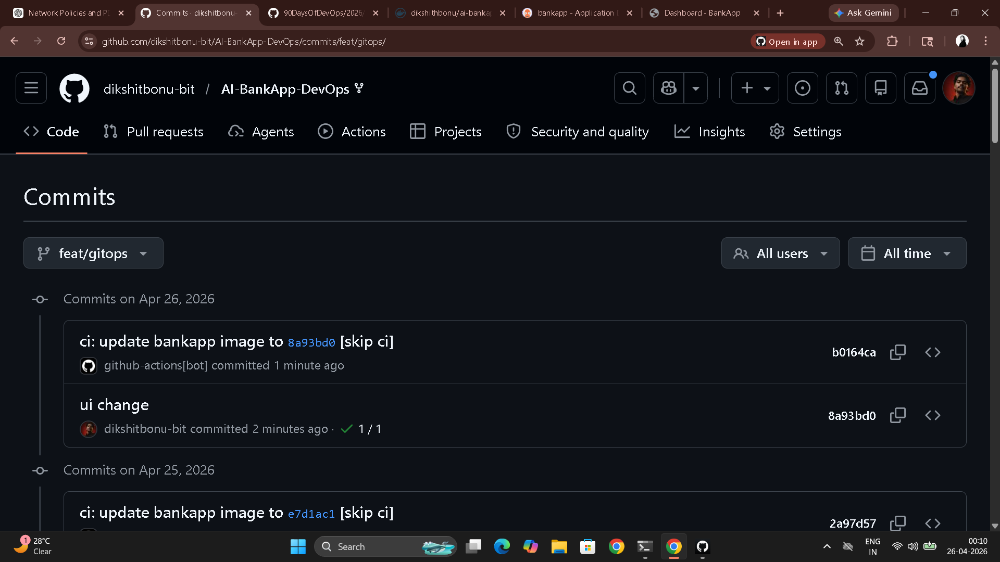
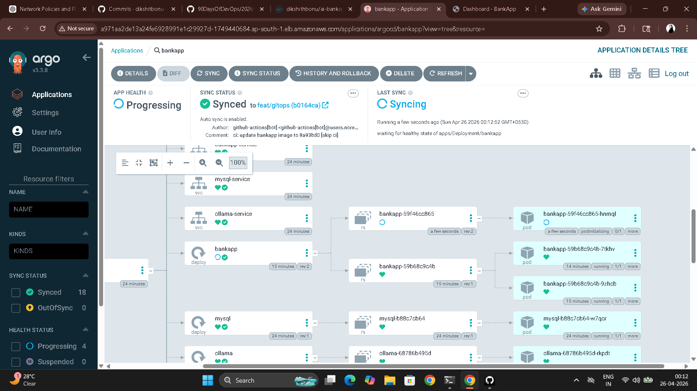
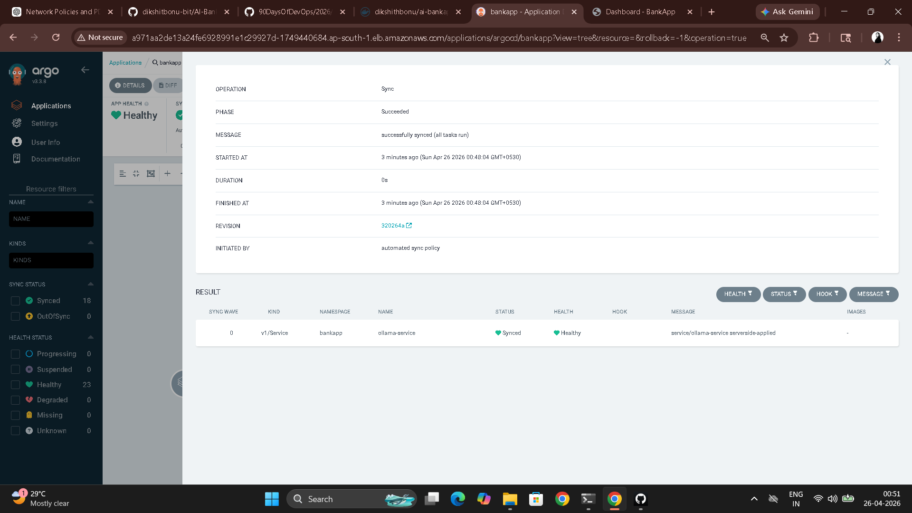

# Day 86 – GitOps Project: End-to-End CI/CD Pipeline with AI-BankApp

---

## Complete GitOps Pipeline

```
[Developer writes code]
         |
[git push to feat/gitops]
         |
[GitHub Actions: gitops-ci.yml]
    |-- Build Maven project (JDK 21)
    |-- Run tests
    |-- Build Docker image
    |-- Push to DockerHub: :latest and :sha
    |-- sed: update image tag in k8s/bankapp-deployment.yml
    |-- git commit "ci: update bankapp image to <sha> [skip ci]"
    |-- git push
         |
[ArgoCD detects new commit — within 3 minutes]
    |-- compares k8s/ manifests vs live cluster
    |-- detects image tag changed
    |-- performs rolling update
    |-- new pods start, old pods terminate
         |
[Zero downtime deployment complete]
[Full audit trail: every step in Git history]
```

---

## Task 1 – Study the CI Pipeline

**`gitops-ci.yml` trigger:**

```yaml
on:
  push:
    branches: [feat/gitops]
    paths:
      - 'src/**'
      - 'pom.xml'
      - 'Dockerfile'
  workflow_dispatch:
```

`paths:` restricts the trigger to application code changes only — not manifest changes. This prevents the infinite loop where ArgoCD's manifest update commit triggers a new build.

**Pipeline steps:**

| Step | What it does |
|------|-------------|
| Checkout code | Clones the repo |
| Set up JDK 21 | Installs Java 21 with Maven cache |
| Build with Maven | `./mvnw clean package -DskipTests -B` |
| Run tests | `./mvnw test -B` (`continue-on-error: true`) |
| Set image tag | `git rev-parse --short HEAD` — 7-char SHA like `1c7cb0e` |
| Login to DockerHub | Authenticates with secrets |
| Build and push image | Pushes `:latest` and `:<sha>` |
| Update K8s manifest | `sed` updates image tag in `k8s/bankapp-deployment.yml` |
| Commit updated manifest | Commits with `[skip ci]` to avoid re-triggering |

**The critical GitOps step:**

```yaml
- name: Update Kubernetes deployment manifest
  run: |
    sed -i "s|image: ${{ env.DOCKERHUB_REPO }}:.*|image: ${{ env.DOCKERHUB_REPO }}:${{ steps.tag.outputs.sha_short }}|" k8s/bankapp-deployment.yml

- name: Commit updated manifest
  run: |
    git config user.name "github-actions[bot]"
    git config user.email "github-actions[bot]@users.noreply.github.com"
    git add k8s/bankapp-deployment.yml
    git diff --staged --quiet || git commit -m "ci: update bankapp image to ${{ steps.tag.outputs.sha_short }} [skip ci]"
    git push
```

**Why `[skip ci]`:** Without it, the manifest update commit triggers the pipeline again, which updates the manifest again — infinite loop. `[skip ci]` signals GitHub Actions to ignore this commit.

**Traceability:** The 7-char git SHA as the image tag gives exact traceability from any running pod back to the commit that built it — `kubectl describe pod <pod>` shows the image tag, which maps directly to `git show <sha>`.

---

## Task 2 – Pipeline Setup on Your Fork

```bash
# 1. Fork: https://github.com/TrainWithShubham/AI-BankApp-DevOps

# 2. Create DockerHub access token:
# hub.docker.com/settings/security → New Access Token (Read/Write)

# 3. Add GitHub Secrets to your fork:
# Settings > Secrets > Actions:
# DOCKERHUB_USERNAME = your-dockerhub-username
# DOCKERHUB_TOKEN    = your-access-token

# 4. Update workflow env in .github/workflows/gitops-ci.yml:
# env:
#   DOCKERHUB_REPO: <your-dockerhub-username>/ai-bankapp-eks

# 5. Update ArgoCD to watch your fork:
argocd app set bankapp --repo https://github.com/<your-username>/AI-BankApp-DevOps.git

# 6. Update k8s/bankapp-deployment.yml image:
# image: <your-dockerhub-username>/ai-bankapp-eks:latest

# Commit and push all changes
git add .
git commit -m "ci: configure pipeline for fork"
git push origin feat/gitops
```

---

## Task 3 – Trigger the Full Pipeline

**Make a visible code change:**

```bash
# Edit src/main/resources/templates/fragments/layout.html
# Change: <title>AI BankApp - Built by YourName</title>

git add src/
git commit -m "feat: customize app title"
git push origin feat/gitops
```

**Watch the pipeline:**

1. Fork > Actions tab → "GitOps CI - Build & Push to DockerHub" running
2. Watch each step complete: build → test → push → manifest update → commit
3. Check the last commit on `feat/gitops` — a `github-actions[bot]` commit: `ci: update bankapp image to <sha> [skip ci]`
4. `k8s/bankapp-deployment.yml` now contains the new image tag

**Watch ArgoCD sync:**

```bash
argocd app get bankapp --refresh
argocd app wait bankapp

kubectl get pods -n bankapp -w
# New pods start with new image, old pods terminate gracefully

kubectl port-forward svc/bankapp-service -n bankapp 8080:8080
# http://localhost:8080 — confirm title change is live
```







---

## Task 4 – Drift Detection and Recovery

**Scenario 1 — Unauthorized scale-down:**

```bash
kubectl scale deployment bankapp -n bankapp --replicas=1
argocd app get bankapp
# Status: OutOfSync
kubectl get pods -n bankapp -w
# Within 3 minutes: ArgoCD restores to Git-specified replica count
```

**Scenario 2 — Image replaced directly:**

```bash
kubectl set image deployment/bankapp bankapp=nginx:latest -n bankapp
# ArgoCD detects wrong image, reverts to the image tag in Git
# BankApp pods restart with the correct image
```

**Scenario 3 — Critical Service deleted:**

```bash
kubectl delete service bankapp-service -n bankapp
# ArgoCD recreates it from Git within the next reconciliation cycle
```

**View all drift events:**

```bash
argocd app history bankapp
# Every self-heal action logged with revision and timestamp
```

**If `selfHeal` were disabled:** ArgoCD would detect the drift and show `OutOfSync` status but would NOT correct it. The cluster would stay in the drifted state until a human manually triggered a sync. This is why production environments often run with `selfHeal: true` and manual sync gates only for major changes — not for routine drift correction.



---

## Task 5 – The Complete DevOps Pipeline Map

```
[Developer writes code]
    |
    | Day 22-28: Git & GitHub
[git push to GitHub]
    |
    | Day 40-49: GitHub Actions
[GitHub Actions CI]
    |-- Build with Maven
    |-- Run tests
    |
    | Day 29-37: Docker
    |-- Build Docker image
    |-- Push to DockerHub
    |-- Update k8s/bankapp-deployment.yml (sed)
    |-- Commit [skip ci]
    |
    | Day 84-86: GitOps / ArgoCD
[ArgoCD detects change]
    |-- Rolling update on EKS
    |
    | Day 81-83: Amazon EKS
[EKS: pods running across 3 AZs]
    |-- HPA scales on CPU   (Day 78-80: Helm chart HPA template)
    |-- EBS volumes persist  (Day 82: EBS CSI driver)
    |-- Gateway API routes   (Day 82: Envoy Gateway)
    |
    | Day 73-77: Observability
[Prometheus scrapes /actuator/prometheus]
    |-- Grafana dashboards
    |-- Alerts on degraded health
    |
[App live — zero manual intervention — full audit trail in Git]
```

---

## Task 6 – Complete Teardown

```bash
# Delete ArgoCD Applications (--cascade deletes all managed K8s resources)
argocd app delete bankapp --cascade -y
argocd app delete monitoring --cascade -y 2>/dev/null
argocd app delete envoy-gateway --cascade -y 2>/dev/null
argocd app delete root-app --cascade -y 2>/dev/null

# Verify cleanup
kubectl get all -n bankapp 2>/dev/null
kubectl get all -n monitoring 2>/dev/null

# Destroy EKS infrastructure
cd AI-BankApp-DevOps/terraform
terraform destroy   # 10-15 minutes
```

**AWS console verification:**
- EKS: no clusters
- EC2: no instances, no load balancers, no EBS volumes
- VPC: bankapp-eks VPC gone
- Billing: charges stop within the hour

**Approximate 3-day GitOps lab cost:** $5-10 (ArgoCD runs on existing EKS cluster from Days 81-83)

---

## Three-Day GitOps Summary

| Day | What was built |
|-----|---------------|
| 84 | ArgoCD setup, first GitOps deploy, self-healing tests, Application manifest |
| 85 | Sync waves, rollbacks vs git revert, App of Apps, notifications, Projects + RBAC |
| 86 | Full CI/CD pipeline end-to-end, pipeline anatomy, drift scenarios, complete teardown |

**Key guarantees this pipeline provides:**

1. Every deployment is traceable to a git commit — no anonymous `kubectl apply` runs
2. The cluster state is always auditable — `git log` on `k8s/` shows every deployment
3. Rollback is `git revert` — one command, full audit trail, ArgoCD handles the rest
4. No developer needs cluster credentials — only the CI bot and ArgoCD do
5. Drift is automatically corrected — the cluster cannot stay out of sync with Git