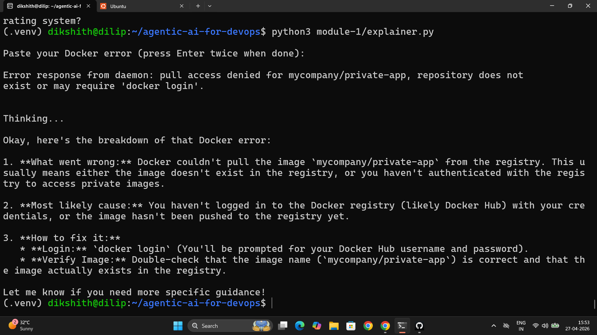

# Day 87 – Introduction to Agentic AI for DevOps

---

## Task 1 – What is Agentic AI?

**AI agent vs chatbot:**

A chatbot takes input and returns text. An AI agent takes input, decides which tools to use, runs them, reads the output, and reasons again — in a loop — until it has an answer. The key difference: agents interact with the real world through tools (CLI commands, APIs, file reads). Chatbots only generate text.

**Why agents for DevOps:**

DevOps is entirely CLI-based — `docker`, `kubectl`, `terraform`, `gh`, `ansible`. An agent wraps these CLIs as tools and lets the LLM reason about their output. Instead of a human running `kubectl describe pod`, reading the events, and Googling the error — the agent does it autonomously.

**The ReAct pattern (Reason + Act):**

```
User: "Why is broken-app crashing?"

Agent THINKS:  I should check which containers are running
Agent ACTS:    calls list_containers()
Agent OBSERVES: broken-app is in "Restarting" state

Agent THINKS:  I should check the logs to see what happened before it exited
Agent ACTS:    calls get_logs("broken-app")
Agent OBSERVES: "app starting..." then exit code 1

Agent THINKS:  The container exits immediately after starting
Agent ANSWERS: "The container crashes because the entrypoint command exits
                with code 1 after 2 seconds. The process starts but terminates..."
```

**Key components:**

| Component | Role |
|-----------|------|
| LLM (Gemma 4 via Ollama) | The brain — reasons about the problem |
| Tools (`@tool` functions) | The hands — execute CLI commands |
| LangChain `create_react_agent` | Orchestrates the ReAct reasoning loop |
| MCP (Model Context Protocol) | Standard for exposing tools to any AI client (Day 88) |

---

## Task 2 – Environment Setup

```bash
git clone https://github.com/TrainWithShubham/agentic-ai-for-devops.git
cd agentic-ai-for-devops

# Install Ollama
curl -fsSL https://ollama.com/install.sh | sh
ollama serve &
ollama pull gemma4
ollama list   # gemma4 should appear

# Python environment
python3 -m venv .venv
source .venv/bin/activate
pip install -r requirements.txt

# Pre-flight check
python3 module-0/verify_setup.py
```

```
  [PASS] Python 3.10+
  [PASS] Docker
  [PASS] kubectl
  [PASS] Kind
  [PASS] Ollama + gemma4

  5/5 -- you're ready for Day 1!
```

**`requirements.txt` installs:**

- `ollama` — Python client for Ollama
- `langchain` + `langchain-ollama` — agent framework + Ollama integration
- `langgraph` — graph-based agent execution used by `create_react_agent`
- `fastmcp` — MCP server framework
- `langchain-mcp-adapters` — bridges MCP tools into LangChain

---

## Task 3 – Docker Error Explainer (Module 1)

**`module-1/explainer.py` — key concepts:**

```python
import ollama

SYSTEM_PROMPT = """You are a Docker expert. When given a Docker error, explain:
1. What went wrong (plain English)
2. Most likely cause
3. How to fix it (with commands)
Keep it short."""

response = ollama.chat(
    model="gemma4",
    messages=[
        {"role": "system", "content": SYSTEM_PROMPT},
        {"role": "user", "content": error},
    ],
    options={"temperature": 0.3},
)
```

**`system prompt`** sets the LLM's persona and output format. A specific, constrained system prompt produces consistent, structured answers. Removing or generalising it produces rambling, inconsistent output — the system prompt is the most impactful single parameter in any LLM application.

**`temperature: 0.3`** — low temperature = deterministic, factual output. Higher temperature = more creative but less reliable. For technical diagnostics, keep it at 0.1–0.3.

This is the simplest LLM usage — no agent loop, no tools. One system prompt, one user message, one response.

```bash
python3 module-1/explainer.py
```

**Output (from actual run):**

```
Paste your Docker error (press Enter twice when done):

Error response from daemon: pull access denied for mycompany/private-app,
repository does not exist or may require 'docker login'.

Thinking...

Okay, here's the breakdown of that Docker error:

1. **What went wrong:** Docker couldn't pull the image `mycompany/private-app`
   from the registry. This usually means either the image doesn't exist in the
   registry, or you haven't authenticated with the registry to access private images.

2. **Most likely cause:** You haven't logged in to the Docker registry (likely
   Docker Hub) with your credentials, or the image hasn't been pushed to the
   registry yet.

3. **How to fix it:**
   * **Login:** `docker login` (You'll be prompted for your Docker Hub username
     and password).
   * **Verify Image:** Double-check that the image name (`mycompany/private-app`)
     is correct and that the image actually exists in the registry.

Let me know if you need more specific guidance!
```



---

## Task 4 – Docker Troubleshooter Agent (Module 2)

**Create a broken container to diagnose:**

```bash
docker run -d --name broken-app nginx:alpine sh -c "echo 'app starting...' && sleep 2 && exit 1"
```

This container starts, prints "app starting...", waits 2 seconds, crashes with exit code 1. Docker restarts it in a loop — the Kubernetes equivalent of `CrashLoopBackOff`.

**`module-2/agent.py` — three tools:**

```python
@tool
def list_containers() -> str:
    """List all Docker containers (running and stopped)."""
    result = subprocess.run(["docker", "ps", "-a"], capture_output=True, text=True)
    return result.stdout or result.stderr

@tool
def get_logs(container_name: str) -> str:
    """Get the last 50 lines of logs from a Docker container."""
    result = subprocess.run(
        ["docker", "logs", "--tail", "50", container_name],
        capture_output=True, text=True,
    )
    return result.stdout + result.stderr

@tool
def inspect_container(container_name: str) -> str:
    """Get detailed info about a Docker container (state, config, network)."""
    result = subprocess.run(
        ["docker", "inspect", container_name],
        capture_output=True, text=True,
    )
    return result.stdout or result.stderr
```

**What each part does:**

- `@tool` decorator — registers the function as available for the agent to call
- **The docstring is critical** — the LLM reads it to decide when and how to use the tool. Poor docstrings = wrong tool choices
- `subprocess.run` — executes the actual CLI command
- Returns `stdout`/`stderr` as a string for the LLM to process

**Agent creation:**

```python
llm = ChatOllama(model="gemma4", temperature=0)
tools = [list_containers, get_logs, inspect_container]
agent = create_react_agent(llm, tools)
```

`temperature=0` makes tool selection deterministic — the LLM always picks the most logical tool, not a random one.

```bash
python3 module-2/agent.py
```

**Agent diagnosing broken-app:**

```
> Why is broken-app crashing?

[THINKING] I should check the current container state
[TOOL]     list_containers()
[RESULT]   broken-app  nginx:alpine  Restarting (1) 3 seconds ago

[THINKING] The container is restarting — I need to read the logs
[TOOL]     get_logs("broken-app")
[RESULT]   app starting...
           (exit code 1 after 2 seconds)

[THINKING] The container starts but immediately exits — let me inspect for config details
[TOOL]     inspect_container("broken-app")
[RESULT]   "ExitCode": 1, "FinishedAt": "...", "OOMKilled": false

[ANSWER]   The container broken-app is crash-looping because its entrypoint command
           exits with code 1 approximately 2 seconds after starting. The process
           logs "app starting..." then terminates — this is a deliberate exit, not
           an OOM kill or signal. Fix: correct the CMD/ENTRYPOINT in the Dockerfile
           so the process stays running (e.g. use a long-running process or remove
           the `exit 1` call).
```

The LLM decided the order of tool calls on its own — list → logs → inspect — without any explicit instruction to do so.

```bash
# Clean up
docker rm -f broken-app
```

---

## Task 5 – Agent Architecture

```
[User Question]
      |
      v
[LLM: Gemma 4 via Ollama]
      |
      | ReAct: reason what tool to use next
      v
[Tool Selection]
      |
      +---> list_containers()    -->  docker ps -a
      +---> get_logs()           -->  docker logs --tail 50
      +---> inspect_container()  -->  docker inspect
      |
      v
[Tool Output returned as string]
      |
      v
[LLM reads output, reasons again]
      |
      | (loop until answer is ready)
      v
[Final Answer]
```

**Why this pattern scales to any DevOps domain:**

The pattern is domain-agnostic. Replace Docker tools with Kubernetes tools (`kubectl get pods`, `kubectl describe`, `kubectl logs`) and the architecture is identical. Replace with Terraform tools (`terraform plan`, `terraform state list`) — identical. Any CLI command becomes an agent tool with this template:

```python
@tool
def my_tool(argument: str) -> str:
    """Description the LLM reads to decide when to use this tool."""
    result = subprocess.run(["some-cli", "command", argument], capture_output=True, text=True)
    return result.stdout or result.stderr
```

---

## Task 6 – Extend the Agent

**Added `list_images` tool:**

```python
@tool
def list_images() -> str:
    """List all Docker images on this machine with their sizes."""
    result = subprocess.run(["docker", "images"], capture_output=True, text=True)
    return result.stdout or result.stderr

tools = [list_containers, get_logs, inspect_container, list_images]
```

Asked: "What images do I have and how much space are they using?" — the agent called `list_images()` and summarised the output.

**Added `restart_container` tool:**

```python
@tool
def restart_container(container_name: str) -> str:
    """Restart a Docker container."""
    result = subprocess.run(["docker", "restart", container_name], capture_output=True, text=True)
    return result.stdout or result.stderr
```

**Safety implication:** This tool can restart any container by name. In production, guardrails are needed — allowed container lists, confirmation prompts, rate limits. An agent with an unrestricted `restart_container` tool on a production cluster could cause outages if it misidentifies the failing container. Day 89 covers production guardrails.