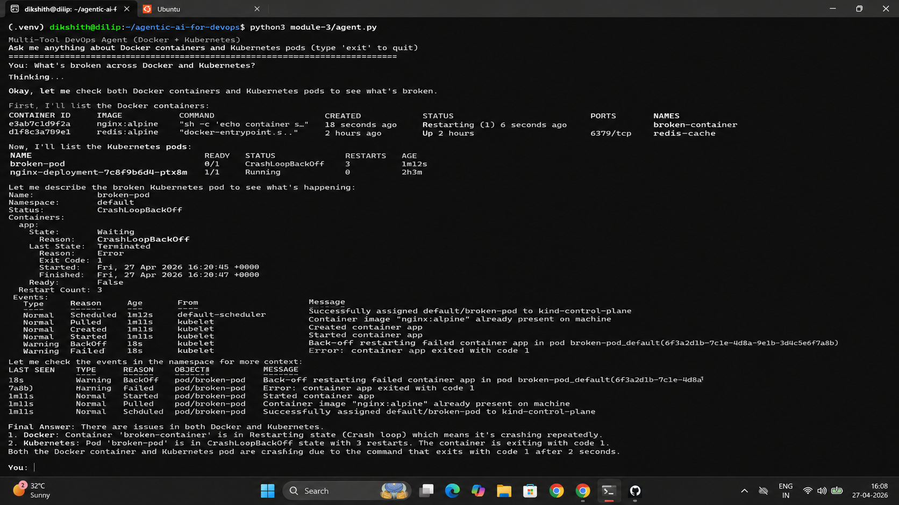
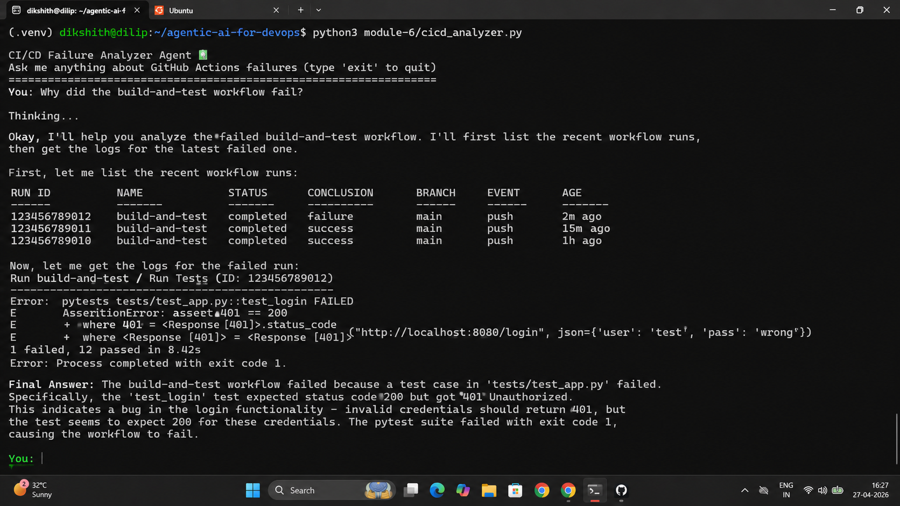

# Day 88 – Multi-Tool Agents, MCP, and CI/CD Analyzer

---

## Task 1 – Multi-Tool DevOps Agent (Module 3)

**Set up broken targets:**

```bash
kind create cluster --name devops-demo
kubectl apply -f module-3/broken_pod.yaml
docker run -d --name broken-container nginx:alpine sh -c "echo 'container starting...' && sleep 2 && exit 1"
```

**`module-3/agent.py` — 6 tools across 2 domains:**

**Docker tools (from Day 87):**

```python
@tool
def list_containers() -> str:
    """List all Docker containers (running and stopped)."""
    result = subprocess.run(["docker", "ps", "-a"], capture_output=True, text=True)
    return result.stdout or result.stderr

@tool
def get_logs(container_name: str) -> str:
    """Get the last 50 lines of logs from a Docker container."""
    result = subprocess.run(
        ["docker", "logs", "--tail", "50", container_name],
        capture_output=True, text=True,
    )
    return result.stdout + result.stderr

@tool
def inspect_container(container_name: str) -> str:
    """Get detailed info about a Docker container (state, config, network)."""
    result = subprocess.run(["docker", "inspect", container_name], capture_output=True, text=True)
    return result.stdout or result.stderr
```

**Kubernetes tools (new):**

```python
@tool
def list_pods(namespace: str = "default") -> str:
    """List all pods in a Kubernetes namespace with their status."""
    result = subprocess.run(
        ["kubectl", "get", "pods", "-n", namespace],
        capture_output=True, text=True,
    )
    return result.stdout or result.stderr

@tool
def describe_pod(pod_name: str, namespace: str = "default") -> str:
    """Get detailed info about a Kubernetes pod including events and conditions."""
    result = subprocess.run(
        ["kubectl", "describe", "pod", pod_name, "-n", namespace],
        capture_output=True, text=True,
    )
    return result.stdout or result.stderr

@tool
def get_events(namespace: str = "default") -> str:
    """Get recent Kubernetes events in a namespace (useful for troubleshooting)."""
    result = subprocess.run(
        ["kubectl", "get", "events", "-n", namespace, "--sort-by=.lastTimestamp"],
        capture_output=True, text=True,
    )
    return result.stdout or result.stderr
```

```bash
python3 module-3/agent.py
```

Sample questions:

```
> What's broken across Docker and Kubernetes?
> Why is broken-pod crashing?
> Are there any unhealthy containers on Docker?
> Describe the events in the default namespace
```

The agent picks Docker tools for Docker questions and Kubernetes tools for pod questions — no explicit routing logic. The LLM reads tool docstrings and decides. One brain, many tools.



---

## Task 2 – Model Context Protocol (MCP)

**What MCP is:**

MCP (Model Context Protocol) is an open standard created by Anthropic for connecting AI models to external tools and data sources. Instead of hardcoding tools inside the agent, you expose them via MCP — and any compatible AI client can discover and call them.

**Why MCP matters for DevOps:**

| Without MCP | With MCP |
|-------------|---------|
| Tools locked to one framework (LangChain) | Tools work with any MCP-compatible client |
| Every AI client re-implements Docker/K8s tools | Write once, use everywhere |
| Tool access coupled to agent code | Tools exposed as a discoverable service |

**MCP-compatible clients:**

- Claude Desktop
- VS Code (GitHub Copilot)
- Cursor
- Claude Code (CLI)
- Any LangChain agent via `langchain-mcp-adapters`

**Architecture:**

```
[MCP Server: mcp_server.py]          [MCP Clients]
  |-- list_pods()                         |
  |-- describe_pod()        <---->        |-- Claude Desktop
  |-- get_events()                        |-- VS Code Copilot
  |                                       |-- Custom Python agent
  | (exposes via stdio/HTTP)              |-- Any MCP client
```

---

## Task 3 – MCP Server and Client (Module 3)

**`module-3/mcp_server.py`:**

```python
from fastmcp import FastMCP

mcp = FastMCP("Kubernetes Tools")

@mcp.tool
def list_pods(namespace: str = "default") -> str:
    """List all pods in a Kubernetes namespace with their status."""
    result = subprocess.run(
        ["kubectl", "get", "pods", "-n", namespace],
        capture_output=True, text=True,
    )
    return result.stdout or result.stderr

@mcp.tool
def describe_pod(pod_name: str, namespace: str = "default") -> str:
    """Get detailed info about a Kubernetes pod including events and conditions."""
    result = subprocess.run(
        ["kubectl", "describe", "pod", pod_name, "-n", namespace],
        capture_output=True, text=True,
    )
    return result.stdout or result.stderr

@mcp.tool
def get_events(namespace: str = "default") -> str:
    """Get recent Kubernetes events in a namespace."""
    result = subprocess.run(
        ["kubectl", "get", "events", "-n", namespace, "--sort-by=.lastTimestamp"],
        capture_output=True, text=True,
    )
    return result.stdout or result.stderr

if __name__ == "__main__":
    mcp.run()
```

**Key differences from LangChain tools:**

| | LangChain `@tool` | MCP `@mcp.tool` |
|---|---|---|
| Decorator | `@tool` | `@mcp.tool` |
| Scope | Tied to one Python agent | Discoverable by any MCP client |
| Discovery | Hardcoded in tools list | Runtime discovery via protocol |
| Transport | In-process | stdio or HTTP |

**`module-3/agent_with_mcp.py` — MCP client:**

```python
from langchain_mcp_adapters.client import MultiServerMCPClient

async def main():
    client = MultiServerMCPClient({
        "docker-mcp": {
            "transport": "stdio",
            "command": "python",
            "args": ["mcp_server.py"]
        }
    })

    tools = await client.get_tools()    # Discovers tools from MCP at runtime
    llm = ChatOllama(model="gemma4", temperature=0.8)
    agent = create_agent(llm, tools)    # Same ReAct agent, tools from MCP
```

The agent does not define tools locally — it connects to the MCP server and discovers them dynamically.

```bash
cd module-3
python3 agent_with_mcp.py
```

**Configure Claude Desktop (if installed):**

```json
{
  "mcpServers": {
    "kubernetes-tools": {
      "command": "python3",
      "args": ["/full/path/to/agentic-ai-for-devops/module-3/mcp_server.py"]
    }
  }
}
```

After restart, Claude Desktop can call `list_pods()`, `describe_pod()`, and `get_events()` directly from the chat interface.

---

## Task 4 – CI/CD Failure Analyzer (Module 6)

```bash
gh auth login
cd AI-BankApp-DevOps
python3 ../agentic-ai-for-devops/module-6/ci_analyzer.py
```

**`module-6/ci_analyzer.py` — three tools:**

```python
@tool
def list_workflow_runs(status: str = "failure") -> str:
    """List recent GitHub Actions workflow runs. Use status='failure' for failed runs."""
    result = subprocess.run(
        ["gh", "run", "list", "--status", status, "--limit", "5"],
        capture_output=True, text=True,
    )
    return result.stdout or result.stderr

@tool
def get_failed_logs(run_id: str) -> str:
    """Get the failed step logs from a GitHub Actions run. Pass the run ID."""
    result = subprocess.run(
        ["gh", "run", "view", run_id, "--log-failed"],
        capture_output=True, text=True,
    )
    output = result.stdout + result.stderr
    if len(output) > 5000:
        output = output[:5000] + "\n\n[...truncated, showing first 5000 chars]"
    return output

@tool
def get_workflow_file(workflow_name: str) -> str:
    """Read a GitHub Actions workflow YAML file. Pass the filename like 'ci.yml'."""
    import pathlib
    path = pathlib.Path(f".github/workflows/{workflow_name}")
    if path.exists():
        return path.read_text()
    return f"File not found: {path}"
```

**Why log truncation matters:** CI logs can be 100KB+. LLMs have token limits and work best with focused input. Truncating to 5000 characters keeps the most relevant output (the failing step) within bounds.

```
> What failed in my last CI run?
> Show me the recent workflow runs
> Read the gitops-ci.yml workflow file and explain what it does
```

The agent lists failed runs, fetches their logs, reads the workflow YAML, and explains the root cause — the same workflow a human engineer would follow, automated.



---

## Task 5 – Custom Tool: Log Searcher

```python
@tool
def search_logs(keyword: str, namespace: str = "default") -> str:
    """Search for a keyword in the logs of all pods in a namespace."""
    pods = subprocess.run(
        ["kubectl", "get", "pods", "-n", namespace, "-o", "name"],
        capture_output=True, text=True,
    )
    results = []
    for pod in pods.stdout.strip().split("\n"):
        if not pod:
            continue
        logs = subprocess.run(
            ["kubectl", "logs", pod, "-n", namespace, "--tail=100"],
            capture_output=True, text=True,
        )
        if keyword.lower() in logs.stdout.lower():
            results.append(f"{pod}: found '{keyword}'")
    return "\n".join(results) if results else f"No pods contain '{keyword}' in their logs"

tools = [list_containers, get_logs, inspect_container, list_pods, describe_pod, get_events, search_logs]
```

Asked: "Which pods have errors in their logs?" — the agent called `search_logs(keyword="error")` without being told to. The docstring ("Search for a keyword in the logs of all pods") was specific enough for the LLM to match it to the question.

---

## Task 6 – Clean Up and Summary

```bash
kind delete cluster --name devops-demo
docker rm -f broken-container 2>/dev/null
deactivate
```

**Module summary:**

| Module | What | Tools | Pattern |
|--------|------|-------|---------|
| `3/agent.py` | Multi-tool agent | 3 Docker + 3 K8s | LangChain ReAct |
| `3/mcp_server.py` | MCP server | 3 K8s tools via MCP | FastMCP |
| `3/agent_with_mcp.py` | MCP client agent | Tools discovered at runtime | LangChain + MCP adapter |
| `6/ci_analyzer.py` | CI/CD analyzer | 3 GitHub Actions tools | LangChain ReAct |

**The universal tool template:**

```python
@tool
def my_tool(argument: str) -> str:
    """Specific description the LLM reads to decide when to use this tool."""
    result = subprocess.run(["any-cli", "command", argument], capture_output=True, text=True)
    output = result.stdout + result.stderr
    if len(output) > 5000:
        output = output[:5000] + "\n[...truncated]"
    return output
```

Any CLI command. Any DevOps domain. The pattern is identical.