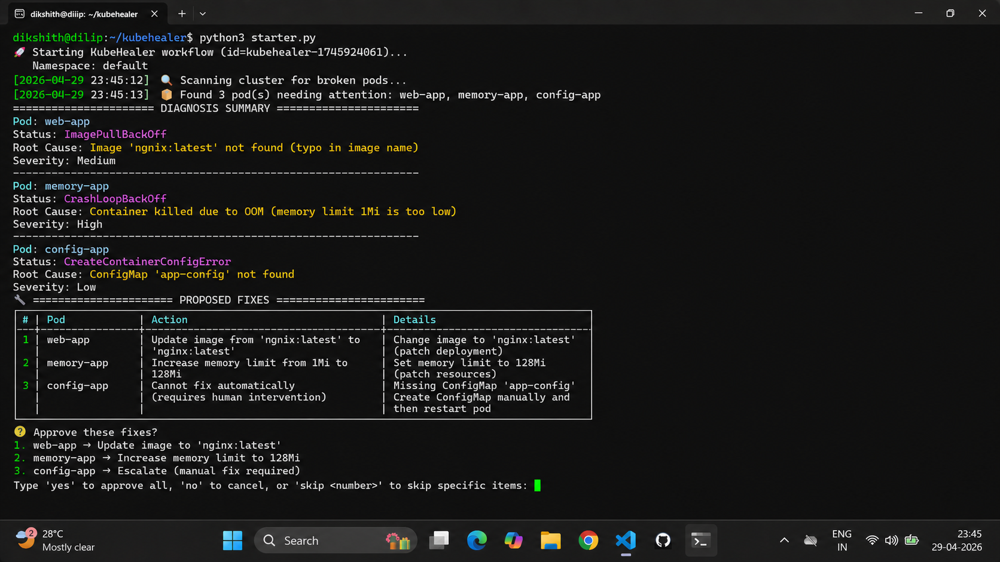
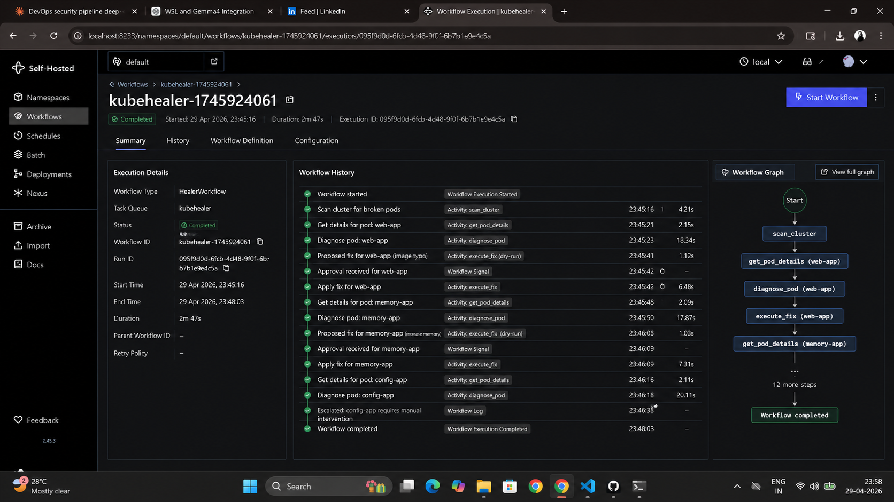

# Day 89 – KubeHealer and AIOps

---

## Task 1 – Understand AIOps and Production Guardrails

**What is AIOps?**

- AI-powered automation for IT operations: monitoring, diagnosis, remediation.
- Augments human operators, not replaces them.
- Handles routine infrastructure faults while escalating uncertain or dangerous issues.
- Ideal for problems that require reasoning across logs, events, and resource state.

**AIOps production guardrails:**

| Guardrail | Why it matters | Example |
|-----------|----------------|---------|
| Human approval | Prevents destructive changes without consent | "I found 3 broken pods. Here are the fixes. Approve?" |
| Scope limits | Restrict actions to safe namespaces/clusters | Do not touch `kube-system` or production database namespaces |
| Audit trail | Record every decision and tool call | Temporal workflow history captures all activity input/output |
| Rollback capability | Enable reversal of changes if a fix is wrong | Patch resources instead of recreating them |
| Timeout/retry limits | Prevent infinite loops and runaway actions | Max 3 retries per pod, timeout after 5 minutes |
| Escalation path | Escalate when the agent cannot safely fix the issue | "Missing ConfigMap app-config. Manual intervention required." |

**Why durable execution with Temporal matters:**

- Without durability, a crash mid-repair loses progress and state.
- With Temporal, completed steps are persisted in workflow history.
- When the worker restarts, Temporal replays finished activities and resumes precisely where it left off.
- This is essential for infrastructure automation where partial fixes are unacceptable.

---

## Task 2 – KubeHealer Architecture

KubeHealer combines three key components:

- **Temporal**: durable workflow engine and audit trail.
- **Claude**: AI reasoning for diagnosing broken pods and proposing fixes.
- **kubectl**: actual Kubernetes tool for scanning pods, reading events, and patching resources.

**High-level flow:**

1. `starter.py` triggers a Temporal workflow.
2. `worker.py` executes activities: scan, diagnose, propose fixes.
3. Claude receives pod diagnostics and recommends safe actions.
4. Human approval is requested before applying patches.
5. Temporal records every activity, signal, and decision.

**Key features:**

- Durable execution via Temporal history.
- Human-in-the-loop approval for remediation.
- Minimal patch updates instead of destructive replacements.
- Escalation for unfixable or unsafe situations.

---

## Task 3 – Deploy Broken Applications

**App 1 — Image typo**

```yaml
apiVersion: v1
kind: Pod
metadata:
  name: web-app
  namespace: default
spec:
  containers:
  - name: web
    image: ngnix:latest
    ports:
    - containerPort: 80
```

- Fault: `ngnix:latest` typo causes `ImagePullBackOff`.
- Diagnosis: image name incorrect.
- Fix: patch image to `nginx:latest`.

**App 2 — OOM crash**

```yaml
apiVersion: v1
kind: Pod
metadata:
  name: memory-app
  namespace: default
spec:
  containers:
  - name: app
    image: nginx:alpine
    resources:
      limits:
        memory: "1Mi"
    command: ["sh", "-c", "echo 'starting' && sleep 3600"]
```

- Fault: memory limit too low, causing `OOMKilled` and `CrashLoopBackOff`.
- Diagnosis: insufficient memory resources.
- Fix: patch memory limit to `128Mi`.

**App 3 — Missing ConfigMap**

```yaml
apiVersion: v1
kind: Pod
metadata:
  name: config-app
  namespace: default
spec:
  containers:
  - name: app
    image: nginx:alpine
    envFrom:
    - configMapRef:
        name: app-config
```

- Fault: referenced `ConfigMap` does not exist.
- Diagnosis: `CreateContainerConfigError` due to missing `app-config`.
- Outcome: escalate instead of fixing automatically.

---

## Task 4 – Run KubeHealer

**Start local infrastructure:**

```bash
kind create cluster --name kubehealer-demo
temporal server start-dev
```

**Run the worker:**

```bash
python3 worker.py
```

**Trigger a healing workflow:**

```bash
python3 starter.py
```

**Expected behavior:**

- KubeHealer scans the cluster and discovers broken pods.
- It calls `kubectl describe` and event logs.
- Claude reasons over the diagnostics and proposes fixes.
- Human approval is requested before applying patches.

**Sample output:**

- Found 3 broken pods.
- Proposed fixes:
  1. `web-app`: Fix image typo (`ngnix` -> `nginx`)
  2. `memory-app`: Increase memory limit (`1Mi` -> `128Mi`)
  3. `config-app`: CANNOT FIX — missing ConfigMap.



**Apply fixes:**

- Approve the workflow when prompted.
- The agent patches `web-app` and `memory-app`.
- `config-app` remains broken and is flagged for manual remediation.

---

## Task 5 – Test Crash Recovery

**Why crash recovery matters:**

- Infrastructure remediation is stateful and may take time.
- A killed worker should not discard progress.
- Temporal preserves workflow state, enabling resume after failure.

**Crash recovery test:**

1. Redeploy the broken pods.
2. Start `worker.py` and run `starter.py`.
3. Kill the worker process while the workflow is running.
4. Restart `worker.py`.

**What happens:**

- Temporal replays completed activities from workflow history.
- The workflow resumes at the approval or next step.
- No diagnostic or remediation work is lost.

**Audit trail:**

- Temporal UI shows each activity execution.
- It records the input/output of scan, diagnose, and fix steps.
- The crash and restart appear in the workflow history.



---

## Task 6 – Reflect on Agentic AI Journey

**When to use AI agents vs traditional automation:**

| Use AI Agents When | Use Traditional Automation When |
|--------------------|--------------------------------|
| Problem requires reasoning and root cause analysis | Problem has a known fixed solution |
| Multiple possible causes and repairs | One cause, one deterministic fix |
| Natural language explanation helps humans | No human approval or explanation needed |
| Diagnosing unknown system failures | Scaling, restarting, or applying a fixed template |

**Examples:**

- AI agents: broken pod diagnosis, log-driven troubleshooting, config drift detection.
- Traditional automation: autoscaling, scheduled backups, deployment rollouts.

**How this connects to the 90-Day Challenge:**

- Day 29–37: Docker fundamentals and CLI-based troubleshooting.
- Day 40–49: CI/CD analysis and automation patterns.
- Day 50–67: Kubernetes concepts and `kubectl` experience.
- Day 73–77: Observability and monitoring for alerting and diagnosis.
- Day 84–86: GitOps, rollbacks, and infrastructure automation.

**Day 89 evolution:**

- Day 87: Passive error explanation with LLMs.
- Day 88: Multi-tool Kubernetes/Docker diagnosis using MCP.
- Day 89: Active remediation with KubeHealer, Temporal durability, and human approval.

---

## Notes

- KubeHealer uses Claude Sonnet 4 for stronger reasoning.
- Temporal is the durable execution engine backing the workflow.
- The `config-app` case demonstrates a safe escalation path.
- This lab shows how production guardrails turn AI action into safe AIOps.

---

## References

- https://github.com/TrainWithShubham/agentic-ai-for-devops
- https://github.com/TrainWithShubham/kubehealer
