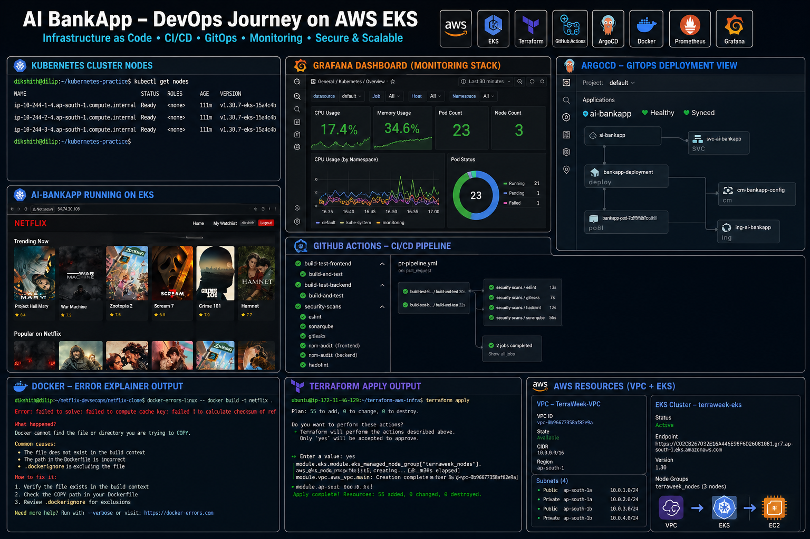

# Day 90 – Grand Finale: The Complete DevOps Journey

---

## Task 1 – The End-to-End Pipeline

A single code change traced through every tool:

```
1. Developer writes code on Linux (Days 1-13)
   using shell scripts (Days 16-21) and Git (Days 22-28)
         |
2. git push to GitHub triggers GitHub Actions (Days 40-49)
         |
3. CI pipeline builds a Docker image (Days 29-37)
   pushes to DockerHub with git SHA as tag
         |
4. Pipeline updates k8s/bankapp-deployment.yml
   with the new image tag via sed + git commit [skip ci]
         |
5. ArgoCD (Days 84-86) detects the commit
   syncs to EKS (Days 81-83) automatically
         |
6. EKS cluster provisioned by Terraform (Days 59-67)
   servers configured by Ansible (Days 68-72)
         |
7. Helm (Days 78-80) manages the deployment
   with environment-specific values per namespace
         |
8. Prometheus + Grafana + Loki (Days 73-77)
   monitor metrics, logs, and traces in real time
         |
9. If something breaks, AI agent (Days 87-89)
   diagnoses the issue using ReAct + CLI tools
         |
10. Fix goes through Git, ArgoCD syncs it
    cycle continues — zero manual kubectl
```

Every block connects to the next. Nothing was learned in isolation.

---

## Task 2 – What I Built with the AI-BankApp

The AI-BankApp (`feat/gitops` branch) tied together the final 13 days:

| Day | What was done with AI-BankApp |
|-----|-------------------------------|
| 78 | Deployed MySQL dependency via stable/mysql Helm chart — one command replaced 5 YAML files |
| 79 | Converted all 12 raw k8s/ manifests into a custom Helm chart with Go templates |
| 80 | Created dev/staging/prod values files, pre-install hooks, packaged chart as .tgz |
| 81 | Provisioned EKS using the project's terraform/ configs — VPC, 3 AZs, 6 add-ons, ArgoCD |
| 82 | Set up Gateway API with Envoy, EBS persistent storage, cookie-based session affinity |
| 83 | Full production deployment with kube-prometheus-stack monitoring and ServiceMonitor |
| 84 | Deployed entire stack via ArgoCD Application manifest — cluster always matches Git |
| 85 | Added sync waves for ordered deployment, App of Apps for multi-app management, RBAC |
| 86 | Wired GitHub Actions GitOps pipeline end-to-end — push code, ArgoCD deploys to EKS |

One real-world project. Every tool applied to it.

---

## Task 3 – Skills Inventory

| Skill | Days | Confidence (1-5) |
|-------|------|------------------|
| Linux command line | 1-13 |4 |
| Shell scripting | 16-21 |3 |
| Git & GitHub | 22-28 |5|
| Docker | 29-37 |5 |
| CI/CD (GitHub Actions) | 38-49 |4 |
| Kubernetes | 50-58 |4 |
| Terraform | 59-67 |4 |
| Ansible | 68-72 | 4 |
| Observability (Prometheus, Grafana, Loki) | 73-77 | 3 |
| Helm | 78-80 | 3 |
| Amazon EKS | 81-83 |4 |
| ArgoCD / GitOps | 84-86 |4 |
| Agentic AI for DevOps | 87-89 |3 |

---

## Task 5 – Graduation Document

### 90-Day Timeline

| Week | Days | Block |
|------|------|-------|
| 1-2 | 1-13 | Linux fundamentals — commands, processes, files, permissions, LVM |
| 3 | 14-15 | Networking — DNS, IP, subnets, ports |
| 3-4 | 16-21 | Shell scripting — Bash, functions, automation projects |
| 4-5 | 22-28 | Git & GitHub — branching, advanced git, GitHub CLI |
| 5-7 | 29-37 | Docker — images, Dockerfile, volumes, networking, Compose, multi-stage |
| 7-9 | 38-49 | CI/CD & GitHub Actions — workflows, triggers, secrets, DevSecOps |
| 9-11 | 50-58 | Kubernetes — Pods, Deployments, Services, Namespaces, RBAC, HPA |
| 11-13 | 59-67 | TerraWeek — Terraform, state, modules, workspaces, EKS with Terraform |
| 13-14 | 68-72 | Ansible — playbooks, roles, templates, Galaxy, Vault, Docker deployment |
| 14-15 | 73-77 | Observability — Prometheus, Grafana, Loki, Promtail, OpenTelemetry, alerting |
| 15-16 | 78-80 | Helm — charts, templates, values, multi-environment deployment |
| 16-17 | 81-83 | Amazon EKS — Terraform provisioning, Gateway API, EBS, IRSA, production deploy |
| 17-18 | 84-86 | ArgoCD & GitOps — self-healing, sync strategies, App of Apps, full CI/CD pipeline |
| 18-19 | 87-89 | Agentic AI — LLM agents, ReAct pattern, MCP, Docker/K8s/CI troubleshooters |
| 19 | 90 | Grand Finale |

### Top 5 "Aha Moments"

1. **Day 50 — Kubernetes architecture:** Realising that etcd, the API server, the scheduler, and the controller manager all run as pods inside kube-system — Kubernetes manages itself using Kubernetes.

2. **Day 64 — Terraform state:** Understanding that the state file is the source of truth and that `terraform destroy` is only safe when you delete Kubernetes-created resources (load balancers, EBS volumes) first — the hard way.

3. **Day 75 — Log-metric correlation:** Seeing a CPU spike in Prometheus and the corresponding log lines in Loki appear side-by-side in Grafana's split view — metrics and logs answering the same incident question from two angles.

4. **Day 84 — ArgoCD self-healing:** Running `kubectl scale deployment bankapp --replicas=1` and watching ArgoCD restore it to 4 within 5 minutes without any human intervention. The cluster physically cannot stay out of sync with Git.

5. **Day 87 — First AI agent:** Watching the agent call `list_containers()`, then `get_logs("broken-app")`, then `inspect_container("broken-app")` — in that order — without being told to. The LLM read the docstrings and reasoned its own way through the problem.

### The Hardest Day

Day 64 (Terraform state management). State corruption, `terraform destroy` hanging because a load balancer was blocking VPC deletion, and manually hunting orphaned EBS volumes in the AWS console — all in one session. The lesson: always delete Kubernetes LoadBalancer Services before `terraform destroy`, and always use remote state with DynamoDB locking from day one.

### What I Plan to Learn Next

- Certified Kubernetes Administrator (CKA)
- HashiCorp Terraform Associate
- Service mesh — Istio or Linkerd
- HashiCorp Vault for secrets management
- Multi-cluster Kubernetes and fleet management
- Build a complete portfolio project from scratch applying days 78-89 to a personal app

### Advice for Someone Starting Day 1 Tomorrow

1. Do not skip days. Each block builds on the last — missing Docker makes Kubernetes harder, missing Kubernetes makes Helm meaningless.
2. Break things on purpose. The real learning happens when something fails and you have to read the error, find the root cause, and fix it — not when the happy path works.
3. Document as you go. Writing `day-N-topic.md` forces you to articulate what you actually understood, not just what you ran.
4. The LinkedIn posts matter. Sharing publicly creates accountability and builds a visible record of your work that hiring managers can read.
5. Keep the cluster costs in check. `terraform destroy` at the end of every EKS session. A $7/day cluster adds up to $210 in a month.



---

